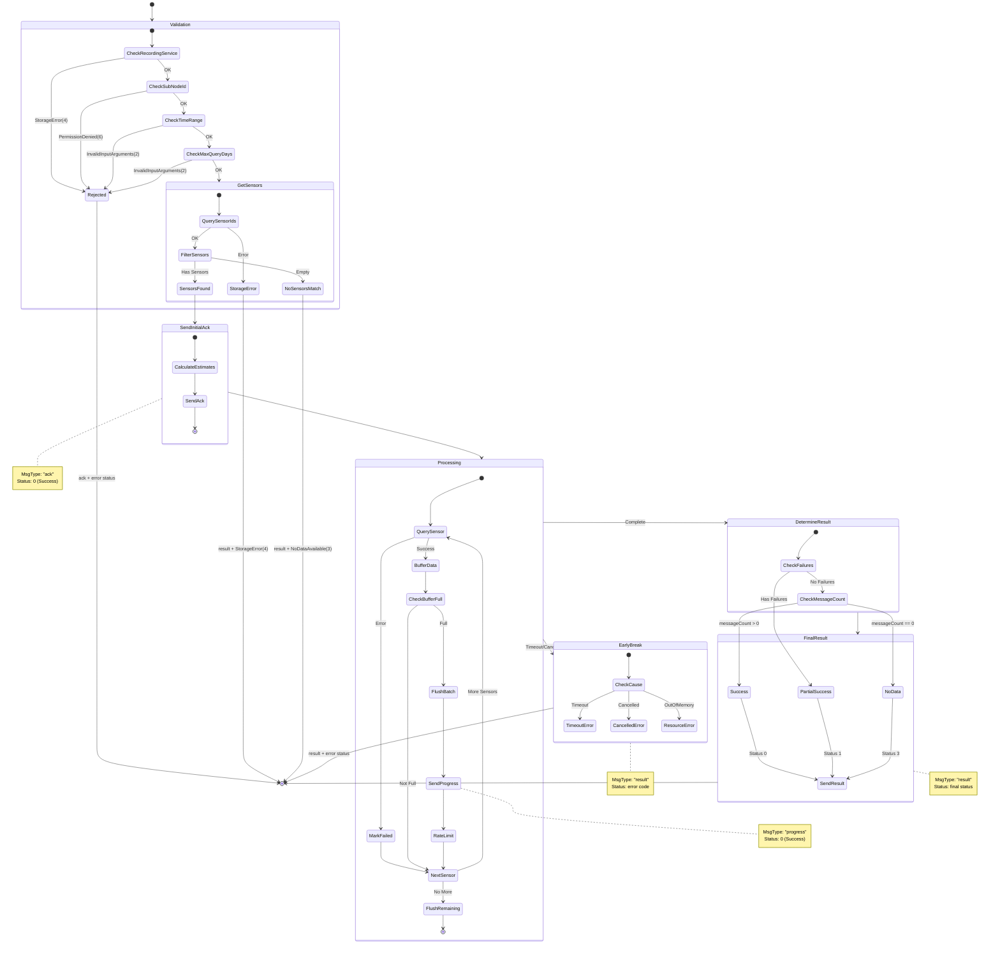
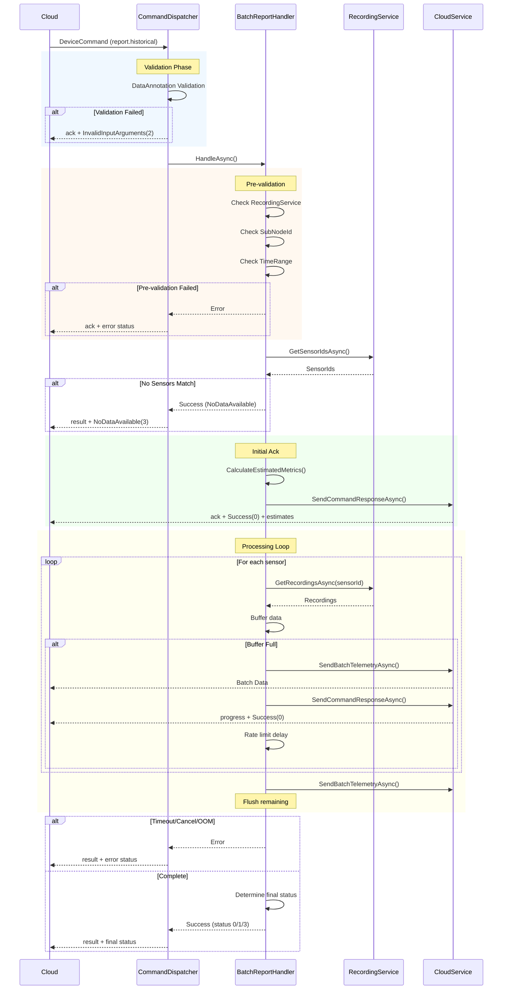

# Command - BatchReportCommand

> Command Name: `report.historical`

## Purpose

The `BatchReportCommand` handles historical telemetry data retrieval from local storage and batch transmission to the cloud. It supports:

- Time-range based queries with configurable start/end times
- Sensor filtering (include/exclude)
- Batch size and rate limiting controls
- Progress reporting during long-running operations
- Partial success handling for incomplete data retrieval

## Validation

### DataAnnotation Validation (Dispatcher Level)

| Field | Rule | Error |
|-------|------|-------|
| `respTopic` | Required, non-empty | InvalidInputArguments(2) |

### Handler Pre-validation

| Check | Condition | Status Code |
|-------|-----------|-------------|
| RecordingService | Must be configured | StorageError(4) |
| SubNodeId | Must be registered | PermissionDenied(6) |
| TimeRange | startTime < endTime | InvalidInputArguments(2) |
| MaxQueryDays | Range <= configured max | InvalidInputArguments(2) |

### Custom Validator (BatchReportCommandValidator)

| Field | Rule | Error |
|-------|------|-------|
| `timeout` | Must be > 0 | InvalidInputArguments(2) |
| `maxBatchSize` | Must be > 0 | InvalidInputArguments(2) |
| `maxBatchesPerMessage` | Must be > 0 | InvalidInputArguments(2) |

## State Machine



## Sequence Diagram



## Request Payload

### Command Parameters

| Parameter | Type | Required | Default | Description |
|-----------|------|----------|---------|-------------|
| `deviceCmd` | string | Yes | - | Command name: `report.historical` |
| `respTopic` | string | Yes | - | Response topic for ack/progress/result |
| `timeRange.startTime` | long | No | 24 hours ago | Start time (Unix milliseconds) |
| `timeRange.endTime` | long | No | Now | End time (Unix milliseconds) |
| `sensorFilter.include` | string[] | No | All | Sensors to include |
| `sensorFilter.exclude` | string[] | No | None | Sensors to exclude |
| `maxBatchesPerMessage` | int | No | 100 | Max batches per NATS message |
| `maxBatchSize` | int | No | 1000 | Max samples per batch |
| `transmissionRateLimit` | int | No | 0 | Messages per second (0 = unlimited) |
| `timeout` | int | No | 300 | Command timeout in seconds |

### Example Request

```json
{
  "cmd": "deviceCmd",
  "seqId": 100,
  "reqSeqId": "a1b2c3d4-e5f6-7890-abcd-ef1234567890",
  "timestamp": 1737004690000,
  "deviceId": "74fe488d5d54",
  "data": {
    "deviceCmd": "report.historical",
    "respTopic": "weda.cmd.response.74fe488d5d54",
    "timeRange": {
      "startTime": 1736918400000,
      "endTime": 1737004800000
    },
    "sensorFilter": {
      "include": ["sensor1", "sensor2"],
      "exclude": []
    },
    "maxBatchesPerMessage": 100,
    "maxBatchSize": 1000,
    "transmissionRateLimit": 10,
    "timeout": 300
  }
}
```

## Response Reference

### Message Types

| MsgType | When Used | Description |
|-------------|-----------|-------------|
| `ack` | Validation failed | Command rejected before processing |
| `ack` | Initial acknowledgment | Command accepted, processing starting |
| `progress` | During processing | Batch sent, processing continues |
| `result` | Early termination | Timeout, cancelled, or resource exhausted |
| `result` | Completion | Processing finished (success/partial/no-data) |

### Status Codes

| Code | Name | Description |
|------|------|-------------|
| 0 | Success | All data retrieved and sent successfully |
| 1 | PartialSuccess | Completed with data gaps (failed sensors or batches) |
| 2 | InvalidInputArguments | Invalid time range or parameters |
| 3 | NoDataAvailable | No sensors match filter or no data in range |
| 4 | StorageError | RecordingService unavailable or read failure |
| 5 | Timeout | Command execution exceeded timeout |
| 6 | PermissionDenied | SubNode not registered |
| 7 | ResourceExhausted | Out of memory |
| 500 | UnexpectedError | Other unexpected errors |

## Response Examples

### Initial Ack (Success)

Sent when command validation passes and processing begins.

```json
{
  "cmd": "deviceCmd",
  "seqId": 100,
  "reqSeqId": "a1b2c3d4-e5f6-7890-abcd-ef1234567890",
  "rspSeqId": "b2c3d4e5-f6a7-8901-bcde-f12345678901",
  "timestamp": 1737004691500,
  "deviceId": "74fe488d5d54",
  "data": {
    "deviceCmd": "report.historical",
    "msgType": "ack",
    "status": 0,
    "errorMessage": "Historical data query started",
    "resultData": {
      "estimatedBatches": 50,
      "estimatedSamples": 10000,
      "estimatedDurationSeconds": 30,
      "storageAvailable": true
    }
  }
}
```

### Progress Update

Sent periodically during batch processing.

```json
{
  "cmd": "deviceCmd",
  "seqId": 100,
  "reqSeqId": "a1b2c3d4-e5f6-7890-abcd-ef1234567890",
  "rspSeqId": "c3d4e5f6-a7b8-9012-cdef-123456789012",
  "timestamp": 1737004695000,
  "deviceId": "74fe488d5d54",
  "data": {
    "deviceCmd": "report.historical",
    "msgType": "progress",
    "status": 0,
    "errorMessage": "Progress update",
    "resultData": {
      "batchesSent": 10,
      "totalBatches": 50,
      "samplesSent": 2000,
      "totalSamples": 10000,
      "percentComplete": 20.0
    }
  }
}
```

### Result - Success (Status: 0)

All data retrieved and sent successfully.

```json
{
  "cmd": "deviceCmd",
  "seqId": 100,
  "reqSeqId": "a1b2c3d4-e5f6-7890-abcd-ef1234567890",
  "rspSeqId": "d4e5f6a7-b8c9-0123-def0-234567890123",
  "timestamp": 1737004720000,
  "deviceId": "74fe488d5d54",
  "data": {
    "deviceCmd": "report.historical",
    "msgType": "result",
    "status": 0,
    "errorMessage": "Historical data retrieval complete",
    "resultData": {
      "batchesSent": 50,
      "totalSamples": 10000,
      "timeRange": {
        "startTime": "2024-01-15T00:00:00.000Z",
        "endTime": "2024-01-16T00:00:00.000Z"
      },
      "sensors": ["sensor1", "sensor2", "sensor3"]
    }
  }
}
```

### Result - Partial Success (Status: 1)

Completed with some data gaps.

```json
{
  "cmd": "deviceCmd",
  "seqId": 100,
  "reqSeqId": "a1b2c3d4-e5f6-7890-abcd-ef1234567890",
  "rspSeqId": "e5f6a7b8-c9d0-1234-ef01-345678901234",
  "timestamp": 1737004720000,
  "deviceId": "74fe488d5d54",
  "data": {
    "deviceCmd": "report.historical",
    "msgType": "result",
    "status": 1,
    "errorMessage": "Historical data retrieval complete with gaps",
    "resultData": {
      "batchesSent": 45,
      "totalSamples": 9000,
      "timeRange": {
        "startTime": "2024-01-15T00:00:00.000Z",
        "endTime": "2024-01-16T00:00:00.000Z"
      },
      "sensors": ["sensor1", "sensor2"],
      "dataGaps": [
        {
          "sensorId": "sensor3",
          "reason": "sensorError"
        }
      ]
    }
  }
}
```

### Result - No Data Available (Status: 3)

No sensors match filter or no data in time range.

```json
{
  "cmd": "deviceCmd",
  "seqId": 100,
  "reqSeqId": "a1b2c3d4-e5f6-7890-abcd-ef1234567890",
  "rspSeqId": "f6a7b8c9-d0e1-2345-f012-456789012345",
  "timestamp": 1737004691500,
  "deviceId": "74fe488d5d54",
  "data": {
    "deviceCmd": "report.historical",
    "msgType": "result",
    "status": 3,
    "errorMessage": "No sensors match the filter criteria",
    "resultData": {
      "batchesSent": 0,
      "totalSamples": 0,
      "timeRange": {
        "startTime": "2024-01-15T00:00:00.000Z",
        "endTime": "2024-01-16T00:00:00.000Z"
      },
      "sensors": []
    }
  }
}
```

### Rejected - Validation Failed (Status: 2)

Command rejected during validation phase.

```json
{
  "cmd": "deviceCmd",
  "seqId": 100,
  "reqSeqId": "a1b2c3d4-e5f6-7890-abcd-ef1234567890",
  "rspSeqId": "a7b8c9d0-e1f2-3456-0123-567890123456",
  "timestamp": 1737004691500,
  "deviceId": "74fe488d5d54",
  "data": {
    "deviceCmd": "report.historical",
    "msgType": "ack",
    "status": 2,
    "errorMessage": "Start time must be before end time"
  }
}
```

### Result - Timeout (Status: 5)

Command execution exceeded timeout.

```json
{
  "cmd": "deviceCmd",
  "seqId": 100,
  "reqSeqId": "a1b2c3d4-e5f6-7890-abcd-ef1234567890",
  "rspSeqId": "b8c9d0e1-f2a3-4567-1234-678901234567",
  "timestamp": 1737004991500,
  "deviceId": "74fe488d5d54",
  "data": {
    "deviceCmd": "report.historical",
    "msgType": "result",
    "status": 5,
    "errorMessage": "Command execution exceeded 300 seconds timeout"
  }
}
```

### Result - Storage Error (Status: 4)

RecordingService unavailable or read failure.

```json
{
  "cmd": "deviceCmd",
  "seqId": 100,
  "reqSeqId": "a1b2c3d4-e5f6-7890-abcd-ef1234567890",
  "rspSeqId": "c9d0e1f2-a3b4-5678-2345-789012345678",
  "timestamp": 1737004691500,
  "deviceId": "74fe488d5d54",
  "data": {
    "deviceCmd": "report.historical",
    "msgType": "ack",
    "status": 4,
    "errorMessage": "RecordingService is not configured"
  }
}
```

## Implementation

### Handler Registration

```csharp
registry.RegisterHandler<BatchReportCommand, BatchReportResult, BatchReportCommandHandler>();
```

### Handler Attributes

```csharp
[Validation(typeof(BatchReportCommandValidator))]  // Custom validator
[Logging(LogLevel.Information)]                     // Log command execution
[AutoAck(false)]                                    // Handler sends its own ack
public class BatchReportCommandHandler : ICommandHandler<BatchReportCommand, BatchReportResult>
```

### Key Source Files

| File | Description |
|------|-------------|
| `Commands/Handlers/BatchReport/BatchReportCommandHandler.cs` | Main handler implementation |
| `Commands/Handlers/BatchReport/Models/BatchReportCommand.cs` | Command model with parameters |
| `Commands/Handlers/BatchReport/Models/BatchReportResult.cs` | Result model with response data |
| `Commands/Handlers/BatchReport/BatchReportCommandValidator.cs` | Custom validation logic |
| `Commands/Handlers/BatchReport/Models/BatchReportStatusCode.cs` | Status code constants |
