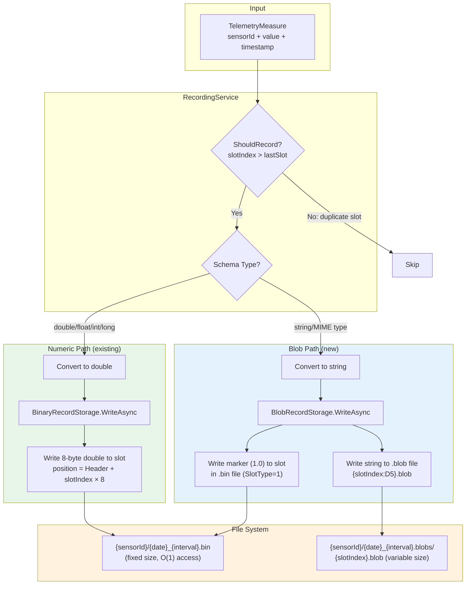

# Dynamic Size Recording Design

## Executive Summary

目前的 Recording Storage 僅支援 `double` (8 bytes fixed slot)。為了支援 string / JSON / Base64 等可變長度資料，以下是四個候選方案的比較：

| 方案 | 概述 | Pros | Cons |
|------|------|------|------|
| **A. Pointer Slot + Blob File** | Slot 存 marker，實際資料存獨立 `.blob` 檔案 | 保留 O(1) 存取；向後相容 V1 檔案；不需額外依賴；實作風險低；與現有 `BinaryRecordStorage` 架構一致 | 每個 slot 一個 blob 檔案，inode 消耗大；讀取需 2 次 I/O (bin + blob)；批次讀取較慢 |
| **B. SQLite** | 用 SQLite DB 存放所有 recording 資料 | 強大查詢能力 (SQL)；單一檔案管理；內建 BLOB 支援；跨 sensor 查詢容易 | 需額外依賴 (SQLite library)；Rotation/VACUUM 慢；與現有 binary slot 設計斷裂；embedded device 資源受限 |
| **C. Append-only Log + Index** | 資料 append 到 log 檔，另建 index 檔記錄 offset | 寫入最快 (sequential I/O)；單一資料檔案 | 讀取需 seek；index 檔維護複雜；corruption 時需重建 index；不再有 O(1) 隨機存取 |
| **D. 固定長度 Slot (限制 string 大小)** | 擴大 slot size (如 256 bytes)，直接放 string | 最簡單，幾乎不改架構；仍保留 O(1) 存取 | 長度限制太嚴格 (256 bytes 放不下 Base64 image)；浪費空間 (大部分 slot 用不到 256 bytes)；無法擴展 |

**推薦方案: A (Pointer Slot + Blob File)** — 與現有架構最相容，保留 O(1) slot 定位能力，向後相容，且不引入外部依賴。

---

## Problem Statement

目前的 Recording Storage 使用 **固定大小的 Slot** 設計，每個 Slot 存放 8 bytes (double)。這使得只能記錄數值型感測器資料，無法記錄 **string**、**JSON**、**Base64 (image/binary)** 等可變長度資料。

```
現狀限制:
┌──────────────────────────────────────────────────────┐
│ Binary File (固定大小)                                │
│ ┌──────────┬──────────┬──────────┬──────────────────┐│
│ │ Header   │ Slot 0   │ Slot 1   │ ...  Slot N     ││
│ │ 24 bytes │ 8 bytes  │ 8 bytes  │      8 bytes    ││
│ │          │ double   │ double   │      double     ││
│ └──────────┴──────────┴──────────┴──────────────────┘│
│                                                      │
│  ❌ 無法存 string                                     │
│  ❌ 無法存 JSON                                       │
│  ❌ 無法存 Base64 image                               │
└──────────────────────────────────────────────────────┘
```

### 現有 Recording 架構回顧

**Binary File Format** (`BinaryRecordStorage.cs`):
- Header: 24 bytes (magic prefix, version, flags, interval, startTimestamp, slotCount)
- Data Section: `slotCount × 8 bytes` (每個 Slot 一個 double)
- Slot Index 計算: `(timestamp - startOfDay) / interval`
- 無資料的 Slot 填入 `NaN`
- 檔名格式: `{yyyy-MM-dd}_{interval}.bin`

**核心優勢**: O(1) 隨機存取、固定檔案大小、快速寫入、快速輪替

---

## Proposed Solution: Pointer-based Slot Design

使用 **Pointer Slot** 方式：Slot 內不再直接存放資料值，而是存放一個指向外部檔案的 **reference**。實際的可變長度資料存放在獨立的 blob 檔案中。

### 設計概念

```
┌─────────────────────────────────────────────────────────────────────┐
│ 方案: Pointer Slot + Blob Storage                                   │
│                                                                     │
│  Main Binary File (固定大小, 保留 O(1) 存取)                         │
│  ┌──────────┬──────────┬──────────┬──────────┬──────────────────┐   │
│  │ Header   │ Slot 0   │ Slot 1   │ Slot 2   │ ...  Slot N     │   │
│  │ 24→32 B  │ 8 bytes  │ 8 bytes  │ 8 bytes  │      8 bytes    │   │
│  │          │ double   │ POINTER  │ double   │      POINTER    │   │
│  │          │ 25.3     │ ref:0001 │ 26.1     │      ref:0002   │   │
│  └──────────┴────┬─────┴──────────┴────┬─────┴──────────────────┘   │
│                  │                     │                            │
│                  ▼                     ▼                            │
│  Blob Directory (可變大小)                                           │
│  ┌───────────────────┐  ┌───────────────────┐                      │
│  │ 0001.blob         │  │ 0002.blob         │                      │
│  │ "Hello World"     │  │ "{\"key\":\"val\"}"│                      │
│  │ (任意長度 string)   │  │ (任意長度 JSON)    │                      │
│  └───────────────────┘  └───────────────────┘                      │
│                                                                     │
│  ✅ 保留 O(1) Slot 存取                                             │
│  ✅ 支援任意長度 string/JSON/Base64                                   │
│  ✅ 向後相容 double 值                                               │
└─────────────────────────────────────────────────────────────────────┘
```

---

## Detailed Architecture

### 1. Slot Type Encoding

利用 IEEE 754 double 的 NaN 空間來編碼 Pointer 資訊:

```
IEEE 754 Double NaN Layout:
┌────┬───────────┬──────────────────────────────────────────────┐
│Sign│ Exponent  │ Mantissa (52 bits)                           │
│ 1  │ 11 bits   │ 52 bits                                      │
│    │ all 1s    │ non-zero = NaN                                │
└────┴───────────┴──────────────────────────────────────────────┘

我們的編碼方式:
- 普通 NaN (無資料):   0x7FF8000000000000 (quiet NaN, mantissa MSB = 1)
- Pointer NaN:        0x7FF0xxxxxxxxxxxx (signaling NaN pattern)
  - 0x7FF4 prefix → Pointer marker
  - 後 48 bits → Blob File ID (最大 281 兆個 blob)

Slot 值解讀:
┌──────────────────────────────────────────────────┐
│ 若 value 是正常 double        → 直接回傳數值     │
│ 若 value == quiet NaN         → 無資料           │
│ 若 value matches pointer NaN  → 讀取 blob 檔案   │
└──────────────────────────────────────────────────┘
```

**替代方案 (simpler): 使用 Flags field**

考量到 NaN encoding 的複雜度，更簡單的替代方案是在 Header 中新增 `SlotType` field:

```
Extended Header Layout (32 bytes):
┌────────┬──────┬─────────┬─────────────────────────────────┐
│ Offset │ Size │ Type    │ Field                           │
├────────┼──────┼─────────┼─────────────────────────────────┤
│ 0      │ 4    │ uint32  │ Prefix (0x57454441 "WEDA")      │
│ 4      │ 2    │ uint16  │ Version (2)  ← 升版             │
│ 6      │ 1    │ byte    │ Flags (bit 0: Endianness)       │
│ 7      │ 1    │ byte    │ CheckSumType                    │
│ 8      │ 4    │ uint32  │ Interval (ms)                   │
│ 12     │ 8    │ ulong   │ StartTimestamp (Unix ms)        │
│ 20     │ 4    │ uint32  │ SlotCount                       │
│ 24     │ 1    │ byte    │ SlotType (NEW)                  │
│         │      │         │  0 = Double (backward compat)   │
│         │      │         │  1 = Pointer (blob reference)   │
│ 25     │ 7    │ byte[]  │ Reserved (padding to 32 bytes)  │
└────────┴──────┴─────────┴─────────────────────────────────┘
```

### 2. File Structure

```
recordings/
└── {SensorId}/
    ├── 2026-02-03_1000.bin          # double sensor (SlotType=0, 現有格式)
    ├── 2026-02-03_5000.bin          # double sensor (另一個 interval)
    ├── 2026-02-03_1000.bin          # string sensor (SlotType=1, pointer)
    └── 2026-02-03_1000.blobs/       # blob storage directory
        ├── 00000.blob               # Slot 0 的 blob 資料
        ├── 00042.blob               # Slot 42 的 blob 資料
        └── 01337.blob               # Slot 1337 的 blob 資料
```

**Blob 檔案命名**: `{slotIndex:D5}.blob` (5 位數 zero-padded slot index)

**Blob 檔案內容**: Raw bytes (UTF-8 string / JSON / Base64 encoded binary)

### 3. Pointer Slot Value Encoding (Simple Approach)

```csharp
/// <summary>
/// Slot stores the blob file's slot index as a positive infinity marker.
/// For SlotType=1 files, the slot value is interpreted as:
///   - NaN         → no data (same as double)
///   - Other value → blob exists, slotIndex used as blob filename
/// </summary>
public const double BlobMarker = 1.0; // sentinel value indicating blob exists
```

對 `SlotType=1` 的檔案:
- Slot value = `NaN` → 無資料
- Slot value = `1.0` (或任何非 NaN) → 對應的 `{slotIndex}.blob` 檔案存在

---

## Data Flow

### Write Flow

```
┌─────────────────────────────────────────────────────────────────────┐
│                         Write Flow                                  │
├─────────────────────────────────────────────────────────────────────┤
│                                                                     │
│  TelemetryMeasure                                                   │
│       │                                                             │
│       ▼                                                             │
│  RecordingService.RecordAsync()                                     │
│       │                                                             │
│       ▼                                                             │
│  ┌─────────────────────────┐                                        │
│  │ Schema type check       │                                        │
│  │ (from DeviceConfig)     │                                        │
│  └────────┬────────────────┘                                        │
│           │                                                         │
│     ┌─────┴──────────────┐                                          │
│     │                    │                                          │
│     ▼                    ▼                                          │
│  schema =             schema =                                      │
│  double/float/int     string/MIME type                              │
│     │                    │                                          │
│     ▼                    ▼                                          │
│  ┌──────────────┐   ┌──────────────────────────────────────────┐    │
│  │ Convert to   │   │ 1. EnsureFileExists (SlotType=1)        │    │
│  │ double       │   │ 2. Write value to blob file              │    │
│  │              │   │    path: {sensorId}/{date}_{interval}     │    │
│  │              │   │          .blobs/{slotIndex:D5}.blob       │    │
│  │              │   │ 3. Write marker (1.0) to slot             │    │
│  └──────┬───────┘   └──────────────┬───────────────────────────┘    │
│         │                          │                                │
│         ▼                          ▼                                │
│  ┌──────────────────────────────────────────┐                       │
│  │ BinaryRecordStorage.WriteToSlotAsync()   │                       │
│  │ (existing code, no change for double)    │                       │
│  └──────────────────────────────────────────┘                       │
│                                                                     │
└─────────────────────────────────────────────────────────────────────┘
```

### Read Flow

```
┌─────────────────────────────────────────────────────────────────────┐
│                          Read Flow                                   │
├─────────────────────────────────────────────────────────────────────┤
│                                                                     │
│  RecordingsController.GetRecordingsAsync(sensorId, start, end)      │
│       │                                                             │
│       ▼                                                             │
│  BinaryRecordStorage.ReadAsync()                                    │
│       │                                                             │
│       ▼                                                             │
│  RecordingBinFileReader.ReadHeader()                                │
│       │                                                             │
│       ▼                                                             │
│  ┌─────────────────────────┐                                        │
│  │ Check header.SlotType   │                                        │
│  └────────┬────────────────┘                                        │
│           │                                                         │
│     ┌─────┴──────────────┐                                          │
│     │                    │                                          │
│     ▼                    ▼                                          │
│  SlotType = 0         SlotType = 1                                  │
│  (Double)             (Pointer)                                     │
│     │                    │                                          │
│     ▼                    ▼                                          │
│  ┌──────────────┐   ┌──────────────────────────────────────────┐    │
│  │ Read double  │   │ For each slot:                           │    │
│  │ from slot    │   │   if value == NaN → skip                 │    │
│  │ (現有邏輯)    │   │   if value != NaN → read blob file       │    │
│  │              │   │     path: .blobs/{slotIndex:D5}.blob     │    │
│  │              │   │     return string content                 │    │
│  └──────┬───────┘   └──────────────┬───────────────────────────┘    │
│         │                          │                                │
│         ▼                          ▼                                │
│  ┌──────────────────────────────────────────┐                       │
│  │ Return List<RecordingDataPoint>          │                       │
│  │ (double values or string values)         │                       │
│  └──────────────────────────────────────────┘                       │
│                                                                     │
└─────────────────────────────────────────────────────────────────────┘
```

---

## Implementation Plan

### Phase 1: Core Types & Abstractions

#### 1.1 Extend RecordingDataPoint

```csharp
// Option A: 新增泛型版本 (推薦)
public readonly record struct RecordingDataPoint<T>(
    long Timestamp,
    T Value
);

// 保留原始版本向後相容
public readonly record struct RecordingDataPoint(
    long Timestamp,
    double Value
);
```

#### 1.2 Extend RecordingFileHeader

```csharp
public class RecordingFileHeader
{
    // ... existing fields ...

    /// <summary>
    /// Slot type: 0 = Double (8-byte IEEE 754), 1 = Pointer (blob reference)
    /// </summary>
    public byte SlotType { get; set; } = 0;

    /// <summary>
    /// Extended header size for version 2+
    /// </summary>
    public const int HeaderSizeV2 = 32;
}
```

#### 1.3 New Interface: IBlobRecordStorage

```csharp
public interface IBlobRecordStorage
{
    Task WriteAsync(string sensorId, int interval, long timestamp, string value, CancellationToken ct = default);
    Task<string?> ReadAsync(string sensorId, int interval, long timestamp, CancellationToken ct = default);
    Task<IReadOnlyList<RecordingDataPoint<string>>> ReadRangeAsync(
        string sensorId, int interval, DateTimeOffset start, DateTimeOffset end, CancellationToken ct = default);
    Task CleanupAsync(DateTimeOffset before, CancellationToken ct = default);
    Task DeleteSensorAsync(string sensorId, CancellationToken ct = default);
}
```

### Phase 2: Blob Storage Implementation

#### 2.1 BlobRecordStorage

```csharp
public class BlobRecordStorage : IBlobRecordStorage
{
    // Write: 計算 slotIndex → 寫入 {slotIndex:D5}.blob
    // Read:  計算 slotIndex → 讀取 {slotIndex:D5}.blob
    // Cleanup: 刪除過期的 .blobs/ 目錄
}
```

#### 2.2 Write Flow

```csharp
public async Task WriteAsync(string sensorId, int interval, long timestamp, string value, CancellationToken ct)
{
    var startOfDay = GetStartOfDay(timestamp);
    var slotIndex = (int)((timestamp - startOfDay) / interval);

    // 1. Ensure blob directory exists
    var blobDir = GetBlobDirectory(sensorId, interval, timestamp);
    Directory.CreateDirectory(blobDir);

    // 2. Write blob file
    var blobPath = Path.Combine(blobDir, $"{slotIndex:D5}.blob");
    await File.WriteAllTextAsync(blobPath, value, Encoding.UTF8, ct);

    // 3. Write marker to main .bin file (SlotType=1)
    var binPath = GetFilePath(sensorId, interval, timestamp);
    EnsureFileExists(binPath, interval, startOfDay, slotType: 1);
    await WriteToSlotAsync(binPath, interval, startOfDay,
        new RecordingDataPoint(timestamp, BlobMarker), ct);
}
```

### Phase 3: RecordingService Integration

#### 3.1 Schema-aware Routing

```csharp
public class RecordingService : IRecordingService
{
    private readonly IRecordStorage _numericStorage;
    private readonly IBlobRecordStorage _blobStorage;

    public async Task RecordAsync(string sensorId, int interval, string schema,
        long timestamp, object value, CancellationToken ct)
    {
        if (IsNumericSchema(schema))
        {
            var doubleValue = Convert.ToDouble(value);
            await _numericStorage.WriteAsync(sensorId, interval,
                new RecordingDataPoint(timestamp, doubleValue), ct);
        }
        else
        {
            var stringValue = value?.ToString() ?? "";
            await _blobStorage.WriteAsync(sensorId, interval, timestamp, stringValue, ct);
        }
    }

    private static bool IsNumericSchema(string schema)
        => schema is "double" or "float" or "integer" or "long";
}
```

### Phase 4: Backward Compatibility

```
Version 1 files (existing):
- Header: 24 bytes, Version=1
- Slot: 8 bytes double
- 讀寫邏輯不變

Version 2 files (new):
- Header: 32 bytes, Version=2, SlotType=0 or 1
- SlotType=0: 同 Version 1 行為
- SlotType=1: Pointer mode, 需讀取 blob 檔案
- RecordingBinFileReader 自動偵測版本
```

---

## Trade-off Analysis

### 優勢

| 項目 | 說明 |
|------|------|
| O(1) 時間定位 | Slot index 計算不變，仍可 O(1) 定位到時間點 |
| 向後相容 | Version 1 檔案完全不受影響 |
| 任意大小 | String/JSON/Base64 不受 8 bytes 限制 |
| 獨立清理 | Blob 檔案可獨立刪除，不影響 index |
| 簡單實作 | 不需要資料庫，純檔案系統操作 |

### 劣勢

| 項目 | 說明 | 緩解措施 |
|------|------|----------|
| 檔案數量多 | 每個 Slot 一個 blob 檔案 | 使用日期目錄分組，定期清理 |
| Disk I/O 增加 | 讀取需 2 次 I/O (bin + blob) | 可加入 LRU cache |
| inode 消耗 | 大量小檔案消耗 inode | 監控 inode 使用率，設定 maxBlobFiles |
| 批次讀取較慢 | 需逐一讀取 blob 檔案 | 可並行讀取 (Task.WhenAll) |

### 替代方案比較

| 方案 | 優勢 | 劣勢 |
|------|------|------|
| **A. Pointer + Blob (本方案)** | 簡單、向後相容、O(1) 存取 | 檔案數量多 |
| B. SQLite | 強大查詢、單一檔案 | 需額外依賴、rotation 慢 |
| C. Append-only Log + Index | 寫入快 | 讀取需 seek、index 維護複雜 |
| D. 限制 string 長度放入 slot | 最簡單 | 長度限制太嚴格 |

**推薦方案 A**：與現有架構最相容，實作風險最低。

---

## Mermaid Flowchart: Complete Recording Flow



---

## Impact on Existing Code

### 需修改的檔案

| 檔案 | 修改內容 |
|------|----------|
| `RecordingFileHeader.cs` | 新增 `SlotType` field, HeaderSizeV2 |
| `BinaryRecordStorage.cs` | CreateFileWithHeader 支援 Version 2 |
| `RecordingBinFileReader.cs` | 讀取時偵測 Version/SlotType |
| `RecordingService.cs` | Schema-aware routing |
| `IRecordStorage.cs` | 可能需要擴展 interface |

### 需新增的檔案

| 檔案 | 說明 |
|------|------|
| `IBlobRecordStorage.cs` | Blob storage interface |
| `BlobRecordStorage.cs` | Blob storage implementation |
| `BlobRecordStorageTests.cs` | Unit tests |

### 不需修改的檔案

| 檔案 | 原因 |
|------|------|
| `RecordingOptions.cs` | 設定不變 |
| `RecordingsController.cs` | API 不變 (透過 Service 層隔離) |
| `RecordingCleanupService.cs` | 只需額外清理 .blobs/ 目錄 |

---

## Open Questions

1. **Blob 檔案大小限制**: 是否需要設定單一 blob 的最大大小？(建議: 與 `TelemetryOptions.MaxBinarySize` 一致, 10MB)
2. **壓縮**: 是否需要對 blob 做壓縮？(建議: 初版不壓縮，未來可加)
3. **BatchReport 整合**: Blob recording 的 batch report 格式需要另外定義嗎？
4. **Recording Interval**: String sensor 的 recording interval 語義是否相同？(建議: 相同，每個 interval 只記錄一筆)

---

## Summary

| Aspect | Decision |
|--------|----------|
| Storage Strategy | Pointer Slot + Blob File (Dual-track) |
| Header Version | Version 2 (32 bytes, 新增 SlotType) |
| Slot Encoding | SlotType=0 (double), SlotType=1 (pointer to blob) |
| Blob Naming | `{slotIndex:D5}.blob` |
| Backward Compat | Version 1 files 完全不受影響 |
| Schema Routing | `RecordingService` 依 schema 決定走 numeric 或 blob path |
| O(1) Access | 保留 (slot index 計算不變) |