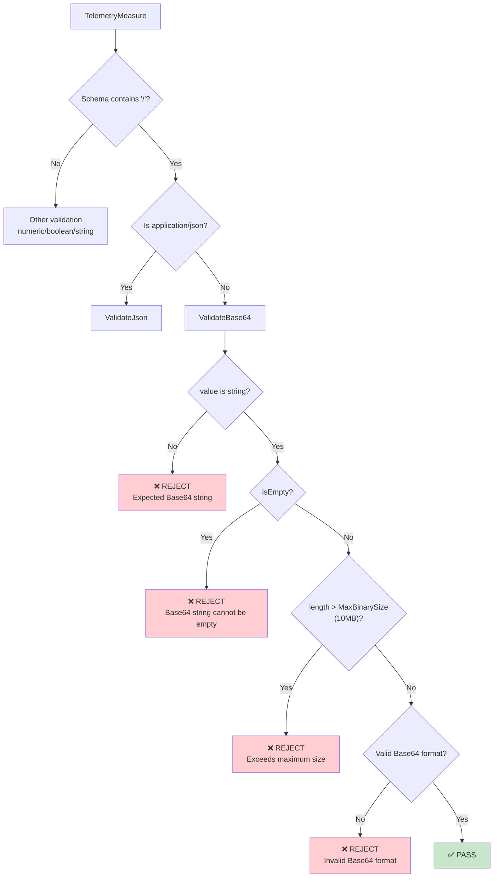
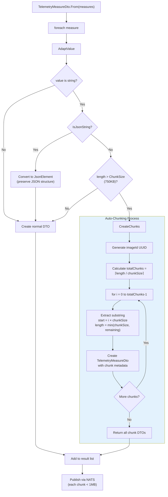
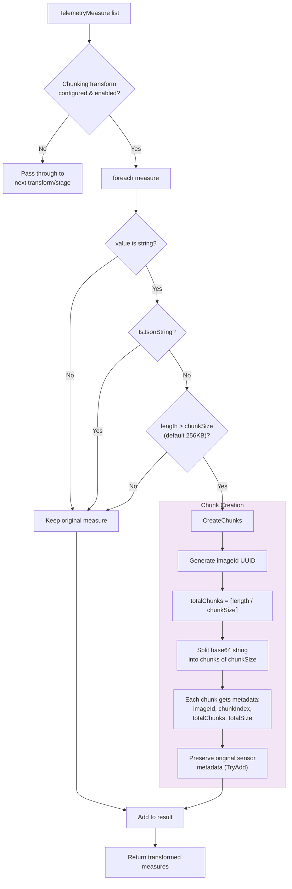
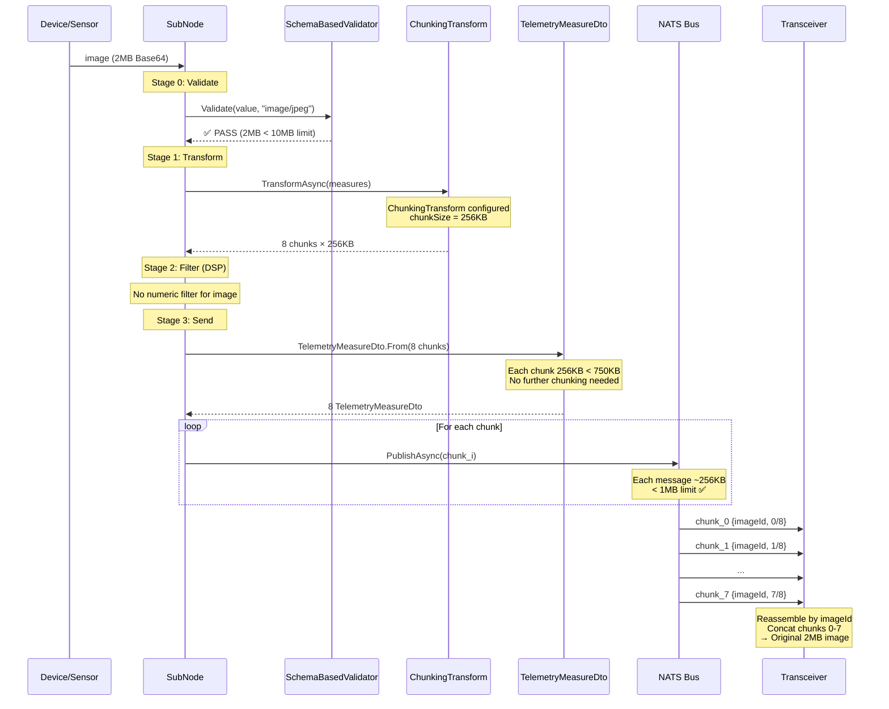
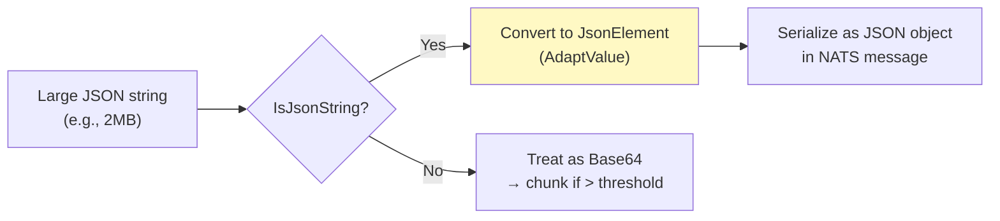
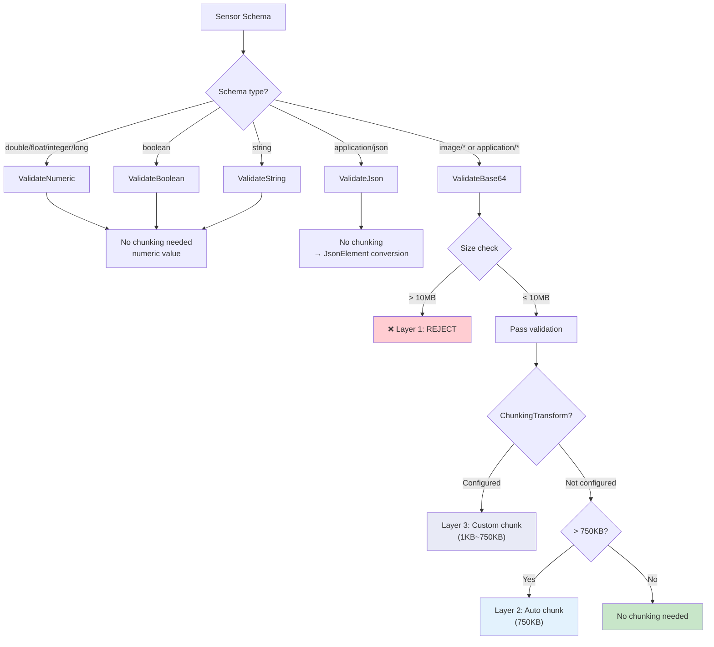

# Large Size Data Publish Design

## Overview

SubNode 處理大型資料 (如 image、binary blob) 上傳到 Cloud 時，受到 **NATS max_payload = 1MB** 的限制。本文件記錄目前已實作的三層防護策略，確保大型資料能安全可靠地透過 NATS 傳輸。

### 三層策略總覽

```
大型資料上傳策略:

┌─────────────────────────────────────────────────────────────────────┐
│                                                                     │
│  Layer 1: 主動拒絕 (Rejection)                                       │
│  ├─ 時機: Validation 階段 (Pipeline Stage 0)                         │
│  ├─ 條件: Base64 data > MaxBinarySize (10MB)                        │
│  └─ 行為: 拒絕處理，Log Warning，跳過 Transform/Filter               │
│                                                                     │
│  Layer 2: 主動截切 (Auto-Chunking at 750KB)                          │
│  ├─ 時機: DTO 轉換階段 (TelemetryMeasureDto.From)                    │
│  ├─ 條件: Base64 string > ChunkSize (750KB)                         │
│  └─ 行為: 自動分片，每片 ≤ 750KB，附帶 chunk metadata                 │
│                                                                     │
│  Layer 3: 客製截切 (ChunkingTransform)                                │
│  ├─ 時機: Transform 階段 (Pipeline Stage 1)                          │
│  ├─ 條件: 使用者配置 chunkSize (1KB ~ 750KB)                         │
│  └─ 行為: 按自訂大小分片，適用於頻寬受限場景                            │
│                                                                     │
└─────────────────────────────────────────────────────────────────────┘
```

---

## Architecture: Data Flow Through Pipeline

```
┌─────────────────────────────────────────────────────────────────────────────┐
│                        TelemetryPipeline.ProcessAsync()                     │
├─────────────────────────────────────────────────────────────────────────────┤
│                                                                             │
│  TelemetryMeasure[]                                                         │
│       │                                                                     │
│       ▼                                                                     │
│  ┌─────────────────────────────────────────────┐                            │
│  │ Stage 0: Validate (SchemaBasedValidator)     │ ◄── Layer 1: 主動拒絕     │
│  │                                              │                           │
│  │  schema contains '/' → ValidateBase64()      │                           │
│  │  ├─ size > 10MB → REJECT (Error)             │                           │
│  │  ├─ invalid Base64 → REJECT (Error)          │                           │
│  │  └─ valid → PASS                             │                           │
│  └─────────────┬────────────┬──────────────────┘                            │
│       valid    │            │ invalid                                       │
│       measures │            │ measures                                      │
│                │            │                                               │
│       ┌────────┘            └──────────┐                                    │
│       ▼                                ▼                                    │
│  ┌──────────────────────────┐   ┌──────────────────────┐                    │
│  │ Stage 1: Transform       │   │ Skip Transform/Filter│ ◄── 被拒絕的       │
│  │                          │   │ 直接進入 Send stage   │     measures      │
│  │ if ChunkingTransform     │   └──────────┬───────────┘                    │
│  │   configured:            │              │                                │
│  │   ├─ size > chunkSize    │ ◄── Layer 3  │                                │
│  │   │  → split into chunks │              │                                │
│  │   └─ size ≤ chunkSize    │              │                                │
│  │     → pass through       │              │                                │
│  └─────────────┬────────────┘              │                                │
│                │                           │                                │
│                ▼                           │                                │
│  ┌──────────────────────────┐              │                                │
│  │ Stage 2: Filter (DSP)    │              │                                │
│  └─────────────┬────────────┘              │                                │
│                │                           │                                │
│                ▼                           │                                │
│  ┌──────────────────────────┐              │                                │
│  │ Stage 3: Send            │◄─────────────┘                                │
│  │ WedaCloudService         │                                               │
│  │   .SendTelemetryAsync()  │                                               │
│  └─────────────┬────────────┘                                               │
│                │                                                            │
│                ▼                                                            │
│  ┌──────────────────────────────────────────┐                               │
│  │ TelemetryClient.SendTelemetryAsync()     │                               │
│  │                                          │                               │
│  │ TelemetryMeasureDto.From(measures)       │ ◄── Layer 2: 主動截切         │
│  │   ├─ Base64 > 750KB → auto chunk         │     (最終防線)                │
│  │   ├─ JSON string → JsonElement           │                               │
│  │   └─ other → pass through                │                               │
│  │                                          │                               │
│  │ NATS.PublishAsync(message)               │                               │
│  └──────────────────────────────────────────┘                               │
│                                                                             │
└─────────────────────────────────────────────────────────────────────────────┘
```

---

## Layer 1: 主動拒絕 (Rejection)

### 目的

在 Pipeline 最早期就攔截超大資料，避免浪費 Transform/Filter 的計算資源。

### 觸發條件

- Sensor schema 包含 `/` (MIME type，如 `image/jpeg`, `application/octet-stream`)
- Base64 encoded string length > `MaxBinarySize` (default: 10MB)

### 實作位置

**`SchemaBasedValidator.cs`** → `ValidateBase64()`

```csharp
private static ErrorOr<Success> ValidateBase64(object value, int maxSize)
{
    if (value is not string s)
        return Error.Failure($"Expected Base64 string, got {value.GetType().Name}");

    if (string.IsNullOrEmpty(s))
        return Error.Failure("Base64 string cannot be empty");

    if (s.Length > maxSize)          // ← 主動拒絕
        return Error.Failure(
            $"Base64 data exceeds maximum size of {maxSize / 1024 / 1024}MB");

    Convert.FromBase64String(s);     // ← 格式驗證
    return Result.Success;
}
```

### Pipeline 整合

**`TelemetryPipeline.cs`** → `ValidateMeasures()`

```csharp
// Stage 0: Validate
bool[] valid = ValidateMeasures(measures);
// valid[i] = false → 該 measure 跳過 Transform/Filter，直接送 Send
```

### 流程圖



### Configuration

```csharp
// TelemetryOptions.cs
public class TelemetryOptions
{
    /// <summary>
    /// Maximum allowed for binary/image data in bytes.
    /// Data exceeding this size will be rejected.
    /// Default is 10MB.
    /// </summary>
    public int MaxBinarySize { get; set; } = 10 * 1024 * 1024;
}
```

---

## Layer 2: 主動截切 (Auto-Chunking at 750KB)

### 目的

作為**最終防線**，在資料即將透過 NATS 發送前，自動將超過 750KB 的 Base64 資料分片，確保每個 NATS message 不超過 1MB payload 限制。

### 觸發條件

- Value 是 string 且不是 JSON
- String length > `ChunkSize` (default: 750KB = 768,000 bytes)

### 實作位置

**`TelemetrySendMessage.cs`** → `TelemetryMeasureDto.From()`

```csharp
public static TelemetryDataDto From(List<TelemetryMeasure> measures, TelemetryOptions options)
{
    foreach (var m in measures)
    {
        var adapted = AdaptValue(m.Value);

        if (adapted is string base64
            && base64.Length > options.ChunkSize   // ← 超過 750KB
            && !IsJsonString(base64))               // ← 非 JSON
        {
            result.AddRange(CreateChunks(m, base64, options.ChunkSize));
        }
        else
        {
            result.Add(/* normal DTO */);
        }
    }
}
```

### Chunk 結構

每個 Chunk 包含以下 metadata:

```json
{
  "sensorId": "f782c",
  "value": "<base64_chunk_data>",
  "timestamp": 1706500000000,
  "metadata": {
    "imageId": "a1b2c3d4-e5f6-7890-abcd-ef1234567890",
    "chunkIndex": 0,
    "totalChunks": 3,
    "totalSize": 2100000
  }
}
```

| Metadata Field | Type | Description |
|----------------|------|-------------|
| `imageId` | string (GUID) | 同一張圖片/資料的唯一識別碼，用於重組 |
| `chunkIndex` | int | 第幾片 (0-based) |
| `totalChunks` | int | 總片數 |
| `totalSize` | int | 原始 Base64 string 的總長度 |

### 流程圖



### 分片範例

```
原始資料: 2MB Base64 string (image/jpeg)
ChunkSize: 750KB (768,000 chars)

分片結果:
┌──────────────────────────────────────────────────────────────────┐
│ Chunk 0                                                          │
│ ├─ imageId: "a1b2c3d4..."                                        │
│ ├─ chunkIndex: 0                                                 │
│ ├─ totalChunks: 3                                                │
│ ├─ totalSize: 2097152                                            │
│ └─ value: base64[0..768000]                                      │
├──────────────────────────────────────────────────────────────────┤
│ Chunk 1                                                          │
│ ├─ imageId: "a1b2c3d4..." (同一個 GUID)                          │
│ ├─ chunkIndex: 1                                                 │
│ ├─ totalChunks: 3                                                │
│ └─ value: base64[768000..1536000]                                │
├──────────────────────────────────────────────────────────────────┤
│ Chunk 2                                                          │
│ ├─ imageId: "a1b2c3d4..." (同一個 GUID)                          │
│ ├─ chunkIndex: 2                                                 │
│ ├─ totalChunks: 3                                                │
│ └─ value: base64[1536000..2097152]                               │
└──────────────────────────────────────────────────────────────────┘

每個 chunk 獨立作為一個 TelemetryMeasureDto 送出
接收端 (Transceiver) 根據 imageId 重組
```

### Configuration

```csharp
// TelemetryOptions.cs
public class TelemetryOptions
{
    /// <summary>
    /// Chunk size threshold for automatic chunking in bytes.
    /// Base64 strings larger than this will be automatically split.
    /// Default is 750KB to stay under NATS 1MB payload limit.
    /// </summary>
    public int ChunkSize { get; set; } = 750 * 1024;
}
```

---

## Layer 3: 客製截切 (ChunkingTransform)

### 目的

提供**可配置的分片 Transform**，讓使用者在頻寬受限的場景下，以更小的 chunk size 分片（例如 256KB），減少單次傳輸量。

### 與 Layer 2 的差異

| 項目 | Layer 2 (Auto-Chunking) | Layer 3 (ChunkingTransform) |
|------|-------------------------|------------------------------|
| 位置 | DTO 轉換 (最終防線) | Pipeline Transform 階段 |
| 預設啟用 | **永遠啟用** | **需手動配置** |
| Chunk Size | 固定 750KB | 可配置 1KB ~ 750KB |
| 預設大小 | 750KB | 256KB |
| 適用場景 | 所有 MIME type sensor | 頻寬受限場景 |
| JSON 處理 | 不 chunk JSON | 不 chunk JSON |

### 實作位置

**`ChunkingTransform.cs`**

```csharp
public class ChunkingTransform : ITelemetryTransform, IConfigurableTransform<ChunkingTransform>
{
    private int _chunkSize = 256 * 1024; // Default 256KB

    public static string TypeName => "chunking";

    public Task<List<TelemetryMeasure>> TransformAsync(
        List<TelemetryMeasure> measures,
        TelemetryTransformContext context,
        CancellationToken ct = default)
    {
        foreach (var measure in measures)
        {
            if (measure.Value is string base64
                && base64.Length > _chunkSize
                && !IsJsonString(base64))
            {
                result.AddRange(CreateChunks(measure, base64));
            }
            else
            {
                result.Add(measure);
            }
        }
        return Task.FromResult(result);
    }
}
```

### 參數驗證

```csharp
public ErrorOr<Success> ValidateParameters(Dictionary<string, object> parameters)
{
    if (parameters.TryGetValue("chunkSize", out var value))
    {
        var size = Convert.ToInt32(value);
        if (size < 1024)        // Minimum 1KB
            return Error.Failure("chunkSize must be at least 1KB");
        if (size > 750 * 1024)  // Maximum 750KB (must fit in NATS)
            return Error.Failure("chunkSize cannot exceed 750KB");
    }
    return Result.Success;
}
```

### Configuration (appsettings.json / cloud config)

```json
{
  "Sensors": [
    {
      "Name": "camera.snapshot",
      "Schema": "image/jpeg",
      "Report": {
        "Enabled": true,
        "Interval": 5000,
        "TransformPipeline": [
          {
            "Type": "chunking",
            "Enabled": true,
            "Parameters": {
              "chunkSize": 262144
            }
          }
        ]
      }
    }
  ]
}
```

### 流程圖



---

## Complete End-to-End Flow

### 以 2MB image/jpeg 為例



### 不同大小的處理路徑

```
┌────────────────────────────────────────────────────────────────────┐
│ 資料大小 vs 處理路徑                                                │
├────────────────────────────────────────────────────────────────────┤
│                                                                    │
│  Size        Layer 1         Layer 3              Layer 2          │
│  (Base64)    Rejection       ChunkingTransform    Auto-Chunking   │
│              (10MB)          (256KB, optional)     (750KB)         │
│                                                                    │
│  100KB  ──── PASS ────────── pass through ──────── pass through   │
│              (< 10MB)        (< 256KB)             (< 750KB)      │
│              Result: 1 message, 100KB                              │
│                                                                    │
│  500KB  ──── PASS ────────── 2 chunks × 256KB ─── pass through   │
│              (< 10MB)        (> 256KB)             (< 750KB each) │
│              Result: 2 messages, ~250KB each                       │
│                                                                    │
│  2MB    ──── PASS ────────── 8 chunks × 256KB ─── pass through   │
│              (< 10MB)        (> 256KB)             (< 750KB each) │
│              Result: 8 messages, ~256KB each                       │
│                                                                    │
│  2MB    ──── PASS ────────── (not configured) ──── 3 chunks       │
│  (no Tx)     (< 10MB)                             × 750KB         │
│              Result: 3 messages, ~700KB each                       │
│                                                                    │
│  15MB   ──── REJECT ──────── (not reached) ─────── (not reached)  │
│              (> 10MB)                                              │
│              Result: ❌ Log warning, skip                          │
│                                                                    │
└────────────────────────────────────────────────────────────────────┘
```

---

## JSON Handling (特殊規則)

JSON string **永遠不會被 chunk**，無論大小:

```csharp
private static bool IsJsonString(string str)
{
    if (string.IsNullOrWhiteSpace(str))
        return false;
    var trimmed = str.TrimStart();
    return trimmed.StartsWith('{') || trimmed.StartsWith('[');
}
```

**原因**: JSON 分片後無法保持語義完整性。JSON 資料在 DTO 轉換時會被轉為 `JsonElement`，保留原始結構。



---

## MIME Type Whitelist

目前支援的 MIME types (由 `SensorsValidator` 驗證):

| MIME Type | Description | Chunking Behavior |
|-----------|-------------|-------------------|
| `image/jpeg` | JPEG 圖片 | Base64 → chunk if large |
| `image/png` | PNG 圖片 | Base64 → chunk if large |
| `application/octet-stream` | Binary blob | Base64 → chunk if large |
| `application/json` | JSON 資料 | **Never chunk** → JsonElement |

### Schema-based Validation 與 Chunking 的關係



---

## Key Implementation Files

| File | Role | Layer |
|------|------|-------|
| [SchemaBasedValidator.cs](../../src/Weda.SubNode.Core/Telemetry/Validation/SchemaBasedValidator.cs) | Validation & rejection | Layer 1 |
| [TelemetryOptions.cs](../../src/Weda.SubNode.Abstractions/Telemetry/TelemetryOptions.cs) | MaxBinarySize & ChunkSize config | Layer 1 & 2 |
| [TelemetryPipeline.cs](../../src/Weda.SubNode.Core/Telemetry/TelemetryPipeline.cs) | Pipeline orchestration | All layers |
| [TelemetrySendMessage.cs](../../src/Weda.SubNode.Abstractions/Cloud/Clients/Telemetry/Contracts/TelemetrySendMessage.cs) | Auto-chunking at DTO level | Layer 2 |
| [ChunkingTransform.cs](../../src/Weda.SubNode.Core/Transforms/ChunkingTransform.cs) | Custom chunking transform | Layer 3 |
| [TelemetryClient.cs](../../src/Weda.SubNode.Cloud/Clients/TelemetryClient.cs) | NATS publish | Send |
| [SensorsValidator.cs](../../src/Weda.SubNode.Core/Configuration/Validators/Device/SensorsValidator.cs) | MIME type whitelist | Config |

## Test Coverage

| Test File | Scenarios |
|-----------|-----------|
| [ImageChunkingTests.cs](../../tests/Weda.SubNode.Core.Tests/Telemetry/ImageChunkingTests.cs) | Validation, auto-chunking, ChunkingTransform, JSON exclusion |
| [SchemaBasedValidatorTests.cs](../../tests/Weda.SubNode.Core.Tests/Telemetry/Validation/SchemaBasedValidatorTests.cs) | MIME type validation, Base64 format, size limits |
| [TelemetryMeasureDtoTests.cs](../../tests/Weda.SubNode.Core.Tests/Telemetry/TelemetryMeasureDtoTests.cs) | DTO conversion, JSON adaptation |

---

## Summary

| Layer | 位置 | 預設閾值 | 行為 | 可配置 |
|-------|------|----------|------|--------|
| **1. 主動拒絕** | SchemaBasedValidator (Stage 0) | 10MB | 拒絕 + Log Warning | `TelemetryOptions.MaxBinarySize` |
| **2. 主動截切** | TelemetryMeasureDto.From (Send) | 750KB | 自動分片 | `TelemetryOptions.ChunkSize` |
| **3. 客製截切** | ChunkingTransform (Stage 1) | 256KB | 按設定分片 | `TransformPipeline[].Parameters.chunkSize` |

```
資料進入 → [Layer 1: > 10MB? 拒絕] → [Layer 3: > 自訂大小? 截切] → [Layer 2: > 750KB? 截切] → NATS
```