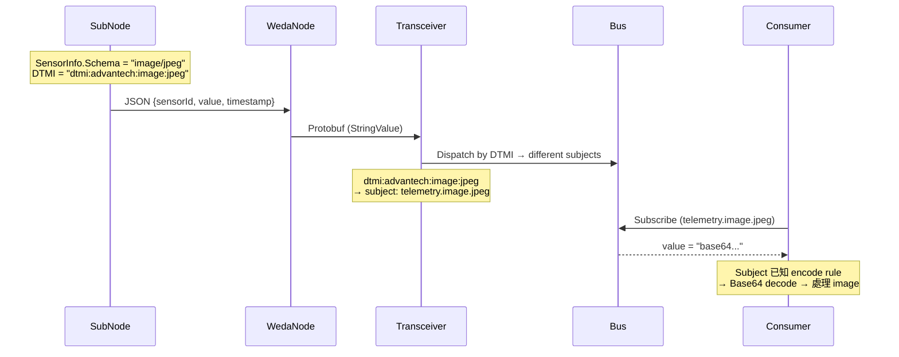
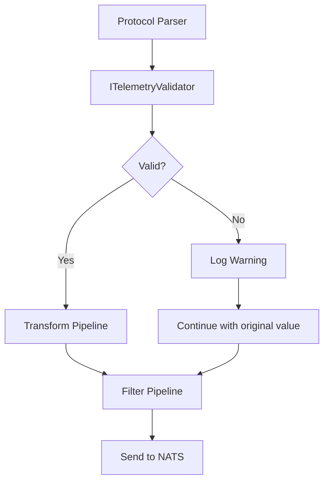
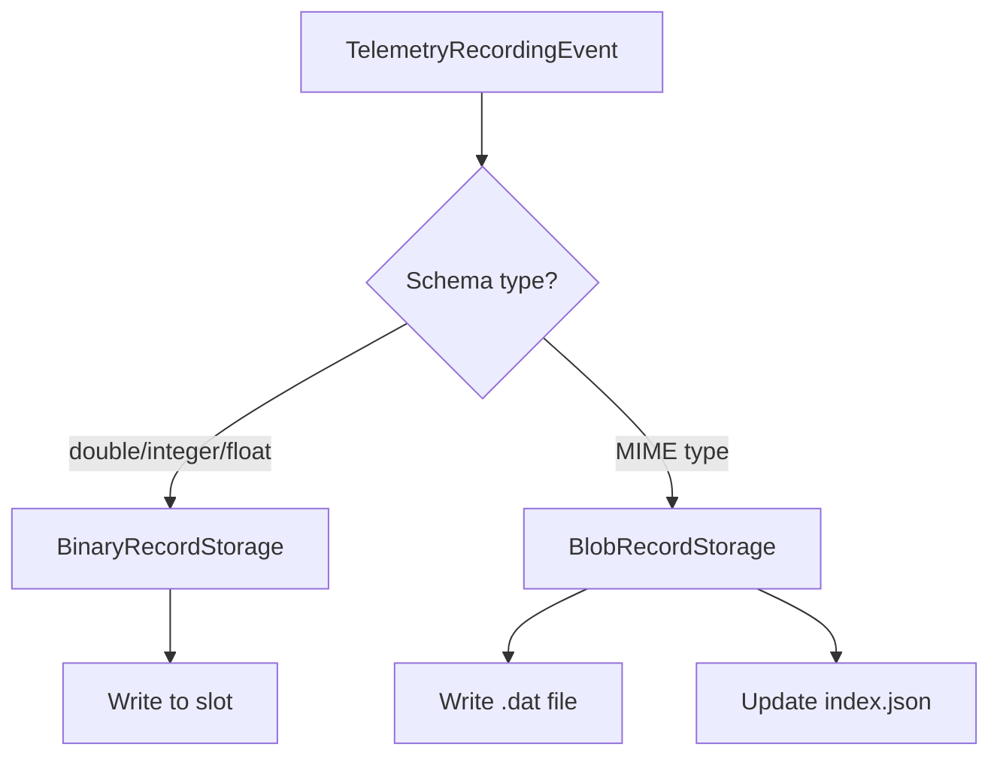
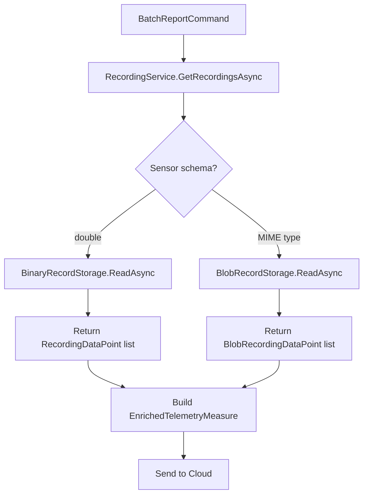

# MimeType Support for SubNode design

## Architecture
**Value polymorphism + Schema-driven + DTDL v2 compliant**

### Data Flow



### DTDL v2 Constraint
DTDL v2 only supports primitive schemas: `boolean`, `date`, `dateTime`, `double`, `duration`, `float`, `integer`, `long`, `string`, `time`

**MIME type (e.g., `"image/jpeg"`) is NOT a valid DTDL schema.**

### Solution: Special DTMI + Skip DTDL Generation

MIME type sensors 使用預定義的特殊 DTMI，後端依 DTMI 識別並做 routing。AutoDtdlGenerator 跳過這些 sensors，不產生 DTDL。

#### Predefined Special DTMIs

| Schema | DTMI | Description |
|--------|------|-------------|
| `application/json` | `dtmi:advantech:app:json` | Embedded JSON data |
| `application/octet-stream` | `dtmi:advantech:app:octet-stream` | Binary data (Base64) |
| `image/png` | `dtmi:advantech:image:png` | PNG image (Base64) |
| `image/jpeg` | `dtmi:advantech:image:jpeg` | JPEG image (Base64) |

#### DTDL Generation Rules

| Sensor Schema | DTDL Generation | Backend Handling |
|---------------|-----------------|------------------|
| `double/integer/float` | 產生 DTDL | 正常 routing |
| `boolean/string` | 產生 DTDL | 正常 routing |
| `image/*` | **跳過** | 依 DTMI 識別，特殊 routing |
| `application/json` | **跳過** | 依 DTMI 識別，特殊 routing |
| `application/*` | **跳過** | 依 DTMI 識別，特殊 routing |

### Wire Format

| SensorInfo.Schema | Value Format |
|-------------------|--------------|
| double/integer/float | JSON number |
| boolean | JSON boolean |
| string | JSON string |
| image/* | Base64 encoded string |
| application/json | JSON string (embedded JSON) |
| application/octet-stream | Base64 encoded string |

### Configuration Validation

**SensorInfo.Schema 為必填欄位**，啟動時驗證：

| 驗證項目 | 規則 | 失敗行為 |
|----------|------|----------|
| Schema 必填 | `Schema` 不可為 null 或空白 | ERROR，拒絕啟動 |
| Schema 格式 | 必須是 DTDL primitive 或合法 MIME type | ERROR，拒絕啟動 |
| DTMI 一致性 | MIME type sensor 若有自訂 DTMI，必須清空 | ERROR，拒絕啟動 |

#### Valid Schema Values

```
// DTDL v2 primitives
boolean, date, dateTime, double, duration, float, integer, long, string, time

// MIME types (pattern: type/subtype)
image/jpeg, image/png, application/json, application/octet-stream, ...
```

#### DTMI Consistency Rule

```
Schema = "image/jpeg" + Dtmi = null                        → OK
Schema = "image/jpeg" + Dtmi = "dtmi:advantech:image:jpeg" → ERROR: 請清空 Dtmi
Schema = "double"     + Dtmi = "dtmi:custom:temp"          → OK (非 MIME type 可自訂)
```

---

## Pain Points (Why we need ITelemetryValidator)

**Q1. `object Value` has no contract with Schema**
- No compile-time safety between Schema and Value type
- Runtime surprises when Value doesn't match expected format

**Q2. Hard to trace errors**
```
Protocol Parser produced wrong data
    ↓
Transform Pipeline pass (no check)
    ↓
Filter Pipeline pass (no check)
    ↓
Serialization fail or garbled output
    ↓
WedaNode received malformed data
```

**Q3. No Fail-Fast mechanism**
- One bad measure can cause batch serialization failure
- Invalid data discovered too late in pipeline

---

## Core Design

### ITelemetryValidator Interface

```csharp
public interface ITelemetryValidator
{
    ValidationResult Validate(TelemetryMeasure measure, Sensor sensor);
}

public record ValidationResult(bool IsValid, string? ErrorMessage = null);
```

### Validation Flow



### Schema-based Validation Strategy

```csharp
public class SchemaBasedValidator : ITelemetryValidator
{
    public ValidationResult Validate(TelemetryMeasure measure, Sensor sensor)
    {
        var schema = sensor.GetEffectiveSchema();

        return schema switch
        {
            "double" or "integer" or "float" => ValidateNumeric(measure.Value),
            "boolean" => ValidateBoolean(measure.Value),
            "string" => ValidateString(measure.Value),
            var s when s.StartsWith("application/json") => ValidateJson(measure.Value),
            var s when s.StartsWith("image/") => ValidateBase64(measure.Value),
            var s when s.StartsWith("application/") => ValidateBase64(measure.Value),
            var s when s.Contains('/') => ValidateMimeTypeSyntax(s) && ValidateBase64(measure.Value),
            _ => ValidationResult.Success
        };
    }
}
```

---

## Implementation Scope (13182)

### Changes Required

| Component | Change | Description |
|-----------|--------|-------------|
| **DtdlGenerator** | Modify | Add `IsMimeType()` check, skip DTDL for MIME type sensors |
| **ITelemetryValidator** | New | Validation interface |
| **SchemaBasedValidator** | New | Validate based on SensorInfo.Schema |
| **TelemetryPipeline** | Modify | Integrate validator, log warnings |

### No Changes Required (SubNode side)

| Component | Reason |
|-----------|--------|
| WedaNode | Base64 string uses existing StringValue |

### Downstream Changes (Out of scope for 13182)

| Component | Change | Description |
|-----------|--------|-------------|
| Transceiver | Dispatch by DTMI | 依據 DTMI 分發到不同 subject |
| Consumer | Subscribe specific subject | 訂閱特定 subject，已知 encode rule |

---

---

## Recording Service Integration

### Problem

Current `RecordingService` only supports `double` values:

```csharp
public readonly record struct RecordingDataPoint(
    long Timestamp,
    double Value  // ← Only supports double!
);
```

The binary slot-based storage (`BinaryRecordStorage`) uses fixed 8-byte slots per timestamp, optimized for numeric telemetry. MIME type data (Base64 strings) cannot fit in this structure.

**Requirement**: MIME type telemetry needs recording for resync (BatchReportCommand).

### Solution: Dual-track Storage (Option A)

Separate storage paths for numeric vs MIME type data:

```
recordings/
├── {sensorId}/                 # double sensors (existing BinaryRecordStorage)
│   ├── 2026-01-29_1000.bin
│   └── 2026-01-30_1000.bin
└── blobs/                      # MIME type sensors (new BlobRecordStorage)
    └── {sensorId}/
        ├── 2026-01-29_1000/
        │   ├── index.json      # [{timestamp, filename, size}]
        │   ├── 1706500000000.dat
        │   └── 1706500001000.dat
        └── ...
```

### Architecture

| Component | Numeric (double) | MIME Type (string) |
|-----------|------------------|-------------------|
| Storage | `BinaryRecordStorage` | `BlobRecordStorage` (new) |
| Data Format | 8-byte slot per interval | Individual files |
| Index | Slot position = timestamp | `index.json` manifest |
| Cleanup | Delete `.bin` files | Delete folder + files |

### Recording Flow



### Resync (BatchReportCommand) Flow



### New Types Required

```csharp
public readonly record struct BlobRecordingDataPoint(
    long Timestamp,
    string Value,      // Base64 encoded data
    string ContentType // MIME type (e.g., "image/jpeg")
);

public interface IBlobRecordStorage
{
    Task WriteAsync(string sensorId, int interval, BlobRecordingDataPoint dataPoint, CancellationToken ct = default);
    Task<IReadOnlyList<BlobRecordingDataPoint>> ReadAsync(string sensorId, int interval, DateTimeOffset start, DateTimeOffset end, CancellationToken ct = default);
    Task CleanupAsync(DateTimeOffset before, CancellationToken ct = default);
    Task DeleteSensorAsync(string sensorId, CancellationToken ct = default);
}
```

### Implementation Scope

> **Note**: Recording Service integration is OUT OF SCOPE for ticket 13182 (validation only). This will be implemented in a separate ticket.

| Component | Change | Scope |
|-----------|--------|-------|
| `IBlobRecordStorage` | New interface | Future ticket |
| `BlobRecordStorage` | New implementation | Future ticket |
| `RecordingService` | Route by schema type | Future ticket |
| `TelemetryRecordingEventHandler` | Support MIME type events | Future ticket |

---

## Summary

| Aspect | Decision |
|--------|----------|
| SensorInfo.Schema | Keep MIME type (e.g., `"image/jpeg"`) for validation |
| DTDL generation | Skip for MIME type sensors (backend routes by DTMI) |
| Value format | Base64 string for binary/image data |
| Validation failure | Log warning, continue processing (don't block) |
| Protocol change | None (still `sensorId + value + timestamp`) |
| Downstream impact | Transceiver dispatch by DTMI → different subjects |
| Recording Storage | Dual-track: BinaryRecordStorage (double) + BlobRecordStorage (MIME) |