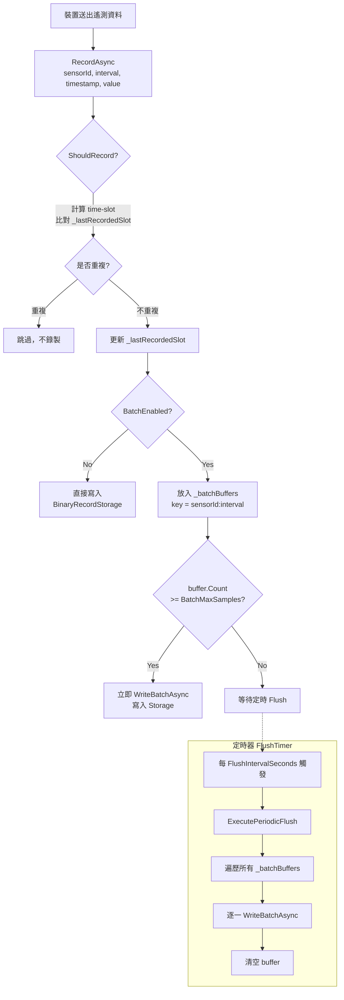
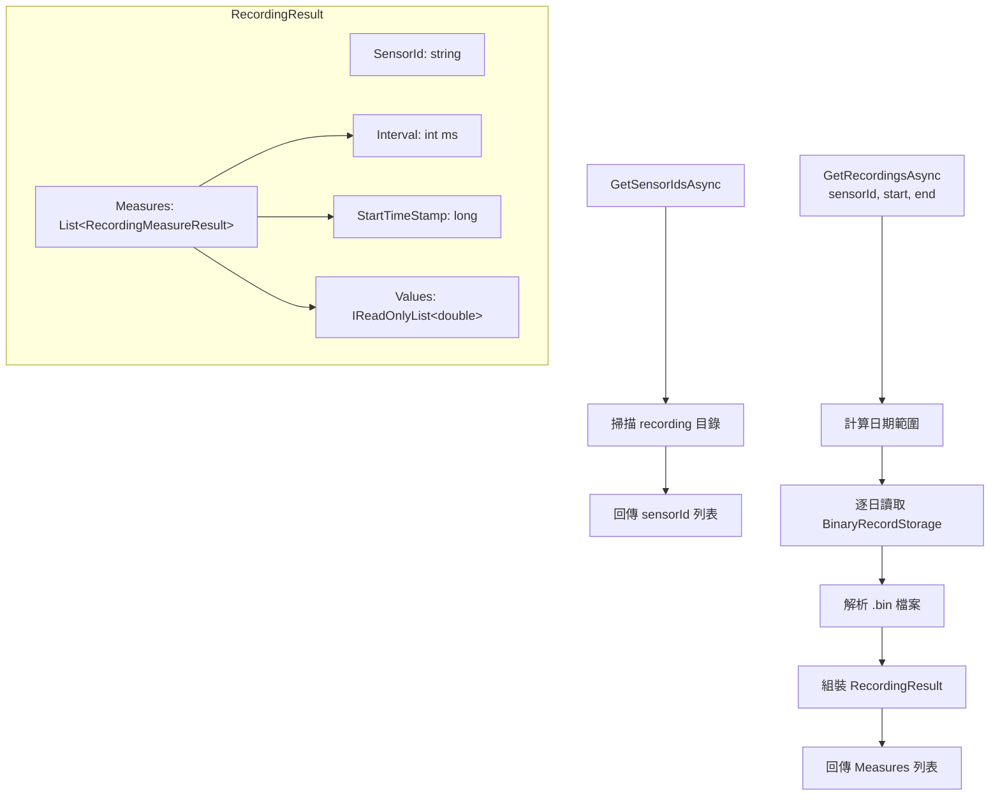
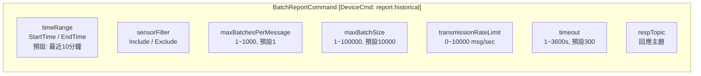
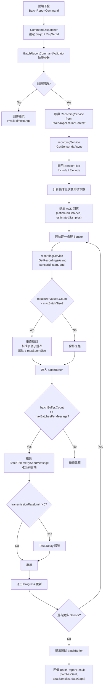
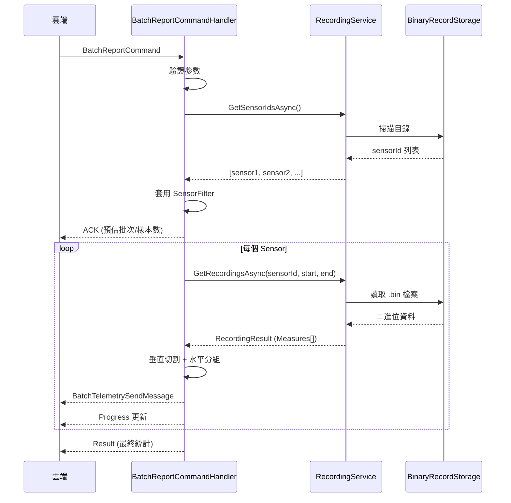

# RecordingService 與 BatchReportCommand 流程

## 1. RecordingService — 資料錄製流程



### 儲存格式

```
.weda/data/recording/
└── {sensorId}/
    ├── 2026-02-01_5000.bin      ← interval=5s 的資料
    ├── 2026-02-01_60000.bin     ← interval=60s 的資料
    └── 2026-02-02_5000.bin
```

---

## 2. RecordingService — 資料查詢流程



---

## 3. BatchReportCommand — 指令結構



---

## 4. BatchReportCommandHandler — 完整執行流程



---

## 5. 回應生命週期



---

## 6. 切割策略說明

### 垂直切割 (Vertical Split)

單一 measure 的 samples 超過 `maxBatchSize` 時，拆成多個子批次：

```
原始 measure: Values = [v0, v1, ..., v24999]  (25000 筆)
maxBatchSize = 10000

切割後:
├── Batch 1: startTs=T0,           Values=[v0 ~ v9999]
├── Batch 2: startTs=T0+10000*interval, Values=[v10000 ~ v19999]
└── Batch 3: startTs=T0+20000*interval, Values=[v20000 ~ v24999]
```

### 水平分組 (Horizontal Split)

多個 measure 累積超過 `maxBatchesPerMessage` 時，分成多則訊息：

```
batchBuffer 中有 5 個 measures，maxBatchesPerMessage = 2

送出:
├── Message 1: measures = [measure1, measure2]
├── Message 2: measures = [measure3, measure4]
└── Message 3: measures = [measure5]
```

---

## 7. 錯誤狀態碼

| Code | 名稱 | 說明 |
|------|------|------|
| 0 | Success | 全部完成 |
| 1 | PartialSuccess | 部分 sensor 有資料缺口 |
| 2 | InvalidTimeRange | 時間範圍無效 |
| 3 | NoDataAvailable | 查無資料 |
| 4 | StorageError | 儲存層讀取錯誤 |
| 5 | Timeout | 超時 (預設 300s) |
| 6 | PermissionDenied | 權限不足 |
| 7 | ResourceExhausted | 資源耗盡 |
