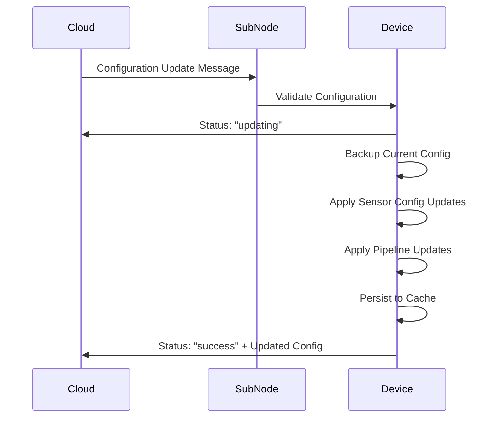

# Advanced Pipeline Configuration Tutorial

本教學示範如何配置和動態更新 Telemetry 處理管道,包含多種 Transform 和 DSP Filter 的組合使用。

## 目錄

1. [概述](#概述)
2. [完整範例設備配置](#完整範例設備配置)
3. [Pipeline 組件說明](#pipeline-組件說明)
4. [動態配置更新](#動態配置更新)
5. [失敗案例測試](#失敗案例測試)
6. [最佳實踐](#最佳實踐)

---

## 概述

### Telemetry 數據流

```
┌─────────────┐    ┌──────────────────┐    ┌────────────────┐    ┌─────────┐
│ Raw Sensor  │───▶│  Transform       │───▶│  DSP Filter    │───▶│  Cloud  │
│   Data      │    │  Pipeline        │    │  Pipeline      │    │         │
└─────────────┘    └──────────────────┘    └────────────────┘    └─────────┘
                    • Calibration           • KalmanFilter
                    • UnitConversion        • MovingAverage
                                            • ReLU
```

### Pipeline 執行順序

1. **Transform Pipeline**: 數據轉換 (校準、單位轉換)
2. **DSP Filter Pipeline**: 信號處理 (濾波、降噪)
3. **Cloud Upload**: 發送到雲端

---

## 完整範例設備配置

以下是一個包含多個 sensor 和複雜 pipeline 配置的完整範例:

```json
{
  "DeviceId": "AdvancedDemo001",
  "DeviceName": "AdvancedSensorHub",
  "SubNodeType": "Custom",
  "Sensors": [
    {
      "Name": "temperature.sensor",
      "ResourceId": "temp",
      "SensorGroup": "Environmental",
      "Config": {
        "Enabled": true,
        "Interval": 1000,
        "Unit": "celsius",
        "Thresholds": {
          "UpperCritical": 80.0,
          "UpperWarning": 60.0,
          "LowerWarning": 0.0,
          "LowerCritical": -10.0
        },
        "TransformPipeline": [
          {
            "Type": "Calibration",
            "Enabled": true,
            "Parameters": {
              "TargetResourceId": "*",
              "Offset": -2.5,
              "Scale": 1.02
            }
          },
          {
            "Type": "UnitConversion",
            "Enabled": true,
            "Parameters": {
              "TargetResourceId": "*",
              "FromUnit": "celsius",
              "ToUnit": "fahrenheit"
            }
          }
        ],
        "DspPipeline": [
          {
            "Type": "KalmanFilter",
            "Enabled": true,
            "Parameters": {
              "ProcessNoise": 0.001,
              "MeasurementNoise": 0.1,
              "InitialEstimate": 25.0,
              "InitialErrorCovariance": 1.0
            }
          },
          {
            "Type": "MovingAverage",
            "Enabled": true,
            "Parameters": {
              "WindowSize": 5
            }
          }
        ]
      }
    },
    {
      "Name": "vibration.sensor",
      "ResourceId": "vib",
      "SensorGroup": "Mechanical",
      "Config": {
        "Enabled": true,
        "Interval": 100,
        "Unit": "mm/s",
        "TransformPipeline": [
          {
            "Type": "Calibration",
            "Enabled": true,
            "Parameters": {
              "TargetResourceId": "*",
              "Offset": 0.0,
              "Scale": 0.98
            }
          }
        ],
        "DspPipeline": [
          {
            "Type": "ReLU",
            "Enabled": true,
            "Parameters": {
              "Threshold": 0.1
            }
          },
          {
            "Type": "MovingAverage",
            "Enabled": true,
            "Parameters": {
              "WindowSize": 10
            }
          }
        ]
      }
    },
    {
      "Name": "pressure.sensor",
      "ResourceId": "press",
      "SensorGroup": "Environmental",
      "Config": {
        "Enabled": true,
        "Interval": 2000,
        "Unit": "kPa",
        "TransformPipeline": [],
        "DspPipeline": [
          {
            "Type": "KalmanFilter",
            "Enabled": true,
            "Parameters": {
              "ProcessNoise": 0.01,
              "MeasurementNoise": 0.5,
              "InitialEstimate": 101.3,
              "InitialErrorCovariance": 1.0
            }
          }
        ]
      }
    }
  ]
}
```

---

## Pipeline 組件說明

### Transform Pipeline

#### 1. Calibration Transform
**用途**: 校準感測器原始數值

**參數**:
- `TargetResourceId`: 目標資源 ID (`"*"` 表示全部)
- `Offset`: 偏移量 (加法)
- `Scale`: 縮放比例 (乘法)

**公式**: `output = (input + Offset) × Scale`

**範例**:
```json
{
  "Type": "Calibration",
  "Enabled": true,
  "Parameters": {
    "TargetResourceId": "*",
    "Offset": -2.5,    // 先減去 2.5
    "Scale": 1.02      // 再乘以 1.02
  }
}
```

#### 2. UnitConversion Transform
**用途**: 單位轉換

**參數**:
- `TargetResourceId`: 目標資源 ID
- `FromUnit`: 來源單位
- `ToUnit`: 目標單位

**支援的單位**:
- 溫度: `celsius`, `fahrenheit`, `kelvin`
- 壓力: `pa`, `kpa`, `bar`, `psi`
- 長度: `meter`, `foot`, `inch`
- 其他單位: pass-through (無轉換)

**範例**:
```json
{
  "Type": "UnitConversion",
  "Enabled": true,
  "Parameters": {
    "TargetResourceId": "*",
    "FromUnit": "celsius",
    "ToUnit": "fahrenheit"
  }
}
```

---

### DSP Filter Pipeline

#### 1. KalmanFilter
**用途**: 卡爾曼濾波器 - 最佳估計,適合有雜訊的量測

**參數**:
- `ProcessNoise`: 過程噪音 (系統動態模型的不確定性)
- `MeasurementNoise`: 量測噪音 (感測器的量測誤差)
- `InitialEstimate`: 初始估計值
- `InitialErrorCovariance`: 初始誤差協方差

**特性**:
- 維護內部狀態 (估計值和誤差協方差)
- 自適應調整濾波強度
- 適合追蹤緩慢變化的信號

**調參建議**:
- `ProcessNoise` 小 → 信任模型預測 → 反應慢但穩定
- `MeasurementNoise` 小 → 信任量測值 → 反應快但易受雜訊影響
- 典型比例: `ProcessNoise : MeasurementNoise = 1:100`

**範例**:
```json
{
  "Type": "KalmanFilter",
  "Enabled": true,
  "Parameters": {
    "ProcessNoise": 0.001,           // 系統噪音小 (模型準確)
    "MeasurementNoise": 0.1,         // 量測噪音大 (感測器不準)
    "InitialEstimate": 25.0,         // 初始溫度估計 25°C
    "InitialErrorCovariance": 1.0    // 初始誤差 1.0
  }
}
```

#### 2. MovingAverage Filter
**用途**: 移動平均濾波器 - 平滑化數據

**參數**:
- `WindowSize`: 滑動窗口大小 (N 個樣本)

**特性**:
- 簡單有效的低通濾波器
- 延遲 = WindowSize / 2
- WindowSize 越大 → 越平滑但延遲越大

**範例**:
```json
{
  "Type": "MovingAverage",
  "Enabled": true,
  "Parameters": {
    "WindowSize": 5    // 平均最近 5 個樣本
  }
}
```

#### 3. ReLU Filter
**用途**: 修正線性單元 - 去除小於閾值的雜訊

**參數**:
- `Threshold`: 閾值 (小於此值會被設為 0)

**特性**:
- 適合去除微小震動/雜訊
- 可能會丟失小信號

**範例**:
```json
{
  "Type": "ReLU",
  "Enabled": true,
  "Parameters": {
    "Threshold": 0.1    // 小於 0.1 的值會被過濾為 0
  }
}
```

---

## 動態配置更新

### 更新流程



### NATS 訊息格式

所有配置更新都通過 NATS 主題發送:
```
Subject: eco1j.weda.dm.config.{deviceId}.req
```

訊息結構:
```json
{
  "deviceId": "AdvancedDemo001",
  "groupId": "",
  "cmd": "updateCmd",
  "seqId": 1,
  "reqSeqId": "update-001",
  "timestamp": 0,
  "data": {
    "cfg": {
      "desired": {
        "subNodeDeviceConfig": {
          "deviceConfigs": {
            "{SubNodeTypeName}": {
              "deviceName": "AdvancedSensorHub",
              "sensors": [ /* sensor configs */ ]
            }
          }
        }
      }
    }
  }
}
```

---

## 失敗案例測試

詳細的測試腳本請參考: [test-pipeline-failures.sh](../../examples/testdevice/test-pipeline-failures.sh)

### 測試案例 1: Transform 參數驗證失敗

**錯誤**: UnitConversion 缺少 `FromUnit` 參數

```json
{
  "Type": "UnitConversion",
  "Enabled": true,
  "Parameters": {
    "TargetResourceId": "*",
    "ToUnit": "fahrenheit"
    // 缺少 "FromUnit"
  }
}
```

**預期結果**:
- Status: `"failed"`
- ErrorMessage: `"Transform at index 0: FromUnit parameter is required"`
- 配置 rollback 到更新前狀態

---

### 測試案例 2: DSP Filter 參數驗證失敗

**錯誤**: KalmanFilter 的 `ProcessNoise` 為負數

```json
{
  "Type": "KalmanFilter",
  "Enabled": true,
  "Parameters": {
    "ProcessNoise": -0.001,      // ❌ 不能為負數
    "MeasurementNoise": 0.1,
    "InitialEstimate": 25.0,
    "InitialErrorCovariance": 1.0
  }
}
```

**預期結果**:
- Status: `"failed"`
- ErrorMessage: `"DSP filter at index 0: ProcessNoise must be positive"`
- 配置 rollback 到更新前狀態

---

### 測試案例 3: Transform 類型不匹配

**錯誤**: 嘗試將 `Calibration` 改成 `UnitConversion`

原始配置:
```json
{
  "Type": "Calibration",
  "Enabled": true,
  "Parameters": { "Offset": -2.5, "Scale": 1.02 }
}
```

更新配置:
```json
{
  "Type": "UnitConversion",    // ❌ 類型不同
  "Enabled": true,
  "Parameters": { "FromUnit": "celsius", "ToUnit": "fahrenheit" }
}
```

**預期結果**:
- Transform 被跳過 (skipped)
- Log: `"Config transform at index 0: type mismatch (Calibration vs UnitConversion)"`
- 需要重建 pipeline (不支援動態更新)

---

### 測試案例 4: 多個 Sensor 部分失敗

**場景**: 更新 3 個 sensor,其中 sensor2 驗證失敗

```json
{
  "sensors": [
    {
      "name": "temperature.sensor",
      "config": {
        "transformPipeline": [
          { "Type": "Calibration", "Enabled": true, "Parameters": {...} }  // ✅ 成功
        ]
      }
    },
    {
      "name": "vibration.sensor",
      "config": {
        "dspPipeline": [
          { "Type": "KalmanFilter", "Enabled": true, "Parameters": { "ProcessNoise": -0.1 } }  // ❌ 失敗
        ]
      }
    },
    {
      "name": "pressure.sensor",
      "config": {
        "transformPipeline": [
          { "Type": "UnitConversion", "Enabled": true, "Parameters": {...} }  // 不會執行
        ]
      }
    }
  ]
}
```

**預期結果**:
- 整個更新被 rollback (atomic 操作)
- 所有 3 個 sensor 的配置都保持不變
- Status: `"failed"`
- ErrorMessage: `"Sensor 'vibration.sensor': DSP filter at index 0: ProcessNoise must be positive"`

---

### 測試案例 5: 超出有效範圍

**錯誤**: MovingAverage 的 `WindowSize` 超出範圍

```json
{
  "Type": "MovingAverage",
  "Enabled": true,
  "Parameters": {
    "WindowSize": 1000    // ❌ 過大 (最大通常為 100)
  }
}
```

**預期結果**:
- Status: `"failed"`
- ErrorMessage: `"DSP filter at index 0: WindowSize must be between 2 and 100"`
- 配置 rollback

---

## 最佳實踐

### 1. Pipeline 設計原則

✅ **DO**:
- 將 Calibration 放在 Transform Pipeline 的最前面
- 將 UnitConversion 放在 Calibration 之後
- DSP Filter 順序: 先降噪 (KalmanFilter) → 再平滑 (MovingAverage)
- 為高頻 sensor 使用較小的 WindowSize
- 為低頻 sensor 使用較大的 WindowSize

❌ **DON'T**:
- 不要在 Transform Pipeline 中放置相同類型的多個 transform
- 不要使用過大的 MovingAverage WindowSize (延遲過大)
- 不要同時啟用過多 DSP Filter (性能影響)

### 2. 參數調優策略

**KalmanFilter 調參**:
```
1. 初始設定: ProcessNoise=0.001, MeasurementNoise=0.1
2. 觀察數據:
   - 如果追蹤太慢 → 增大 ProcessNoise 或減小 MeasurementNoise
   - 如果雜訊太多 → 減小 ProcessNoise 或增大 MeasurementNoise
3. 微調: 以 10 倍為單位調整
```

**MovingAverage 調參**:
```
1. 根據採樣頻率決定:
   - 1Hz   → WindowSize: 3-5
   - 10Hz  → WindowSize: 5-10
   - 100Hz → WindowSize: 10-20
2. 權衡: 平滑度 vs 延遲
```

### 3. 動態更新注意事項

✅ **支援動態更新**:
- ✅ Transform/Filter 的 `Enabled` 狀態
- ✅ Transform/Filter 的 `Parameters`
- ✅ Sensor 的 `Enabled`, `Interval`, `Unit`, `Thresholds`

❌ **不支援動態更新** (需要重啟):
- ❌ Transform/Filter 的類型 (Type) 變更
- ❌ Transform/Filter 的數量增減
- ❌ Transform/Filter 的順序調整
- ❌ Sensor 的新增或刪除

### 4. 錯誤處理

所有配置更新都是 **原子性操作** (atomic):
- 驗證失敗 → 整個更新被拒絕
- 應用失敗 → 自動 rollback 到更新前狀態
- 部分失敗 → 整個更新都會 rollback

### 5. 監控建議

啟用 ValueChanged 事件來監控 pipeline:
```csharp
device.EnableValueChangeTracking = true;
device.ValueChanged += (s, e) =>
{
    Console.WriteLine($"[{e.StageName}] {e.Stage}");
    Console.WriteLine($"  Input:  [{string.Join(", ", e.InputValues)}]");
    Console.WriteLine($"  Output: [{string.Join(", ", e.OutputValues)}]");
    Console.WriteLine($"  Changed: {e.ValuesChanged}");
};
```

輸出範例:
```
[Calibration] Transform
  Input:  [25.0]
  Output: [22.95]
  Changed: True

[UnitConversion] Transform
  Input:  [22.95]
  Output: [73.31]
  Changed: True

[KalmanFilter] Filter
  Input:  [73.31]
  Output: [73.28]
  Changed: True

[MovingAverage] Filter
  Input:  [73.28]
  Output: [73.25]
  Changed: True
```

---

## 完整測試腳本

請參考以下測試腳本進行實際測試:
- [test-pipeline-success.sh](../../examples/testdevice/test-pipeline-success.sh) - 成功案例
- [test-pipeline-failures.sh](../../examples/testdevice/test-pipeline-failures.sh) - 失敗案例

執行測試:
```bash
cd examples/testdevice
./test-pipeline-failures.sh
```

---

## 參考資料

- [Transform 和 DSP Filter 事件監控](../wiki/zh/03_advanced/telemetry_event_hooks.md)
- [Configuration Update 系統設計](../wiki/zh/02_use_cases/02_transformation_dspfilter.md)