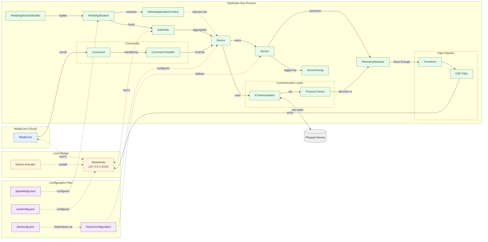

# Terminology

> Key terms and concepts used in SubNode SDK documentation.

## Overview

This article compiles key terms and concepts used in SubNode SDK documentation. It serves as a quick reference to help developers understand the SDK's core vocabulary.

## What You'll Learn

After reading this article, you will be able to:

- Understand the relationship between SubNode, WedaCore, and WedaNode
- Master core data structures like Device, Sensor, and TelemetryMeasure
- Understand terminology related to communication and data processing layers
- Familiarize yourself with key concepts of configuration files and application hosting

---

## SubNode Project at a Glance

**SubNode SDK** is a .NET-based framework for building edge device applications that bridge physical devices to the **WedaCore** cloud platform. A SubNode application acts as the aggregation root that owns one or more `Device` instances; each device exposes one or more `Sensor` data points whose readings are emitted as `TelemetryMeasure` records, flow through a configurable `Data Pipeline` (Transforms + DSP Filters), and are published over NATS through the local `WedaNode` broker to the cloud.

The SDK is organized around three main concerns:

- **Connectivity** - `ICommunication` abstractions (Request/Response, Pub/Sub, Streaming) plus `Protocol Parser` implementations decouple wire protocols from device logic.
- **Data Processing** - A composable pipeline of `Transform` and `DSP Filter` stages shape raw values into clean telemetry.
- **Hosting & Configuration** - `WedaApplication` + `WedaApplicationBuilder` provide a .NET Generic Host wrapper; behaviour is driven by `devicecfg.json`, `systemcfg.json`, and `appsettings.json`.

The end-to-end story: **WedaCore** (cloud) <- NATS -> **WedaNode** (local broker, set up by **Device Activator**) <- NATS -> **SubNode** (your application) -> physical devices.

## Terminology Quick Reference

| Category | Term | Role | Lives In |
|----------|------|------|----------|
| Platform | **SubNode** | Edge application; aggregation root for devices | Your process |
| Platform | **WedaCore** | Cloud platform (twins, telemetry, commands) | Cloud |
| Platform | **WedaNode** | Local NATS broker bridging SubNode <-> WedaCore | `127.0.0.1:4224` |
| Platform | **Device Activator** | GUI wizard that installs/configures WedaNode | Host machine |
| Device | **Device** | Abstraction of a physical device or data source | `IDevice` / `DeviceBase` |
| Device | **Sensor** | A data point owned by a Device | `Sensors[]` in cfg |
| Device | **TelemetryMeasure** | Single reading (ResourceId, Value, Timestamp) | Runtime |
| Device | **SensorGroup** | Category tag: AI, AO, DI, DO, SYS, TEMP, PWR | Sensor metadata |
| Communication | **ICommunication** | Transmission contract between SubNode and device | SDK interface |
| Communication | **Protocol Parser** | Encode commands / decode raw bytes -> `TelemetryMeasure` | SDK component |
| Processing | **Data Pipeline** | Stage chain: Raw -> Transforms -> DSP -> Final | Per-sensor |
| Processing | **Transform** | Value modification (calibration, unit conv., chunking) | `Report.Transforms` |
| Processing | **DSP Filter** | Signal processing (Kalman, MovingAverage, ReLU) | `Report.DspFilters` |
| Commands | **Command** | Remote operation request from WedaCore | NATS message |
| Commands | **Command Handler** | `ICommandHandler<TCmd,TResult>` implementation | Device code |
| Configuration | **DeviceConfiguration** | Runtime view of a device's settings | In-memory |
| Configuration | **devicecfg.json** | Devices, sensors, communication, reports | Project root |
| Configuration | **systemcfg.json** | WedaNode URL, auth strategy, credentials | Project root |
| Configuration | **appsettings.json** | .NET / Serilog runtime settings | Project root |
| Hosting | **WedaApplication** | Main application host | Entry point |
| Hosting | **WedaApplicationBuilder** | Fluent API to register devices and cloud | `Program.cs` |
| Hosting | **IWedaApplicationContext** | App-wide services injected into devices | DI container |

---

## Core Concepts

### SubNode

**SubNode** is an edge device application built using SubNode SDK. It represents a logical grouping of one or more devices that communicates with the WedaCore cloud platform. Each SubNode has:

- Unique identifier (`SubNodeId`)
- Metadata (name, type, manufacturer, model, version)
- One or more Device instances

### WedaCore

**WedaCore** is the cloud platform that SubNode applications connect to. It provides:

- Digital twin management
- Telemetry data storage and visualization
- Remote command execution
- Configuration management
- Device monitoring and alerting

### WedaNode

**WedaNode** is a local NATS broker service installed by Device Activator. It runs on `127.0.0.1:4224` by default and serves as a bridge between SubNode applications and WedaCore.

```
┌──────────────┐          ┌───────────────────┐          ┌──────────────┐
│   SubNode    │◀──NATS──▶│      WedaNode     │◀──NATS──▶│   WedaCore   │
│ Application  │          │ (127.0.0.1:4224)  │          │   (Cloud)    │
└──────────────┘          └───────────────────┘          └──────────────┘
```

### Device Activator

**Device Activator** is a GUI installation wizard that:

- Installs and configures WedaNode
- Manages device credentials and certificates
- Handles system service registration

## Device Components

### Device

**Device** represents an abstraction of a physical device or data source. In code, devices implement the `IDevice` interface or inherit from `DeviceBase`. A SubNode application can contain multiple devices.

Device type examples:
- `TcpModbusDevice` - Modbus TCP device
- `MqttDevice` - MQTT device
- `AggregatorDevice` - Aggregates data from multiple devices
- Custom device classes for specific protocols

### Sensor

**Sensor** is a data point within a device. Each sensor has:

| Property | Description |
|----------|-------------|
| `ResourceId` | Unique identifier (UUID, auto-generated) |
| `Name` | Human-readable name (e.g., `temperature_sensor1`), must comply with IoT DB naming rules |
| `SensorGroup` | Category: AI, DO, DI, SYS, TEMP, PWR |
| `Parameters` | Protocol-specific settings (register addresses, etc.) |
| `Report` | Telemetry configuration |
| `Record` | Local storage configuration |
| `SensorInfo` | Schema and display metadata |

### TelemetryMeasure

**TelemetryMeasure** is a single data reading from a sensor:

```csharp
public record TelemetryMeasure
{
    public string ResourceId { get; }    // Sensor identifier
    public object Value { get; }          // Measured value
    public long Timestamp { get; }        // Unix timestamp (milliseconds)
    public IReadOnlyDictionary<string, object>? Metadata { get; }
}
```

### SensorGroup

Sensors are grouped by category:

| Group | Description | Examples |
|-------|-------------|----------|
| `AI` | Analog Input | Voltage, current, temperature sensors |
| `AO` | Analog Output | Variable output control |
| `DI` | Digital Input | Switches, buttons, contact sensors |
| `DO` | Digital Output | Relays, LEDs, actuators |
| `SYS` | System | CPU usage, memory, health metrics |
| `TEMP` | Temperature | Temperature sensors |
| `PWR` | Power | Power consumption, power meters |

## Communication

### ICommunication

Interface defining data transmission between SubNode and physical devices. Supports three modes:

| Mode | Interface | Use Cases |
|------|-----------|-----------|
| Request/Response | `IRequestResponseCommunication` | Modbus, HTTP |
| Publish/Subscribe | `IPubSubCommunication` | MQTT, NATS |
| Streaming | `IStreamingCommunication` | WebSocket, gRPC |

### Protocol Parser

**Protocol Parser** converts between raw protocol data and `TelemetryMeasure` objects. It handles:

- Encoding commands for devices
- Decoding responses to telemetry
- Data type interpretation (registers to values)

Built-in Parsers:
- `ModbusProtocolParser` - Modbus registers
- `ISensingProtocolParser` - Advantech ISensing format
- `ImageProtocolParser` - Binary image data

## Data Processing

### Data Pipeline

**Data Pipeline** is a sequence of processing stages that telemetry data flows through:

```
Raw Value ──▶ Transforms ──▶ DSP Filters ──▶ Final Value
```

### Transform

**Transform** modifies telemetry values. Configured per sensor in the `Report.Transforms` array.

| Transform | Type Name | Purpose |
|-----------|-----------|---------|
| Calibration | `calibration` | Apply Scale and Offset |
| Unit Conversion | `unitconversion` | Convert units |
| Chunking | `chunking` | Batch data points, used in low-bandwidth scenarios to split data points |

Configuration example:
```json
{
  "Transforms": [
    {
      "Type": "calibration",
      "Enabled": true,
      "Parameters": {
        "Scale": 0.1,
        "Offset": 10.0
      }
    }
  ]
}
```

### DSP Filter

**DSP (Digital Signal Processing) Filter** performs signal processing on telemetry data.

Built-in DSP Filters:

| Filter | Type Name | Purpose | Use Cases |
|--------|-----------|---------|-----------|
| Kalman Filter | `kalman` | Noise reduction, true value estimation | Temperature/humidity sensor jitter, analog signal noise |
| Moving Average | `movingaverage` | Sliding average smoothing | Voltage/current fluctuations, short-term trend analysis |
| ReLU | `relu` | Clamp negative values to zero | Force zero when power calculations yield negative values |

## Commands and Configuration

### Command

**Command** is a remote operation request sent from WedaCore to a device. Commands have:

- `DeviceCmd` - Command identifier (e.g., `set.do`, `report.data`)
- `Parameters` - Command-specific data
- `Timeout` - Maximum execution time

### Command Handler

**Command Handler** processes incoming commands and returns results. Implement `ICommandHandler<TCommand, TResult>` to customize commands.

### DeviceConfiguration

**DeviceConfiguration** is the runtime representation of device settings, loaded from `devicecfg.json`. It contains:

- Device metadata (name, enabled state)
- Communication settings (host, port, credentials)
- Sensor definitions
- Reporting periods

## Configuration Files

### devicecfg.json

Main configuration file defining devices and sensors:

```json
{
  "SubNode": {
    "Name": "MySubNode",
    "SubNodeType": "CustomDevice"
  },
  "DeviceConfigs": {
    "DeviceName": {
      "Enabled": true,
      "DeviceCommunication": { ... },
      "Sensors": [ ... ]
    }
  }
}
```

### systemcfg.json

System-level settings for NATS connection and cloud configuration:

```json
{
  "WedaNode": {
    "Url": "127.0.0.1:4224",
    "AuthStrategy": "UserPassword",
    "Username": "user",
    "Password": "password"
  }
}
```

### appsettings.json

Standard .NET configuration for logging (Serilog) and other runtime settings.

## Application Hosting

### WedaApplication

Main application host that manages device lifecycle:

```csharp
var builder = WedaApplication.CreateDefaultBuilder(args);
builder.AddDevice<MyDevice>("ConfigKey");
var app = builder.Build();
await app.RunAsync();
```

### WedaApplicationBuilder

Fluent API for configuring and building `WedaApplication`:

- `AddDevice<T>()` - Register device type
- `UseCloud()` / `UseMockCloud()` - Configure cloud connection
- `Build()` - Create application instance

### IWedaApplicationContext

Provides access to application-wide services and configuration in device implementations:

- Service Provider (DI container)
- Configuration Root
- Cloud Service
- Logging

## Concept Relationship Graph

The diagram below maps the terms above into a graph-RAG-style mindset chart. Solid arrows mean *contains / produces*, dashed arrows mean *configures / describes*, and dotted arrows mean *crosses a process or network boundary*.



**How to read it:**

- The **green cluster** is everything that lives in your `dotnet run` process. `WedaApplicationBuilder` builds the `WedaApplication`, which hosts a `SubNode` that aggregates `Device` instances.
- Each `Device` owns one or more `Sensor` objects (tagged by `SensorGroup`), which emit `TelemetryMeasure` records that travel through the `Data Pipeline` (Transform -> DSP Filter) before being published.
- The **orange bridge** is `WedaNode` - a local NATS broker installed by `Device Activator`. All traffic between SubNode and the **blue cloud** (`WedaCore`) hops through it.
- The **purple cluster** is the configuration plane. JSON files on disk are materialized into `DeviceConfiguration` and the system / hosting settings that drive the runtime.
- Commands flow the opposite direction of telemetry: `WedaCore` -> `WedaNode` -> `SubNode` -> `Command Handler` -> `Device`.

## Summary

- SubNode is the aggregation root of edge applications, managing multiple Devices
- WedaCore is the cloud platform, WedaNode is the local NATS broker
- Device represents physical device abstraction, Sensor is a data point within a device
- Data Pipeline includes Transform and DSP Filter processing stages
- Three configuration files: devicecfg.json (device), systemcfg.json (system), appsettings.json (logging)

## See Also

- [Architecture Overview](./02-architecture.md) - System design and data flow
- [Configuration Examples](../04-configuration/03-configuration-examples.md) - Detailed configuration options
- [Custom Device](../09-customization/01-custom-device.md) - Building custom devices

---

## Change History

| Version | Date | Author | Changes |
|---------|------|--------|---------|
| 1.0.0 | 2026-03-23 | Rain Hu | Doc created. |
| 1.1.0 | 2026-06-04 | Rain Hu | Added project summary, quick-reference table, and concept relationship graph. |
