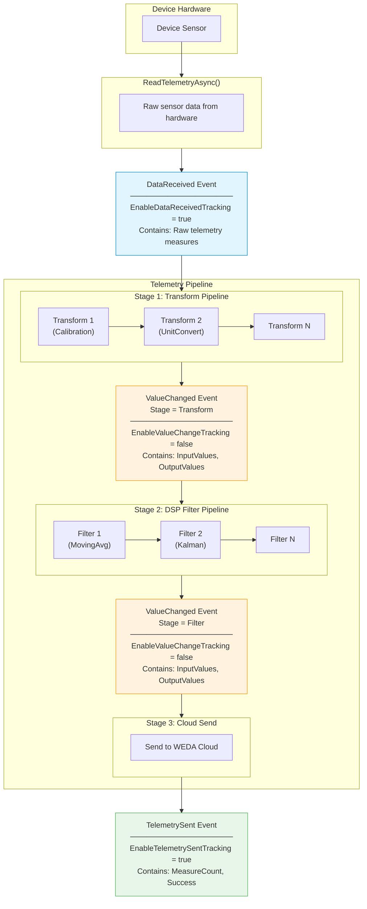
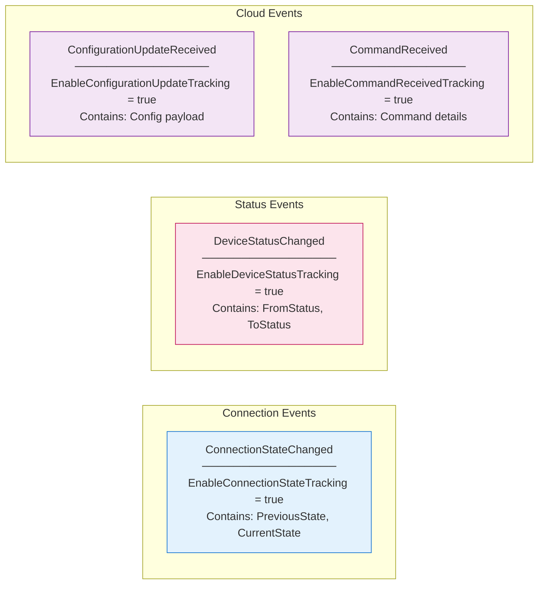

# Telemetry Event Hooks

This document describes the event hooks available in the telemetry data flow pipeline, allowing you to monitor and debug data transformations at each stage.

## Data Flow Overview



## Other Device Events



## Event Summary Table

| Event | Enable Flag | Default | Description |
|-------|-------------|---------|-------------|
| `DataReceived` | `EnableDataReceivedTracking` | `false` | Raw telemetry data from device |
| `ValueChanged` | `EnableValueChangeTracking` | `false` | Per-stage transform/filter values |
| `TelemetrySent` | `EnableTelemetrySentTracking` | `false` | Cloud send result |
| `ConnectionStateChanged` | `EnableConnectionStateTracking` | `false` | Device connection changes |
| `DeviceStatusChanged` | `EnableDeviceStatusTracking` | `false` | Device lifecycle status |
| `ConfigurationUpdateReceived` | `EnableConfigurationUpdateTracking` | `false` | Cloud config updates |
| `CommandReceived` | `EnableCommandReceivedTracking` | `false` | Cloud command execution |

> **Note:** All tracking flags default to `false` for better performance. Enable only the events you need.

## Usage Example

```csharp
public class MyDevice : TcpModbusDevice
{
    public MyDevice(IWedaApplicationContext context, DeviceConfiguration config)
        : base(context, config)
    {
        // Enable and subscribe to events you need
        EnableDataReceivedTracking = true;
        DataReceived += OnDataReceived;

        EnableValueChangeTracking = true;
        ValueChanged += OnValueChanged;

        EnableTelemetrySentTracking = true;
        TelemetrySent += OnTelemetrySent;

        // Optionally disable events you don't need
        // EnableConnectionStateTracking = false;
    }

    private void OnDataReceived(object? sender, DataReceivedEvent e)
    {
        _logger.LogInformation("Raw data: {Count} measures", e.Data.Count);
        foreach (var m in e.Data)
        {
            _logger.LogDebug("  {ResourceId}: {Value}", m.ResourceId, m.Value);
        }
    }

    private void OnValueChanged(object? sender, TelemetryValueChangedEvent e)
    {
        var stageType = e.Stage == ValueChangeStage.Transform ? "Transform" : "Filter";

        _logger.LogDebug(
            "[{StageType}] {StageName} (#{Index}): {In} -> {Out} values ({Duration:F2}ms)",
            stageType, e.StageName, e.StageIndex,
            e.InputValues.Count, e.OutputValues.Count,
            e.Duration?.TotalMilliseconds ?? 0);

        // Log individual value changes
        if (e.ValuesChanged)
        {
            for (int i = 0; i < Math.Max(e.InputValues.Count, e.OutputValues.Count); i++)
            {
                var input = i < e.InputValues.Count ? e.InputValues[i].Value?.ToString() : "(none)";
                var output = i < e.OutputValues.Count ? e.OutputValues[i].Value?.ToString() : "(filtered)";

                if (input != output)
                    _logger.LogDebug("  [{Index}] {Input} -> {Output}", i, input, output);
            }
        }
    }

    private void OnTelemetrySent(object? sender, TelemetrySentEvent e)
    {
        _logger.LogInformation("Sent {Count} measures, Success={Success}",
            e.MeasureCount, e.Success);
    }
}
```

## TelemetryValueChangedEvent Properties

| Property | Type | Description |
|----------|------|-------------|
| `DeviceId` | `string` | Device identifier |
| `ResourceId` | `string` | Sensor/resource identifier |
| `StageName` | `string` | Name of transform or filter |
| `Stage` | `ValueChangeStage` | `Transform` or `Filter` |
| `StageIndex` | `int` | Index in pipeline (0-based) |
| `InputValues` | `IReadOnlyList<TelemetryMeasure>` | Values before processing |
| `OutputValues` | `IReadOnlyList<TelemetryMeasure>` | Values after processing |
| `Duration` | `TimeSpan?` | Processing duration |
| `ValuesChanged` | `bool` | Whether values were modified |
| `CountDelta` | `int` | Output count - Input count |
| `Timestamp` | `DateTimeOffset` | Event timestamp |

## Performance Considerations

- **EnableValueChangeTracking** is `false` by default because it creates copies of telemetry data at each pipeline stage
- Enable only during debugging or when detailed monitoring is required
- In production, consider disabling events you don't need to reduce overhead