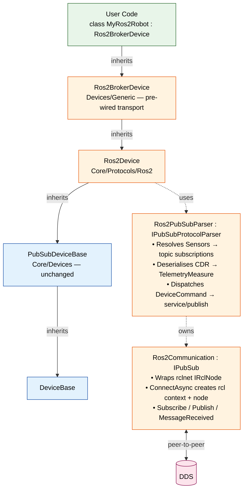
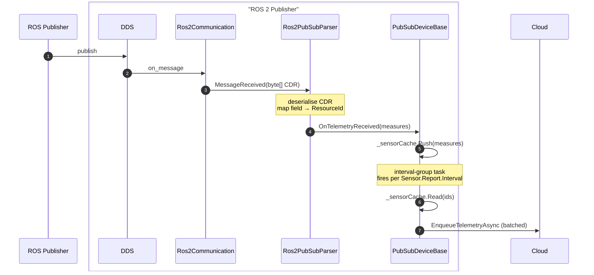

# ROS 2 Bridge — Architecturec

> Three new components plug into existing SDK extension points. No core framework changes.
 
## Layered View

The bridge inherits the layering used by the existing `MqttISensingDevice` (`src/Weda.SubNode.Devices/Generic/MqttISensingDevice.cs`) and `TcpOpcUaPubSubDevice` (`src/Weda.SubNode.Devices/Generic/TcpOpcUaPubSubDevice.cs`). Each layer owns one responsibility: 



This is the same shape as `ISensingDevice → ISensingPubSubParser → MqttCommunication`. Anyone already familiar with the MQTT/ISensing path can read the ROS 2 bridge with no new mental model.

## Components

### `Ros2Communication : IPubSub`

**Location:** `src/Weda.SubNode.Core/Communication/Ros2/Ros2Communication.cs` (new)

**Owns:** ROS 2 node lifecycle, subscriptions, raw CDR byte streams.

| Member | Behaviour |
|--------|-----------|
| `ConnectAsync` | Create `RclContext` with `ROS_DOMAIN_ID`, create `IRclNode` with configured node name. |
| `DisconnectAsync` | Dispose all live subscriptions, dispose node, dispose context. |
| `SubscribeAsync(topic, ct)` | Resolve message type from registry, create rclnet typed subscription, register byte-emitting callback. |
| `PublishAsync(topic, payload, ct)` | Resolve message type, deserialise CDR from `byte[]`, publish via rclnet typed publisher. |
| `MessageReceived` | Raised with `MessageReceivedEvent<byte[]>` carrying topic + serialised CDR payload. |
| `StateChanged` | Raised on node liveliness loss (DDS QoS event). |

**Why `byte[]` payload?** Matches `MqttCommunication` and the non-generic `IPubSub` interface, so the framework can stay protocol-agnostic. CDR↔object conversion stays inside the parser layer where the schema lookup lives — see [Type Registry](#type-registry) below.

### Type Registry

The bridge does not hand-roll CDR codecs. ROS 2 IDL (`.msg` / `.srv`) is the authoritative schema; the registry is the seam that turns IDL into runnable .NET code.

**Contract:**

```csharp
public interface IRos2TypeRegistry
{
    bool TryGetMessageCodec(string ros2TypeName, out IMessageCodec codec);
    bool TryGetServiceCodec(string ros2TypeName, out IServiceCodec codec);
}

public interface IMessageCodec
{
    Type ClrType { get; }                                      // generated POCO
    object Deserialize(ReadOnlySpan<byte> cdr);
    byte[] Serialize(object message);
    bool TryResolveField(string fieldPath, out FieldDescriptor field);
}

public readonly record struct FieldDescriptor(
    string Path, Type ClrType, bool IsPrimitive, bool IsArray);
```

**Three implementations**, selected by transport + config:

| Registry | Source of codecs | When used | Trade-off |
|---|---|---|---|
| `GeneratedTypeRegistry` | Assemblies produced by `rosidl_typesupport_dotnet` at `dotnet build` time. Discovered via `[Ros2Message("sensor_msgs/msg/BatteryState")]` attributes. | **Default.** All message types declared in `Ros2MessagePackage` MSBuild items. | Compile-time type safety, fastest deserialise. New types require a build/redeploy. |
| `DynamicTypeRegistry` | `librosidl_dynamic_typesupport_c` P/Invoke; reads IDL metadata from the on-host ROS install at startup. | Activated when `DeviceCommunication.AllowDynamicTypes = true` and the requested type is missing from `GeneratedTypeRegistry`. | Works with messages unknown at build time (customer-proprietary `.msg`). Reflection cost per message. |
| `JsonRosbridgeRegistry` | None — JSON keys are the schema. `FieldPath` becomes a `JsonElement` walk (same approach as `ISensingPubSubParser.HandleDataMessage`). | When `Transport = rosbridge`. | Zero codegen; no DDS QoS; loses type safety. Fallback transport only. |

The registry is built once during `Ros2Device.InitializeAsync`. Untrusted cloud-supplied `MessageType` strings are looked up against this fixed set — they never trigger assembly-walk or runtime type resolution outside the registry.

This makes the configuration validation rules in [05-configuration.md](./05-configuration.md#validation-rules) literal rather than hand-wavy: rule 5 (`FieldPath` resolves to a primitive) becomes `codec.TryResolveField(...)` + `field.IsPrimitive`.

**Build-time wiring (`.csproj`):**

```xml
<ItemGroup>
  <!-- Pre-generated: common packages every robot uses -->
  <Ros2MessagePackage Include="std_msgs"        Version="humble" />
  <Ros2MessagePackage Include="sensor_msgs"     Version="humble" />
  <Ros2MessagePackage Include="geometry_msgs"   Version="humble" />
  <Ros2MessagePackage Include="nav_msgs"        Version="humble" />
  <Ros2MessagePackage Include="diagnostic_msgs" Version="humble" />

  <!-- Customer-specific: .msg files in your repo -->
  <Ros2MessagePackage Include="$(MSBuildProjectDirectory)/ros2_msgs/robot_msgs" />
</ItemGroup>
```

The generator runs as part of `dotnet build`, output lands in `obj/ros2_generated/*.cs`, and is compiled into the assembly. Same model `Grpc.Tools` uses for `.proto` files.

### `Ros2PubSubParser : IPubSubProtocolParser`

**Location:** `src/Weda.SubNode.Core/Protocols/Ros2/Ros2PubSubParser.cs` (new)

**Owns:** topic↔sensor mapping, CDR deserialisation, command dispatch. Mirrors `ISensingPubSubParser` (`src/Weda.SubNode.Core/Protocols/ISensing/ISensingPubSubParser.cs`).

| Responsibility | Implementation |
|----------------|----------------|
| Build subscription list | Iterate `_configuration.Sensors`; pull `Parameters["Topic"]`, `Parameters["MessageType"]`, `Parameters["FieldPath"]`, `Parameters["QoS"]`. |
| Subscribe on `StartAsync` | Call `Communication.SubscribeAsync(topic)` for each unique topic; register `MessageReceived` handler. |
| Deserialise on receive | Resolve message type → CDR decoder, extract field by `FieldPath`, build `TelemetryMeasure`. Raise `OnTelemetryReceived(List<TelemetryMeasure>)`. |
| Execute command | Switch on `command.DeviceCmd`: `"CallService"` → ROS service client; `"PublishTopic"` → typed publish; default → `Error.Failure("Command.NotSupported", ...)`. |
| Refresh on config change | `RefreshSensorMetadata()` rebuilds subscription set; called from `DeviceBase.ApplyValidatedConfigurationAsync`. |

### `Ros2Device` and `Ros2BrokerDevice`

**Location (Core, transport-agnostic):** `src/Weda.SubNode.Core/Protocols/Ros2/Ros2Device.cs`

```csharp
public class Ros2Device : PubSubDeviceBase
{
    public Ros2Device(IWedaApplicationContext ctx, DeviceConfiguration cfg, IPubSub pubSub)
        : base(ctx, cfg,
               new Ros2PubSubParser(cfg, pubSub, ctx.GetLogger<Ros2PubSubParser>())) { }
}
```

**Location (Generic, pre-wired):** `src/Weda.SubNode.Devices/Generic/Ros2BrokerDevice.cs`

```csharp
public class Ros2BrokerDevice : Ros2Device
{
    public Ros2BrokerDevice(IWedaApplicationContext ctx, string configKey)
        : this(ctx, ctx[configKey]) { }

    public Ros2BrokerDevice(IWedaApplicationContext ctx, DeviceConfiguration cfg)
        : base(ctx, cfg, CreateRos2Communication(ctx, cfg)) { }

    private static IPubSub CreateRos2Communication(
        IWedaApplicationContext ctx, DeviceConfiguration cfg)
    {
        var c = cfg.DeviceCommunication;
        var nodeName = c.GetValueOrDefault("NodeName") as string
                       ?? throw new InvalidOperationException("NodeName is required");
        var domainId = Convert.ToInt32(c.GetValueOrDefault("DomainId")
                       ?? throw new InvalidOperationException("DomainId is required"));
        var qos      = Ros2QoS.Parse(c.GetValueOrDefault("QoS"));
        var settings = cfg.ConnectionSettings ?? new ConnectionSettings();
        var logger   = ctx.GetLogger<CommunicationBase>();
        return new Ros2Communication(nodeName, domainId, qos, settings, logger);
    }
}
```

User code stays minimal:

```csharp
public class MyRos2Robot : Ros2BrokerDevice
{
    public MyRos2Robot(IWedaApplicationContext ctx, string configKey) : base(ctx, configKey)
    {
        EnableDataReceivedTracking = true;
        DataReceived += (_, e) =>
        {
            // optional: log, alert, store locally — pipeline already forwards to cloud
        };
    }
}
```

## Lifecycle Alignment

The framework already drives the full lifecycle through `DeviceBase` and `PubSubDeviceBase`. The bridge plugs into the documented hook points without overriding sealed methods.

| Framework hook | What the bridge does |
|----------------|----------------------|
| `DeviceBase.InitializeAsync` (calls `Communication.ConnectAsync` via `DeviceConnectionManager`) | `Ros2Communication.ConnectAsync` creates the rcl context and node. |
| `PubSubDeviceBase.StartBackgroundTasksAsync` (sealed) | Calls `_parser.StartAsync` → opens all topic subscriptions. Sensor cache begins filling. |
| Interval-grouped sampling task (framework, sealed) | Reads from `_sensorCache`, emits via `EnqueueTelemetryAsync`, batched up to cloud. **No bridge code involved.** |
| `DeviceBase.ApplyValidatedConfigurationAsync` | Diff topic set → `_parser.RefreshSensorMetadata()` resubscribes/unsubscribes. |
| `DeviceBase.StopAsync` | `_parser.StopAsync` unsubscribes; `Ros2Communication.DisconnectAsync` disposes node. |

Because the sampling and uplink are already framework-owned, the bridge's only job during steady state is **populate the sensor cache**.

## Telemetry Sequence



## Command Sequence (Service)

```mermaid
sequenceDiagram
    autonumber
    participant Cloud
    participant Pipeline as CommandPipeline
    participant Dev as Ros2Device
    participant Parser as Ros2PubSubParser
    participant Comm as Ros2Communication

    Cloud->>Pipeline: DeviceCommand
    Pipeline->>Dev: route
    Dev->>Parser: ExecuteCommandAsync(cmd)
    Note over Parser: resolve service type<br/>via Ros2TypeRegistry
    Parser->>Comm: WaitForServiceAsync
    Parser->>Comm: SendRequestAsync(req)
    Comm-->>Parser: response
    Parser-->>Dev: ErrorOr&lt;object&gt;
    Dev-->>Pipeline: CommandResponse
    Pipeline-->>Cloud: ack / result
```

The path is identical to how `ISensingPubSubParser.ExecuteCommandAsync` dispatches `SetDO` / `SetAO` over MQTT — the only difference is the transport call inside the `switch` arm.

## Project Layout

The bridge is split into two projects to keep the ROS 2 native dependency optional:

```
src/
  Weda.SubNode.Core/
    Communication/Ros2/Ros2Communication.cs        ◄── new
    Communication/Ros2/Ros2QoS.cs                  ◄── new
    Communication/Ros2/Ros2TypeRegistry.cs         ◄── new
    Protocols/Ros2/Ros2Device.cs                   ◄── new
    Protocols/Ros2/Ros2PubSubParser.cs             ◄── new
    Protocols/Ros2/Models/Ros2CommandPayload.cs    ◄── new
  Weda.SubNode.Devices/
    Generic/Ros2BrokerDevice.cs                    ◄── new
  Weda.SubNode.Simulators/
    Ros2/Ros2Simulator.cs                          ◄── new (optional, for tests)
examples/
  ros2-device/                                     ◄── new (mirror of wise-4012-isensing)
```

Builds that don't need ROS 2 do not reference these folders, mirroring how `OpcUa` and `Mqtt` are isolated today.

## See Also

- [Telemetry Interface](./03-telemetry.md) — sensor parameter shape, QoS resolution, deserialisation rules.
- [Command Interface](./04-commands.md) — `DeviceCommand` payload schema for service/publish/action.
- `src/Weda.SubNode.Core/Devices/PubSubDeviceBase.cs` — sealed background-task implementation that the bridge relies on.
- `src/Weda.SubNode.Core/Protocols/ISensing/ISensingPubSubParser.cs` — closest existing parser for reference.

---

## Change History

| Version | Date | Author | Changes |
|---------|------|--------|---------|
| 0.1.0 | 2026-05-08 | Kevin Chien | Initial design draft. |
