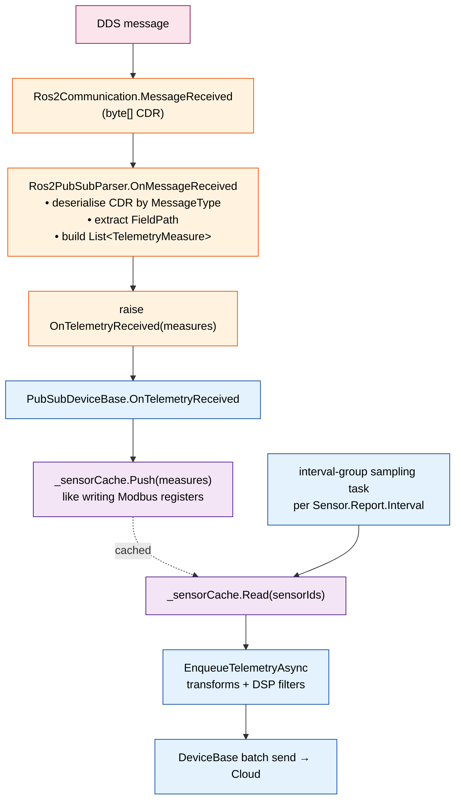

# ROS 2 Bridge — Telemetry Interface

> Each sensor in `devicecfg.json` binds to one ROS topic plus an extraction path. The framework handles batching, transforms, and uplink.

## Mapping Model

A SubNode sensor is a single scalar (or boolean) point. ROS messages are typically composite. The bridge therefore maps:

```
1 sensor  ──►  1 topic + 1 message field path
```

Multiple sensors **may** share a topic (one subscription, multiple field extractions). The parser deduplicates subscriptions by `(topic, message_type, qos_profile)` so that a `sensor_msgs/msg/BatteryState` topic carrying `voltage`, `current`, `percentage` becomes one DDS subscription feeding three `TelemetryMeasure` rows on every message.

## Sensor Parameters

The bridge reads these keys from each `Sensor.Parameters`:

| Key | Required | Type | Description |
|-----|----------|------|-------------|
| `Topic` | yes | string | Fully-qualified ROS topic, e.g. `/robot1/battery_state`. Leading `/` recommended. |
| `MessageType` | yes | string | Canonical ROS type, e.g. `sensor_msgs/msg/BatteryState`. Must be registered in the type registry. |
| `FieldPath` | yes | string | Dotted path into the deserialised message, e.g. `voltage`, `pose.position.x`, `wrench.force.z`. |
| `QoS` | no | object | Per-sensor QoS override. Defaults to the device-level QoS (see [Configuration](./05-configuration.md#qos-profiles)). |
| `Unit` | no | string | Carried into `TelemetryMeasure` metadata; not used by the parser. |

`Sensor.Name`, `Sensor.SensorGroup`, and `Sensor.Report.Interval` keep their existing SDK semantics — the bridge does not reinterpret them.

### Example sensor block

```json
{
  "Name": "BatteryVoltage",
  "SensorGroup": "AI",
  "Parameters": {
    "Topic": "/robot1/battery_state",
    "MessageType": "sensor_msgs/msg/BatteryState",
    "FieldPath": "voltage",
    "QoS": { "Reliability": "Reliable", "History": "KeepLast", "Depth": 10 }
  },
  "Report": { "Enabled": true, "Interval": 1000 }
}
```

## Field Extraction Rules

The bridge supports two schema modes. Mode is selected per sensor by what `FieldPath` resolves to:

| Field type at `FieldPath` | Schema mode | `TelemetryMeasure.Value` | `SensorInfo.Schema` |
|---------------------------|-------------|--------------------------|---------------------|
| Numeric (`int8`..`float64`) | Primitive | `double` | `double` |
| `bool` | Primitive | `bool` | `boolean` |
| `string` | Primitive | `string` | `string` |
| `time` / `duration` | Primitive | ISO-8601 `string` | `dateTime` / `duration` |
| Nested struct | **Composite** | `IDictionary<string, object>` (JSON-shaped) | `application/json` |
| Array (`Type[]`, `Type[N]`) | **Composite** | `IList<object>` (JSON-shaped) | `application/json` |
| `FieldPath` omitted or empty | **Composite** (whole message) | `IDictionary<string, object>` | `application/json` |

Composite mode auto-generates a DTDL `Object` schema from the ROS IDL and attaches the schema DTMI in `TelemetryMeasure.Metadata`. See [Composite Messages](./06-composite-messages.md) for the full mapping table, generation flow, and worked example.

If a path doesn't exist on the registered message type at all, validation fails in `Ros2PubSubParser.ValidateConfiguration` and the device is rejected before `StartAsync`. The cloud-pushed config update path goes through the same validation, so a bad path cannot brick a running device — the two-phase update rolls back.

## QoS Profiles

QoS resolves in this order (most specific wins):

1. `Sensor.Parameters.QoS` (per sensor)
2. `DeviceCommunication.QoS` (per device)
3. Built-in default: `{ Reliability: Reliable, History: KeepLast, Depth: 10, Durability: Volatile, Liveliness: Automatic }`

| Field | Allowed values | Notes |
|-------|----------------|-------|
| `Reliability` | `Reliable`, `BestEffort` | Sensor data that drives a safety decision **must** be `Reliable`. |
| `History` | `KeepLast`, `KeepAll` | `KeepAll` rare in IIoT — only when paired with bounded `Depth`. |
| `Depth` | int ≥ 1 | Subscription queue depth. |
| `Durability` | `Volatile`, `TransientLocal` | Use `TransientLocal` for late-joiner state (e.g. `/robot1/safety/estop` last value). |
| `Liveliness` | `Automatic`, `ManualByTopic` | Liveliness loss is forwarded to `DeviceStatus.Degraded`. |
| `Deadline` | duration (e.g. `"500ms"`) | Optional. Missed deadline raises a tracked event. |

## Sensor Cache Flow

Once a topic is subscribed, the data path is identical to MQTT/ISensing:



Two consequences worth internalising:

- **DDS publish rate ≠ cloud publish rate.** A 100 Hz DDS topic feeding a sensor with `Report.Interval = 1000` produces one cloud row per second; the cache holds the most-recent value at sample time. This is the same semantic as polling a Modbus register at a slower cadence than the PLC scan.
- **`DataReceived` fires per DDS message, `DataProcessed` fires per cloud sample.** Pick the right hook for the side effect you want (raw audit vs. published rollup).

## Timestamps

ROS messages typically carry a `header.stamp` (sec + nanosec). The parser uses this priority:

1. If `MessageType` has a `Header header` field, use `header.stamp` converted to Unix-ms.
2. Else use the DDS reception timestamp (`MessageReceivedEvent.ReceivedAtUtc`).
3. Else use `DateTimeOffset.UtcNow`.

This matches `ISensingPubSubParser`'s `JsonValueKind.Number/String/_` fallback chain.

## Worked Example — Robot State

`devicecfg.json` snippet wiring three sensors off two topics:

```json
"Sensors": [
  {
    "Name": "BatteryVoltage",
    "SensorGroup": "AI",
    "Parameters": {
      "Topic": "/robot1/battery_state",
      "MessageType": "sensor_msgs/msg/BatteryState",
      "FieldPath": "voltage"
    },
    "Report": { "Enabled": true, "Interval": 1000 }
  },
  {
    "Name": "BatteryPercentage",
    "SensorGroup": "AI",
    "Parameters": {
      "Topic": "/robot1/battery_state",
      "MessageType": "sensor_msgs/msg/BatteryState",
      "FieldPath": "percentage"
    },
    "Report": { "Enabled": true, "Interval": 1000 }
  },
  {
    "Name": "EmergencyStop",
    "SensorGroup": "DI",
    "Parameters": {
      "Topic": "/robot1/safety/estop",
      "MessageType": "std_msgs/msg/Bool",
      "FieldPath": "data",
      "QoS": { "Reliability": "Reliable", "Durability": "TransientLocal" }
    },
    "Report": { "Enabled": true, "Interval": 100 }
  }
]
```

After `StartAsync`:

- The bridge opens **two** DDS subscriptions (`/robot1/battery_state`, `/robot1/safety/estop`).
- Every battery message produces 2 `TelemetryMeasure` rows (`BatteryVoltage`, `BatteryPercentage`); every estop message produces 1 row.
- Cloud sees `BatteryVoltage` at 1 Hz, `EmergencyStop` at 10 Hz, regardless of underlying DDS rates.

## Type Registry

ROS 2 IDL (`.msg` / `.srv`) is the authoritative schema. The bridge does **not** hand-roll CDR codecs — `IRos2TypeRegistry` (defined in [02-architecture.md](./02-architecture.md#type-registry)) is the seam that turns IDL into runnable .NET code.

### Three ways to consume the schema

| Path | Source of codec | Activated when | Trade-off |
|------|----------------|----------------|-----------|
| **Generated** (`rosidl_typesupport_dotnet`) | `dotnet build` runs the generator over `Ros2MessagePackage` items, emits typed POCO + CDR codec. | Default. All types declared at build time. | Compile-time safety, fastest deserialise, type-checked `FieldPath`. New message types need a rebuild. |
| **Dynamic** (`rosidl_dynamic_typesupport`) | P/Invoke into `librosidl_dynamic_typesupport_c`; reads IDL metadata from the on-host ROS install at startup. | `DeviceCommunication.AllowDynamicTypes = true` and the type is missing from the generated registry. | Works with messages unknown at build time (customer-proprietary `.msg`). Reflection cost per message. |
| **JSON via rosbridge** | None — JSON keys carry the field names. `FieldPath` becomes a `JsonElement` walk. | `Transport = rosbridge`. | Zero codegen, no DDS QoS, no type safety. Fallback transport only. |

### `FieldPath` resolution

Whichever path is active, validation goes through `IMessageCodec.TryResolveField`:

```csharp
if (!codec.TryResolveField(sensor.Parameters["FieldPath"], out var field))
    return Error.Validation("Config.InvalidFieldPath",
        $"{path} not found on {messageType}");
if (!field.IsPrimitive)
    return Error.Validation("Config.InvalidFieldPath",
        $"{path} terminates on composite {field.ClrType.Name}");
```

This is what makes [validation rule 5](./05-configuration.md#validation-rules) literal rather than hand-wavy — the IDL tells you whether `pose.position.x` exists and whether it's a primitive.

### Build-time wiring

A bridge project declares the message packages it depends on as MSBuild items:

```xml
<ItemGroup>
  <!-- Pre-generated common packages -->
  <Ros2MessagePackage Include="std_msgs"        Version="humble" />
  <Ros2MessagePackage Include="sensor_msgs"     Version="humble" />
  <Ros2MessagePackage Include="geometry_msgs"   Version="humble" />
  <Ros2MessagePackage Include="nav_msgs"        Version="humble" />
  <Ros2MessagePackage Include="diagnostic_msgs" Version="humble" />

  <!-- Customer-specific .msg files in the repo -->
  <Ros2MessagePackage Include="$(MSBuildProjectDirectory)/ros2_msgs/robot_msgs" />
</ItemGroup>
```

Output goes into `obj/ros2_generated/*.cs` and gets compiled into the assembly — same model `Grpc.Tools` uses for `.proto`.

### Safety boundary

The registry is built once at `Ros2Device.InitializeAsync` and never extended at runtime. Untrusted cloud-supplied `MessageType` strings are looked up against this fixed set; they never trigger an assembly walk or arbitrary code load. Combined with the `PublishableTopics` allow-list ([04-commands.md](./04-commands.md#publishtopic-payload)), this closes the two main injection vectors a remote-config channel could open.

## See Also

- [Command Interface](./04-commands.md) — outbound side of the same parser.
- [Configuration Reference](./05-configuration.md) — full schema and validation rules.
- [Pipeline Overview](../05-data-pipeline/01-overview.md) — what happens to a `TelemetryMeasure` after `EnqueueTelemetryAsync`.

---

## Change History

| Version | Date | Author | Changes |
|---------|------|--------|---------|
| 0.1.0 | 2026-05-08 | Kevin Chien | Initial design draft. |
