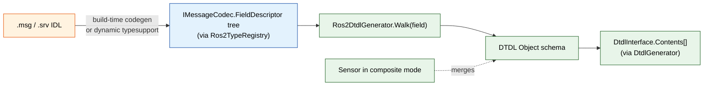

# ROS 2 Bridge — Composite Messages

> When `FieldPath` resolves to a struct (not a primitive), the bridge ships the **whole sub-message as a JSON object** with `Schema = "application/json"`, and auto-generates a DTDL `Object` schema from the ROS 2 IDL.

## Why Two Modes

A `geometry_msgs/msg/PoseStamped` is six numbers grouped as a meaningful unit. Forcing the user to declare six sensors (`pose.position.x`, `pose.position.y`, …) loses the structural relationship — the cloud sees six independent telemetry streams that have to be re-correlated by timestamp.

Two schema modes solve this without splitting the design:

| Mode | Activated when | `TelemetryMeasure.Value` | `SensorInfo.Schema` | DTDL emitted |
|------|----------------|--------------------------|---------------------|--------------|
| **Primitive** | `FieldPath` resolves to a scalar leaf | `double`, `bool`, `string`, … | `double` / `boolean` / `string` | `Telemetry { schema: <primitive> }` |
| **Composite** | `FieldPath` omitted, empty, or resolves to a struct | `IDictionary<string, object>` (JSON-shaped) | `application/json` | `Telemetry { schema: Object { fields: [...] } }` |

The primitive path is the existing behaviour documented in [03-telemetry.md](./03-telemetry.md). This page covers composite mode.

## When Composite Mode Activates

`Ros2PubSubParser` decides per sensor at `InitializeAsync`:

```csharp
if (codec.TryResolveField(fieldPath ?? string.Empty, out var field))
{
    sensor.SchemaMode = field.IsPrimitive
        ? SchemaMode.Primitive   // existing path
        : SchemaMode.Composite;  // new path
}
else
{
    return Error.Validation("Config.InvalidFieldPath", $"{fieldPath} not found on {messageType}");
}
```

Three configuration shapes that select composite mode:

```json
// 1. No FieldPath — ship the whole message
"Parameters": {
  "Topic": "/robot1/pose",
  "MessageType": "geometry_msgs/msg/PoseStamped"
}

// 2. FieldPath ending on a sub-struct
"Parameters": {
  "Topic": "/robot1/pose",
  "MessageType": "geometry_msgs/msg/PoseStamped",
  "FieldPath": "pose.position"   // resolves to {x, y, z}
}

// 3. Empty FieldPath, equivalent to (1)
"Parameters": {
  "Topic": "/robot1/diagnostics",
  "MessageType": "diagnostic_msgs/msg/DiagnosticArray",
  "FieldPath": ""
}
```

## TelemetryMeasure Shape

Existing SDK fields, no schema change required (`src/Weda.SubNode.Abstractions/Telemetry/TelemetryData.cs`):

```csharp
new TelemetryMeasure
{
    ResourceId = sensor.ResourceId,
    Value = new Dictionary<string, object>            // JSON-serialisable
    {
        ["pose"] = new Dictionary<string, object>
        {
            ["position"]    = new Dictionary<string, object> { ["x"] = 1.2, ["y"] = 3.4, ["z"] = 0.0 },
            ["orientation"] = new Dictionary<string, object> { ["x"] = 0, ["y"] = 0, ["z"] = 0, ["w"] = 1 }
        },
        ["header"] = new Dictionary<string, object>
        {
            ["frame_id"] = "map",
            ["stamp"]    = 1715169600123L
        }
    },
    Timestamp = stampMs,
    Metadata  = new Dictionary<string, object>
    {
        ["contentType"] = "application/json",
        ["messageType"] = "geometry_msgs/msg/PoseStamped",
        ["schemaDtmi"]  = "dtmi:advantech:ros2:geometry_msgs:PoseStamped;1"
    }
}
```

`Metadata.contentType` is the wire-level Content-Type. `Metadata.schemaDtmi` lets the cloud look up the matching DTDL Object schema for parsing/UI without re-deriving it.

## DTDL Generation From `.msg` IDL

The bridge ships a `Ros2DtdlGenerator` that walks `IMessageCodec.FieldDescriptor` trees and emits DTDL fragments. It plugs into the existing auto-gen flow (`src/Weda.SubNode.Abstractions/DigitalTwin/DtdlGenerator.cs`) — composite ROS sensors are no longer skipped by `IsMimeType`.

### IDL → DTDL primitive map

| ROS 2 IDL type | DTDL v3 schema | Notes |
|----------------|----------------|-------|
| `bool` | `boolean` | |
| `byte`, `int8`, `uint8`, `int16`, `uint16`, `int32` | `integer` | DTDL has no fixed-width int; range loss accepted. |
| `uint32`, `int64`, `uint64` | `long` | `uint64` near `Int64.MaxValue` may lose precision. |
| `float32` | `float` | |
| `float64` | `double` | |
| `string`, `wstring` | `string` | |
| `builtin_interfaces/msg/Time` | `dateTime` | Converted to ISO-8601 by the parser. |
| `builtin_interfaces/msg/Duration` | `duration` | ISO-8601 duration. |
| nested `MsgType` | `Object { fields: ... }` | Recurses. |
| `Type[N]` (fixed) | `Array { elementSchema: ... }` | Length carried as `description`. |
| `Type[]` (unbounded) | `Array { elementSchema: ... }` | |
| `Type[<=N]` (bounded) | `Array { elementSchema: ... }` | Bound carried as `description`. |

### Generation flow



The generator is invoked once at `InitializeAsync` for any sensor in composite mode, the result is cached by `(MessageType, FieldPath)` so multiple sensors sharing the same path do not re-walk.

## Schema Sources

Both DTDL generation and runtime parse/compose lean on the same `IMessageCodec` (defined in [02-architecture.md](./02-architecture.md#type-registry)). The codec needs the IDL — here is where it physically lives:

| Source | Path | When available |
|--------|------|---------------|
| Installed ROS package | `/opt/ros/<distro>/share/<pkg>/msg/*.msg`, `*.srv`, `*.idl` | Anywhere ROS is installed; populated by `apt install ros-<distro>-<pkg>`. |
| ament index | `/opt/ros/<distro>/share/ament_index/resource_index/rosidl_interfaces/<pkg>` | Same as above; lists *which* messages a package owns. |
| Customer repo | `<workspace>/src/<pkg>/msg/*.msg` | Built with `colcon build`, installed into `install/<pkg>/share/<pkg>/msg/`. |
| Wire discovery (DDS-XTypes) | DDS announces type definitions on the wire | Requires XTypes-aware RMW (FastDDS full, CycloneDDS partial). See [Wire-Level Type Discovery](#wire-level-type-discovery-xtypes). |

`IRos2TypeRegistry` chains the first three at startup (build-time generated → dynamic typesupport reading the host install). Wire discovery is opt-in for safety reasons.

## Codec Reference Paths

Three implementations of `IMessageCodec` cover the source set:

### A. Build-time codegen — default

`rosidl_parser` (Python) is invoked at `dotnet build` by `rosidl_typesupport_dotnet` for each `Ros2MessagePackage` MSBuild item. It walks each `.msg` file, builds an AST, and emits one `.cs` per message:

```csharp
// obj/ros2_generated/sensor_msgs/msg/BatteryState.g.cs  (machine-generated)
public sealed class BatteryState : IRosMessage
{
    public std_msgs.msg.Header Header { get; set; }
    public float Voltage { get; set; }
    public float Current { get; set; }
    public float Percentage { get; set; }
    // ... all fields in IDL order

    public static MessageTypeSupport TypeSupport => _typeSupport;

    public void WriteCdr(CdrWriter w)
    {
        Header.WriteCdr(w);
        w.WriteFloat32(Voltage);
        w.WriteFloat32(Current);
        w.WriteFloat32(Percentage);
        // ...
    }

    public static BatteryState ReadCdr(CdrReader r) => new()
    {
        Header     = std_msgs.msg.Header.ReadCdr(r),
        Voltage    = r.ReadFloat32(),
        Current    = r.ReadFloat32(),
        Percentage = r.ReadFloat32(),
        // ...
    };
}
```

Field order **is** the schema — CDR has no field tags, so generator and wire must agree on order. A `.msg` change requires a rebuild on both sides. Generated code goes into `obj/ros2_generated/` and is compiled into the assembly.

### B. Runtime dynamic typesupport — Iron+

When `AllowDynamicTypes = true` and the type isn't in the generated registry, the bridge falls through to `librosidl_dynamic_typesupport_c`:

```csharp
// Pseudocode — wraps rosidl_dynamic_typesupport_c P/Invoke
var typeDesc = DynamicTypeLoader.LoadFromAmentIndex("robot_msgs/msg/CustomState");
// typeDesc is a tree of FieldDescriptor: { Name, Type, IsArray, Fields[] }

IMessageCodec codec = new DynamicMessageCodec(typeDesc);
```

The dynamic walker reads CDR sequentially, dispatched by type tag at each node:

```csharp
object ReadField(CdrReader r, FieldDescriptor f) => f.Type switch
{
    PrimitiveType.Float32 => r.ReadFloat32(),
    PrimitiveType.Bool    => r.ReadBoolean(),
    PrimitiveType.String  => r.ReadString(),
    StructType s          => ReadStruct(r, s),                 // recurse
    ArrayType  a          => ReadArray(r, a, f.Bound),         // recurse per element
    _ => throw new NotSupportedException(f.Type.ToString())
};
```

Slower than codegen (per-field switch), but works for messages unknown at build time. Output is `IDictionary<string, object>` rather than a typed POCO.

### C. JSON via rosbridge — fallback transport

`rosbridge_server` does the IDL walk on its side. The bridge sees JSON:

```json
{ "op": "publish", "topic": "/robot1/battery_state", "msg": { "voltage": 24.1, "current": -2.3, ... } }
```

Parse = `JsonSerializer.Deserialize<JsonElement>` + `FieldPath` walk. Compose = build `JsonNode` and POST. **No CDR involved.** Schema fidelity is whatever the rosbridge_server install was built against — version skew between the bridge and rosbridge surfaces as missing keys, not as a CDR error.

## Runtime Pipelines

### Parse — incoming telemetry

```
DDS bytes (CDR)
  → Ros2Communication.MessageReceived(byte[] cdr)
  → IRos2TypeRegistry.TryGetMessageCodec(messageType, out codec)
  → codec.Deserialize(cdr) ─────────► IRosMessage instance      (codegen)
                                                or
                                      IDictionary<string,object> (dynamic)
  → if FieldPath is primitive:
        codec.TryResolveField(path, out field)
        value = field.Reader(message)            ◄── primitive scalar
    else (composite mode):
        value = ToJsonObject(message, subtree)   ◄── whole or sub-tree as JSON
  → new TelemetryMeasure {
        Value = value,
        Schema = primitive ? "double|bool|..." : "application/json"
    }
```

`field.Reader` is a `Func<object, object>` cached at registry-build time — per-message extraction is one delegate call, not a reflection walk. The composite case uses a precompiled per-codec `ToJsonObject` that walks `FieldDescriptor` once and emits the dictionary in IDL order.

### Compose — outgoing service request

```
DeviceCommand (Parameters: { service, serviceType, request: {...} })
  → IRos2TypeRegistry.TryGetServiceCodec(serviceType, out svcCodec)
  → svcCodec.RequestCodec.FromJson(JsonElement) ─────► request POCO   (codegen)
                                                       or
                                                       IDictionary    (dynamic)
  → request.WriteCdr(writer)                         ◄── codegen path
        or DynamicCdrWriter.Write(typeDesc, dict)    ◄── dynamic path
  → byte[] cdrRequest
  → rclnet.Client.SendRequestAsync(cdrRequest, ct)
  → byte[] cdrResponse
  → svcCodec.ResponseCodec.Deserialize(cdrResponse) → response POCO/dict
  → svcCodec.ResponseCodec.ToJson(response) → JsonElement → ErrorOr<object>
```

The JSON↔POCO step on the codegen path uses `System.Text.Json` over the generated POCO (field names match `.msg` field names by convention). The dynamic path goes JSON ↔ `IDictionary` directly, no POCO in between.

## Codec Lifecycle

| Phase | What the registry does | Where in the framework |
|-------|------------------------|------------------------|
| `Ros2Device.InitializeAsync` | Build registry: scan generated assemblies via `[Ros2Message]` attributes; if `AllowDynamicTypes`, also index ament resource files. | `DeviceBase.InitializeAsync` → `Communication.ConnectAsync` |
| `Ros2PubSubParser.StartAsync` | For each sensor: `TryGetMessageCodec(MessageType)`; cache `(codec, field reader, FieldDescriptor tree)` per sensor. | Called by `PubSubDeviceBase.StartBackgroundTasksAsync` |
| Per incoming message | Lookup is already cached on the sensor — only `codec.Deserialize` + `field.Reader` (or `ToJsonObject`) run on the hot path. | `Ros2Communication.MessageReceived` handler |
| Per outgoing command | `TryGetServiceCodec` once per command; request/response codecs reused for the duration of the call. | `Ros2PubSubParser.ExecuteCommandAsync` |
| `RefreshSensorMetadata` | Re-resolve codecs for changed sensors only; unchanged sensors keep cached delegates. | Cloud-pushed config update path |

## Wire-Level Type Discovery (XTypes)

When the IDL is unavailable on disk but the publisher has it, DDS-XTypes lets the bridge ask for it on the wire. With FastDDS:

```csharp
// Pseudocode — RMW must expose the type-info request
var typeInfo = await dds.RequestTypeInfoAsync(topicName, ct);
var typeDesc = DynamicTypeLoader.FromXTypes(typeInfo.RemoteTypeObject);
registry.RegisterDynamic(messageType, typeDesc);
```

This is the same mechanism `ros2 topic echo --csv` uses for unknown types. Useful for exploratory deployments — but **disabled by default** in the bridge: wire-supplied types are not authenticated, so honouring them on a safety-critical SubNode would be an injection vector.

Gate behind a config flag, paired with `AllowDynamicTypes`:

```json
"DeviceCommunication": {
  "AllowDynamicTypes": true,
  "AllowXTypesDiscovery": true
}
```

When enabled, the registry still validates that any wire-discovered type's leaves map to DTDL primitives (the same rule 5b in [validation rules](./05-configuration.md#validation-rules)) — a malformed remote type definition is rejected, not silently accepted.

## Worked Example — PoseStamped

### Sensor configuration

```json
{
  "Name": "RobotPose",
  "SensorGroup": "POSITION",
  "Parameters": {
    "Topic": "/robot1/pose",
    "MessageType": "geometry_msgs/msg/PoseStamped"
  },
  "Report": { "Enabled": true, "Interval": 200 }
}
```

### Generated DTDL fragment

```json
{
  "@type": "Telemetry",
  "@id":   "dtmi:autogen:position:a1b2c3d4;1",
  "name":  "RobotPose",
  "displayName": "Robot Pose",
  "schema": {
    "@type": "Object",
    "fields": [
      {
        "name": "header",
        "schema": {
          "@type": "Object",
          "fields": [
            { "name": "frame_id", "schema": "string" },
            { "name": "stamp",    "schema": "dateTime" }
          ]
        }
      },
      {
        "name": "pose",
        "schema": {
          "@type": "Object",
          "fields": [
            {
              "name": "position",
              "schema": {
                "@type": "Object",
                "fields": [
                  { "name": "x", "schema": "double" },
                  { "name": "y", "schema": "double" },
                  { "name": "z", "schema": "double" }
                ]
              }
            },
            {
              "name": "orientation",
              "schema": {
                "@type": "Object",
                "fields": [
                  { "name": "x", "schema": "double" },
                  { "name": "y", "schema": "double" },
                  { "name": "z", "schema": "double" },
                  { "name": "w", "schema": "double" }
                ]
              }
            }
          ]
        }
      }
    ]
  }
}
```

### Resulting telemetry payload

```json
{
  "ResourceId": "21af0dc4-9254-5389-a7dd-df64d7cf782c",
  "Timestamp":  1715169600123,
  "Value": {
    "header": { "frame_id": "map", "stamp": "2026-05-08T09:00:00.123Z" },
    "pose": {
      "position":    { "x": 1.2, "y": 3.4, "z": 0.0 },
      "orientation": { "x": 0,   "y": 0,   "z": 0,   "w": 1 }
    }
  },
  "Metadata": {
    "contentType": "application/json",
    "messageType": "geometry_msgs/msg/PoseStamped",
    "schemaDtmi":  "dtmi:advantech:ros2:geometry_msgs:PoseStamped;1"
  }
}
```

The cloud now has both the structured value and the schema needed to interpret it.

## Schema Stability and Versioning

ROS 2 messages are versioned by package. A bump in `geometry_msgs` (rare, but possible across distros) changes the auto-generated DTDL. Two safeguards:

1. **DTMI versioning** — `Ros2DtdlGenerator` includes a hash of the generator output in the DTMI version segment: `dtmi:advantech:ros2:geometry_msgs:PoseStamped;<schemaHash>`. Cloud-side schema stores are immutable per DTMI version, so a schema change produces a new ID rather than overwriting.
2. **Wire-level fingerprint** — `Metadata.schemaDtmi` always matches the schema the running SubNode generated. If a robot ships a newer message version than the SubNode was built against, this mismatch surfaces in the cloud immediately rather than as silent field drift.

## Performance Considerations

| Concern | Impact | Mitigation |
|---------|--------|-----------|
| JSON serialisation per message | ~10× CPU vs primitive scalar packing | Apply `Sensor.Report.Interval` aggressively; the framework already samples from `_sensorCache`, so a 100 Hz topic with `Interval: 1000` only serialises once per second. |
| Wire size | Composite payloads are larger than scalars | Prefer composite mode for **structurally meaningful** groupings only. Loose collections of independent values stay as separate primitive sensors. |
| Cloud-side parsing | Cloud must handle both scalar and Object schemas | `Schema = "application/json"` already routes to a different ingestion path in WedaCore — no new code on the cloud. |

## When to Use Which Mode

| Use composite mode when… | Use primitive mode when… |
|-------------------------|--------------------------|
| Fields are structurally inseparable (pose, twist, transform) | Fields are independent metrics (battery voltage, current, percentage) |
| Cloud-side analysis needs the full message atomically | Cloud only consumes one field |
| The message version may evolve and you want schema fidelity | The field is a stable scalar |
| You'd otherwise create more than 4–5 primitive sensors off the same topic | The topic carries a single value or a flat record of independent values |

A `sensor_msgs/msg/BatteryState` is a borderline case — its fields are independent (so primitive mode is fine), but if you also want `power_supply_status` and `cell_voltage[]`, composite mode keeps the array intact.

## Validation Rules (Updated)

The two-phase config update validates composite mode the same way as primitive mode, with one extra check:

| Rule | Description | Error code |
|------|-------------|-----------|
| 5a | `FieldPath` is empty/omitted **or** `codec.TryResolveField` returns true. | `Config.InvalidFieldPath` |
| 5b | If the resolved field is composite, the codec must report **all leaf fields** as supported primitive types (no opaque blobs). | `Config.UnsupportedCompositeField` |
| 5c | If the resolved field is an array, `Sensor.Report.Aggregation` (if set) must be `None` — array aggregation is not implemented in v1. | `Config.UnsupportedAggregation` |

## See Also

- [Telemetry Interface](./03-telemetry.md) — primitive-mode mapping, sensor cache flow.
- [Configuration Reference](./05-configuration.md#validation-rules) — full validation rule set.
- `src/Weda.SubNode.Abstractions/DigitalTwin/DtdlGenerator.cs` — interface auto-gen the bridge plugs into.
- `src/Weda.SubNode.Abstractions/Telemetry/TelemetryData.cs` — `Value` and `Metadata` shape (no SDK changes required).

---

## Change History

| Version | Date | Author | Changes |
|---------|------|--------|---------|
| 0.1.0 | 2026-05-08 | Kevin Chien | Initial design draft. |
