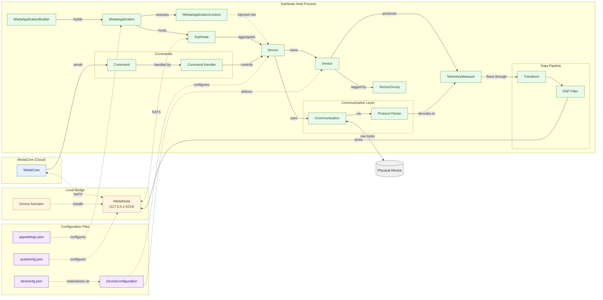

# 術語表

> SubNode SDK 文件中使用的關鍵術語和概念。

## Overview

本文彙整 SubNode SDK 文件中使用的關鍵術語和概念。作為快速參考，協助開發者理解 SDK 的核心詞彙。

## What You'll Learn

閱讀本文後，你將能夠：

- 理解 SubNode、WedaCore、WedaNode 之間的關係
- 掌握 Device、Sensor、TelemetryMeasure 等核心資料結構
- 了解通訊層和資料處理層的相關術語
- 熟悉設定檔和應用程式託管的關鍵概念

---

## SubNode 專案速覽

**SubNode SDK** 是一套基於 .NET 的框架，用於建構橋接實體裝置與 **WedaCore** 雲端平台的邊緣裝置應用程式。SubNode 應用程式扮演聚合根的角色，擁有一個或多個 `Device` 實例；每個裝置暴露一個或多個 `Sensor` 資料點，讀數以 `TelemetryMeasure` 記錄的形式發出，流經可組態的 `Data Pipeline`（Transform + DSP Filter），並透過本機 `WedaNode` 代理經由 NATS 發布到雲端。

SDK 圍繞三個主要關注點組織：

- **連線層（Connectivity）** - `ICommunication` 抽象（Request/Response、Pub/Sub、Streaming）加上 `Protocol Parser` 實作，將通訊協定與裝置邏輯解耦。
- **資料處理（Data Processing）** - 由 `Transform` 與 `DSP Filter` 組成的可組合管線，將原始值處理為乾淨的遙測資料。
- **託管與設定（Hosting & Configuration）** - `WedaApplication` + `WedaApplicationBuilder` 提供 .NET Generic Host 封裝；行為由 `devicecfg.json`、`systemcfg.json`、`appsettings.json` 驅動。

端到端的脈絡：**WedaCore**（雲端）<- NATS -> **WedaNode**（本機代理，由 **Device Activator** 安裝）<- NATS -> **SubNode**（你的應用程式）-> 實體裝置。

## 術語快速索引

| 類別 | 術語 | 角色 | 所在位置 |
|------|------|------|----------|
| 平台 | **SubNode** | 邊緣應用程式；裝置的聚合根 | 你的行程 |
| 平台 | **WedaCore** | 雲端平台（分身、遙測、命令） | 雲端 |
| 平台 | **WedaNode** | 橋接 SubNode <-> WedaCore 的本機 NATS 代理 | `127.0.0.1:4224` |
| 平台 | **Device Activator** | 安裝/設定 WedaNode 的 GUI 精靈 | 主機 |
| 裝置 | **Device** | 實體裝置或資料來源的抽象 | `IDevice` / `DeviceBase` |
| 裝置 | **Sensor** | 裝置擁有的資料點 | 設定中的 `Sensors[]` |
| 裝置 | **TelemetryMeasure** | 單筆讀數（ResourceId、Value、Timestamp） | 執行期 |
| 裝置 | **SensorGroup** | 類別標籤：AI、AO、DI、DO、SYS、TEMP、PWR | 感測器中繼資料 |
| 通訊 | **ICommunication** | SubNode 與裝置間的傳輸契約 | SDK 介面 |
| 通訊 | **Protocol Parser** | 編碼命令／將原始位元組解碼為 `TelemetryMeasure` | SDK 元件 |
| 處理 | **Data Pipeline** | 階段鏈：Raw -> Transforms -> DSP -> Final | 每個感測器 |
| 處理 | **Transform** | 值修改（校正、單位換算、分塊） | `Report.Transforms` |
| 處理 | **DSP Filter** | 訊號處理（Kalman、MovingAverage、ReLU） | `Report.DspFilters` |
| 命令 | **Command** | 來自 WedaCore 的遠端操作請求 | NATS 訊息 |
| 命令 | **Command Handler** | `ICommandHandler<TCmd,TResult>` 實作 | 裝置程式碼 |
| 設定 | **DeviceConfiguration** | 裝置設定的執行期視圖 | 記憶體中 |
| 設定 | **devicecfg.json** | 裝置、感測器、通訊、報告 | 專案根目錄 |
| 設定 | **systemcfg.json** | WedaNode URL、認證策略、憑證 | 專案根目錄 |
| 設定 | **appsettings.json** | .NET / Serilog 執行期設定 | 專案根目錄 |
| 託管 | **WedaApplication** | 主應用程式主機 | 進入點 |
| 託管 | **WedaApplicationBuilder** | 註冊裝置與雲端的 Fluent API | `Program.cs` |
| 託管 | **IWedaApplicationContext** | 注入到裝置的應用程式範圍服務 | DI 容器 |

---

## 核心概念

### SubNode

**SubNode** 是使用 SubNode SDK 建構的邊緣裝置應用程式。它代表一個或多個裝置的邏輯群組，與 WedaCore 雲端平台通訊。每個 SubNode 具有：

- 唯一識別碼 (`SubNodeId`)
- 中繼資料（名稱、類型、製造商、型號、版本）
- 一個或多個 Device 實例

### WedaCore

**WedaCore** 是 SubNode 應用程式連接的雲端平台。它提供：

- 數位分身管理
- 遙測資料儲存和視覺化
- 遠端命令執行
- 設定管理
- 裝置監控和警示

### WedaNode

**WedaNode** 是由 Device Activator 安裝的本機 NATS 代理服務。它預設運行於 `127.0.0.1:4224`，作為 SubNode 應用程式與 WedaCore 之間的橋接。

```
┌──────────────┐          ┌───────────────────┐          ┌──────────────┐
│   SubNode    │◀──NATS──▶│      WedaNode     │◀──NATS──▶│   WedaCore   │
│ Application  │          │ (127.0.0.1:4224)  │          │   (Cloud)    │
└──────────────┘          └───────────────────┘          └──────────────┘
```

### Device Activator

**Device Activator** 是一個 GUI 安裝精靈，功能包括：

- 安裝和設定 WedaNode
- 管理裝置憑證和證書
- 處理系統服務註冊

## 裝置元件

### Device

**Device** 代表實體裝置或資料來源的抽象。在程式碼中，裝置實作 `IDevice` 介面或繼承 `DeviceBase`。一個 SubNode 應用程式可以包含多個裝置。

裝置類型範例：
- `TcpModbusDevice` - Modbus TCP 裝置
- `MqttDevice` - MQTT 裝置
- `AggregatorDevice` - 聚合多個裝置的資料
- 針對特定協定的自訂裝置類別

### Sensor

**Sensor** 是裝置內的資料點。每個感測器具有：

| 屬性 | 說明 |
|------|------|
| `ResourceId` | 唯一識別碼（UUID，自動產生）|
| `Name` | 人類可讀名稱（例如 `temperature_sensor1`），需符合 IoT DB 命名規則|
| `SensorGroup` | 類別：AI、DO、DI、SYS、TEMP、PWR |
| `Parameters` | 協定特定設定（暫存器位址等）|
| `Report` | 遙測設定 |
| `Record` | 本地儲存設定 |
| `SensorInfo` | Schema 和顯示中繼資料 |

### TelemetryMeasure

**TelemetryMeasure** 是來自感測器的單一資料讀數：

```csharp
public record TelemetryMeasure
{
    public string ResourceId { get; }     // 感測器識別碼
    public object Value { get; }          // 量測值
    public long Timestamp { get; }        // Unix 時間戳記（毫秒）
    public IReadOnlyDictionary<string, object>? Metadata { get; }
}
```

### SensorGroup

感測器依類別分組：

| 群組 | 說明 | 範例 |
|------|------|------|
| `AI` | Analog Input | 電壓、電流、溫度感測器 |
| `AO` | Analog Output | 可變輸出控制 |
| `DI` | Digital Input | 開關、按鈕、接觸感測器 |
| `DO` | Digital Output | 繼電器、LED、致動器 |
| `SYS` | System | CPU 使用率、記憶體、健康指標 |
| `TEMP` | Temperature | 溫度感測器專用 |
| `PWR` | Power | 功率消耗、電力計量表 |

## 通訊

### ICommunication

定義 SubNode 與實體裝置之間資料傳輸方式的介面。支援三種模式：

| 模式 | 介面 | 使用場景 |
|------|------|----------|
| Request/Response | `IRequestResponseCommunication` | Modbus、HTTP |
| Publish/Subscribe | `IPubSubCommunication` | MQTT、NATS |
| Streaming | `IStreamingCommunication` | WebSocket、gRPC |

### Protocol Parser

**Protocol Parser** 在原始協定資料與 `TelemetryMeasure` 物件之間轉換。它處理：

- 為裝置編碼命令
- 將回應解碼為遙測
- 資料類型解譯（暫存器轉值）

內建 Parser：
- `ModbusProtocolParser` - Modbus 暫存器
- `ISensingProtocolParser` - Advantech ISensing 格式
- `ImageProtocolParser` - 二進位影像資料

## 資料處理

### Data Pipeline

**Data Pipeline** 是遙測資料流經的處理階段序列：

```
Raw Value ──▶ Transforms ──▶ DSP Filters ──▶ Final Value
```

### Transform

**Transform** 修改遙測值。在 `Report.Transforms` 陣列中針對每個感測器設定。

| Transform | Type Name | 用途 |
|-----------|-----------|------|
| Calibration | `calibration` | 套用 Scale 和 Offset |
| Unit Conversion | `unitconversion` | 單位轉換 |
| Chunking | `chunking` | 批次資料點，用於低網速情景，用於切割資料點 |

設定範例：
```json
{
  "Transforms": [
    {
      "Type": "calibration",
      "Enabled": true,
      "Parameters": {
        "Scale": 0.1,
        "Offset": 10.0
      }
    }
  ]
}
```

### DSP Filter

**DSP (Digital Signal Processing) Filter** 對遙測資料執行訊號處理。

內建 DSP Filter：

| Filter | Type Name | 用途 | 使用場景 |
|--------|-----------|------|----------|
| Kalman Filter | `kalman` | 降噪，估計真實值 | 溫濕度感測器跳動、類比訊號雜訊 |
| Moving Average | `movingaverage` | 滑動平均平滑 | 電壓/電流波動、短期趨勢分析 |
| ReLU | `relu` | 將負值歸零 | 功率計算結果為負時強制歸零 |

## 命令與設定

### Command

**Command** 是從 WedaCore 傳送到裝置的遠端操作請求。命令具有：

- `DeviceCmd` - 命令識別碼（例如 `set.do`、`report.data`）
- `Parameters` - 命令特定資料
- `Timeout` - 最大執行時間

### Command Handler

**Command Handler** 處理傳入的命令並回傳結果。實作 `ICommandHandler<TCommand, TResult>` 以自訂命令。

### DeviceConfiguration

**DeviceConfiguration** 是裝置設定的執行時期表示，從 `devicecfg.json` 載入。它包含：

- 裝置中繼資料（名稱、啟用狀態）
- 通訊設定（主機、連接埠、憑證）
- 感測器定義
- 報告週期

## 設定檔

### devicecfg.json

定義裝置和感測器的主要設定檔：

```json
{
  "SubNode": {
    "Name": "MySubNode",
    "SubNodeType": "CustomDevice"
  },
  "DeviceConfigs": {
    "DeviceName": {
      "Enabled": true,
      "DeviceCommunication": { ... },
      "Sensors": [ ... ]
    }
  }
}
```

### systemcfg.json

NATS 連線和雲端設定的系統層級設定：

```json
{
  "WedaNode": {
    "Url": "127.0.0.1:4224",
    "AuthStrategy": "UserPassword",
    "Username": "user",
    "Password": "password"
  }
}
```

### appsettings.json

用於日誌記錄（Serilog）和其他執行時期設定的標準 .NET 設定。

## 應用程式託管

### WedaApplication

管理裝置生命週期的主要應用程式主機：

```csharp
var builder = WedaApplication.CreateDefaultBuilder(args);
builder.AddDevice<MyDevice>("ConfigKey");
var app = builder.Build();
await app.RunAsync();
```

### WedaApplicationBuilder

用於設定和建構 `WedaApplication` 的 Fluent API：

- `AddDevice<T>()` - 註冊裝置類型
- `UseCloud()` / `UseMockCloud()` - 設定雲端連線
- `Build()` - 建立應用程式實例

### IWedaApplicationContext

在裝置實作中提供應用程式範圍服務和設定的存取：

- Service Provider（DI 容器）
- Configuration Root
- Cloud Service
- Logging

## 概念關係圖

下方圖表把前面定義的術語整理成 graph-RAG 風格的心智圖。實線箭頭代表 *包含／產生*，虛線箭頭代表 *設定／描述*，點線箭頭代表 *跨越行程或網路邊界*。



**如何閱讀：**

- **綠色叢集** 是所有存在於你 `dotnet run` 行程中的元件。`WedaApplicationBuilder` 建構出 `WedaApplication`，後者託管一個聚合多個 `Device` 實例的 `SubNode`。
- 每個 `Device` 擁有一個或多個 `Sensor` 物件（由 `SensorGroup` 標記），這些感測器發出 `TelemetryMeasure` 記錄，於發布前流經 `Data Pipeline`（Transform -> DSP Filter）。
- **橘色橋接** 是 `WedaNode` — 由 `Device Activator` 安裝的本機 NATS 代理。SubNode 與 **藍色雲端**（`WedaCore`）之間的所有流量都會經過它。
- **紫色叢集** 是設定平面。磁碟上的 JSON 檔案會具現化為 `DeviceConfiguration`，以及驅動執行期的系統／託管設定。
- 命令的流向與遙測相反：`WedaCore` -> `WedaNode` -> `SubNode` -> `Command Handler` -> `Device`。

## Summary

- SubNode 是邊緣應用程式的聚合根，管理多個 Device
- WedaCore 是雲端平台，WedaNode 是本機 NATS 代理
- Device 代表實體裝置抽象，Sensor 是裝置內的資料點
- Data Pipeline 包含 Transform 和 DSP Filter 兩個處理階段
- 三個設定檔：devicecfg.json（裝置）、systemcfg.json（系統）、appsettings.json（日誌）

## See Also

- [架構概述](./02-architecture.md) - 系統設計和資料流程
- [設定範例](../04-configuration/03-configuration-examples.md) - 詳細設定選項
- [自訂裝置](../09-customization/01-custom-device.md) - 建構自訂裝置

---

## Change History

| Version | Date | Author | Changes |
|---------|------|--------|---------|
| 1.0.0 | 2026-03-23 | Rain Hu | Doc created. |
| 1.1.0 | 2026-06-04 | Rain Hu | 新增專案速覽、術語快速索引表與概念關係圖。 |
