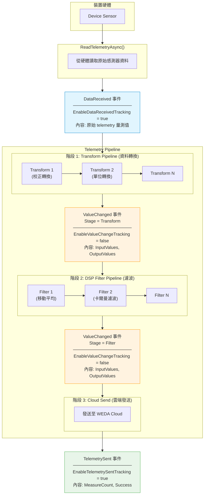
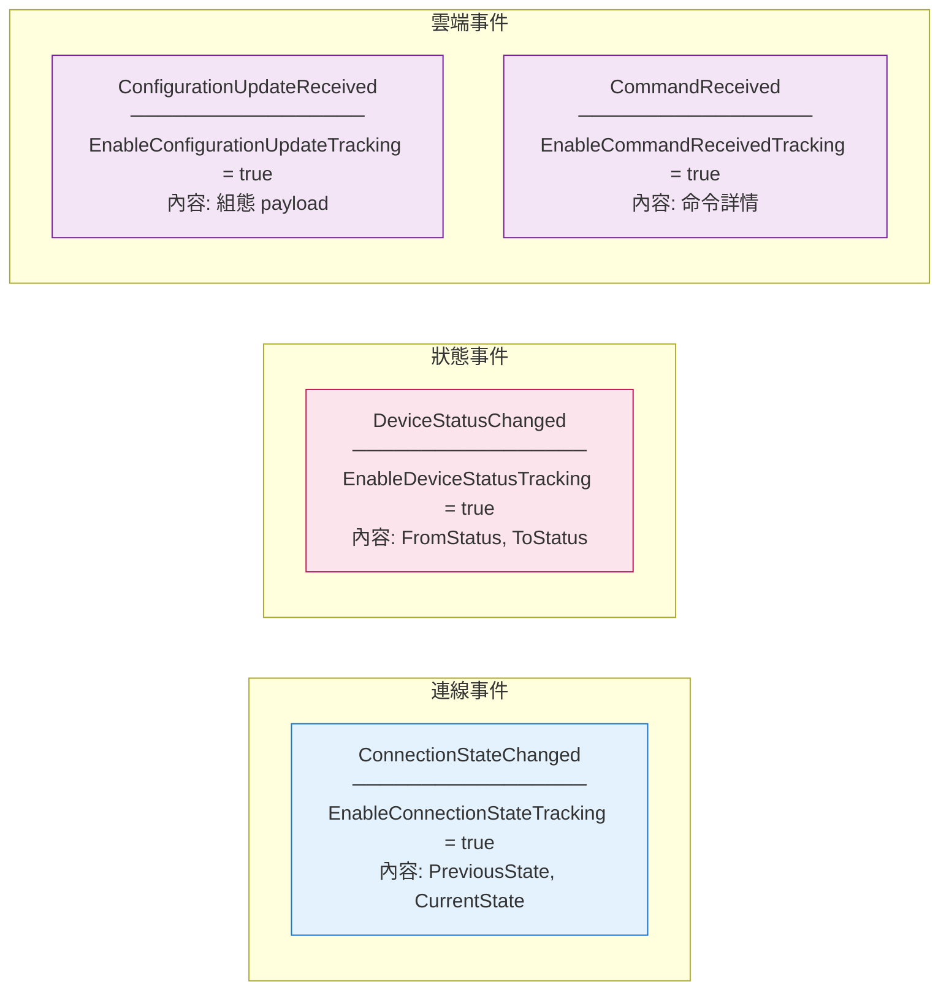

# Telemetry 事件 Hooks

本文件說明 telemetry 資料流 pipeline 中可用的事件 hooks，讓您可以監控和除錯每個階段的資料轉換。

## 資料流程總覽



## 其他裝置事件



## 事件總覽表

| 事件 | 啟用旗標 | 預設值 | 說明 |
|------|----------|--------|------|
| `DataReceived` | `EnableDataReceivedTracking` | `false` | 來自裝置的原始 telemetry 資料 |
| `ValueChanged` | `EnableValueChangeTracking` | `false` | 每個 transform/filter 階段的值變化 |
| `TelemetrySent` | `EnableTelemetrySentTracking` | `false` | 雲端發送結果 |
| `ConnectionStateChanged` | `EnableConnectionStateTracking` | `false` | 裝置連線狀態變化 |
| `DeviceStatusChanged` | `EnableDeviceStatusTracking` | `false` | 裝置生命週期狀態 |
| `ConfigurationUpdateReceived` | `EnableConfigurationUpdateTracking` | `false` | 雲端組態更新 |
| `CommandReceived` | `EnableCommandReceivedTracking` | `false` | 雲端命令執行 |

> **注意:** 所有追蹤旗標預設為 `false` 以提升效能。只啟用您需要的事件。

## 使用範例

```csharp
public class MyDevice : TcpModbusDevice
{
    public MyDevice(IWedaApplicationContext context, DeviceConfiguration config)
        : base(context, config)
    {
        // 啟用並訂閱需要的事件
        EnableDataReceivedTracking = true;
        DataReceived += OnDataReceived;

        EnableValueChangeTracking = true;
        ValueChanged += OnValueChanged;

        EnableTelemetrySentTracking = true;
        TelemetrySent += OnTelemetrySent;
    }

    private void OnDataReceived(object? sender, DataReceivedEvent e)
    {
        _logger.LogInformation("原始資料: {Count} 個量測值", e.Data.Count);
        foreach (var m in e.Data)
        {
            _logger.LogDebug("  {ResourceId}: {Value}", m.ResourceId, m.Value);
        }
    }

    private void OnValueChanged(object? sender, TelemetryValueChangedEvent e)
    {
        var stageType = e.Stage == ValueChangeStage.Transform ? "Transform" : "Filter";

        _logger.LogDebug(
            "[{StageType}] {StageName} (#{Index}): {In} -> {Out} 個值 ({Duration:F2}ms)",
            stageType, e.StageName, e.StageIndex,
            e.InputValues.Count, e.OutputValues.Count,
            e.Duration?.TotalMilliseconds ?? 0);

        // 記錄個別值的變化
        if (e.ValuesChanged)
        {
            for (int i = 0; i < Math.Max(e.InputValues.Count, e.OutputValues.Count); i++)
            {
                var input = i < e.InputValues.Count ? e.InputValues[i].Value?.ToString() : "(無)";
                var output = i < e.OutputValues.Count ? e.OutputValues[i].Value?.ToString() : "(已過濾)";

                if (input != output)
                    _logger.LogDebug("  [{Index}] {Input} -> {Output}", i, input, output);
            }
        }
    }

    private void OnTelemetrySent(object? sender, TelemetrySentEvent e)
    {
        _logger.LogInformation("已發送 {Count} 個量測值, 成功={Success}",
            e.MeasureCount, e.Success);
    }
}
```

## TelemetryValueChangedEvent 屬性

| 屬性 | 型別 | 說明 |
|------|------|------|
| `DeviceId` | `string` | 裝置識別碼 |
| `ResourceId` | `string` | 感測器/資源識別碼 |
| `StageName` | `string` | Transform 或 Filter 的名稱 |
| `Stage` | `ValueChangeStage` | `Transform` 或 `Filter` |
| `StageIndex` | `int` | 在 pipeline 中的索引 (從 0 開始) |
| `InputValues` | `IReadOnlyList<TelemetryMeasure>` | 處理前的值 |
| `OutputValues` | `IReadOnlyList<TelemetryMeasure>` | 處理後的值 |
| `Duration` | `TimeSpan?` | 處理耗時 |
| `ValuesChanged` | `bool` | 值是否有變化 |
| `CountDelta` | `int` | 輸出數量 - 輸入數量 |
| `Timestamp` | `DateTimeOffset` | 事件時間戳 |

## 效能考量

- **EnableValueChangeTracking** 預設為 `false`，因為它會在每個 pipeline 階段建立 telemetry 資料的副本
- 僅在除錯或需要詳細監控時才啟用
- 在正式環境中，可考慮停用不需要的事件以減少額外開銷
