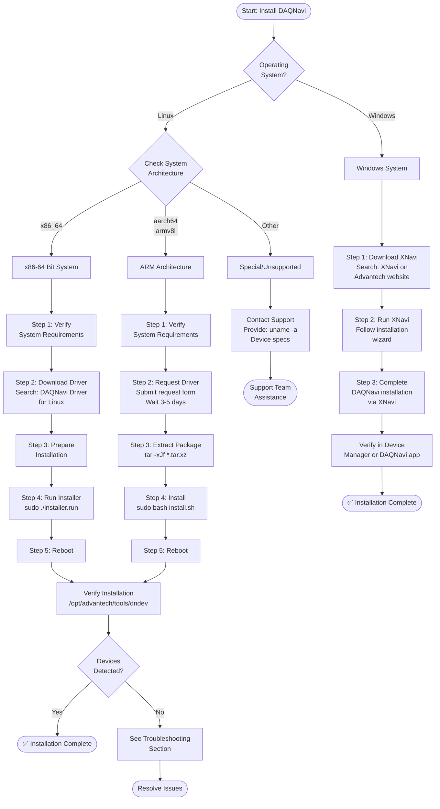

# DAQNavi Linux Driver Installation Guide - Getting Drivers by Architecture

**Applicable Version**: DAQNavi SDK 4.0 and above  
**Document Version**: 1.0  
**Last Updated**: 2026-07-07

---

## 📌 About This Guide

This guide can be deployed anywhere (GitHub, websites, wikis, local files, etc.) without path dependencies.

**Resource References**:
- 🌐 **Primary**: All resources link to [Advantech Official Website](https://www.advantech.com/)
- 💾 **Local Backup**: If you have DAQNavi installed locally, supporting files are available at:
  ```
  [DAQNavi_Installation_Path]/DAQNavi_Linux_Readme.txt
  [DAQNavi_Installation_Path]/DAQNavi_Linux_Driver_request_form.rtf
  ```

---

## Table of Contents

1. [Installation Flow Overview](#installation-flow-overview) ⭐ **Start here**
2. [Quick Start: Identify Your System Architecture](#quick-start-identify-your-system-architecture)
3. [How to Find Drivers on Advantech Website](#how-to-find-drivers-on-advantech-website)
4. [x86-64 Bit System](#x86-64-bit-system)
5. [ARM Architecture System](#arm-architecture-system)
6. [Special Architecture Support](#special-architecture-support)
7. [Post-Installation Verification](#post-installation-verification)
8. [Troubleshooting & Support](#troubleshooting--support)
9. [Resource Links & References](#resource-links--references)

---

## Installation Flow Overview



**Flow Key Points**:
- 🟦 **Blue boxes**: Action steps
- 🔷 **Diamond**: Decision points
- 🟩 **Green endpoint**: Success

---

## Quick Start: Identify Your System Architecture

**First step**: Before installing, confirm your Linux system architecture. Run the following command:

```bash
uname -m
```

Based on the output, select the corresponding section:

| Output | System Architecture | Next Steps |
|--------|-------------------|-----------|
| `x86_64` | 64-bit Intel/AMD Processor | Jump to [How to Find Drivers](#how-to-find-drivers-on-advantech-website) → x86-64 Section |
| `aarch64` or `armv8l` | ARM 64-bit Processor | Jump to [How to Find Drivers](#how-to-find-drivers-on-advantech-website) → ARM Section |
| Other | Special/Unsupported Architecture | Jump to [Special Architecture Support](#special-architecture-support) or contact [Support Resources](#support-resources) |

---

## How to Find Drivers on Advantech Website

🎯 **Now that you know your architecture, locate the correct driver for your platform**

### For Linux x86-64 Users

1. Go to **[https://www.advantech.com/](https://www.advantech.com/)**

2. **Search** for: `DAQNavi Driver for Linux`

3. Find the result from **Technical Download** page

4. Look for: **DAQNavi Driver for Linux** in search results

5. In the **Solution** section, click the **download link** to get the driver package

6. **File format**: `linux_driver_source_X.X.X.X_64bit.run`

   ➜ Then proceed to [x86-64 Bit System section](#x86-64-bit-system) → Step 1: Verify Requirements

---

### For Linux ARM Users

**ARM drivers are not publicly available for download. You must request via the official form.**

1. Go to **[https://www.advantech.com/](https://www.advantech.com/)**

2. **Search** for: `IAG_FAQ_DAQ_Linux Driver Request Guidelines`

3. Find the result from **FAQ** page

4. In the **Solution** section, **download** the guidelines document

5. **Follow the instructions** to:
   - Understand ARM driver request process for your specific platform
   - Obtain the request form: `DAQNavi_Linux_Driver_request_form.rtf`
   - Provide device model and platform information (e.g., device model, Jetson/embedded platform type)

6. **Complete and submit the form** with:
   - Device model (e.g., PCIE-1840, USB-4704)
   - Target platform (e.g., Jetson Nano, Xavier, Orin)
   - Linux distribution and kernel version
   - Contact information

   ➜ Wait for Advantech to process your request (typically 3-5 business days)
   ➜ Then proceed to [ARM Architecture System section](#arm-architecture-system) → Step 3: Extract the Package

---

### For Windows Users

1. Go to **[https://www.advantech.com/](https://www.advantech.com/)**

2. **Search** for: `XNavi`

3. Find the result from **Technical Download** page

4. Look for: **XNavi – The installation tool for DAQNavi/SDK** in search results

5. In the **Solution** section, click the **download link** to get XNavi

6. **Install XNavi** on your Windows target device

   ✅ DAQNavi/SDK installation will be completed via XNavi

**After installation**, the following tools are available:
- 📊 **Navigator** (GUI): Graphical interface for device management
- 🖥️ **dndev.exe** (CLI): Command-line tool in `[DAQNavi_Installation_Path]\DeviceManager(Console)\`
  - Use to verify connected DAQ devices
  - Example: `dndev` or `dndev /?` for help

---

## x86-64 Bit System

### Step 1: Verify System Requirements

Run these commands to ensure your system meets the minimum requirements:

```bash
# 1. Check Linux kernel version
echo "Kernel version:"
uname -r
# Expected: Version > 2.6.18

# 2. Check glibc version
echo "glibc version:"
ldd --version | head -1
# Expected: Version > 2.11

# 3. Display full system information
echo "Full system info:"
uname -a
```

**✅ Verification Checklist**:
- [ ] Kernel version > 2.6.18
- [ ] glibc version > 2.11
- [ ] Distribution listed in [Supported Distributions table](#supported-linux-distributions) below
- [ ] Have administrator (sudo) access

### Supported Linux Distributions

| Distribution | Recommended Version | Kernel Version | Status | Notes |
|-------------|------------------|-----------------|--------|-------|
| Ubuntu | 22.04 LTS | 6.8.0 | ✅ Fully Supported | Long-term support |
| Debian | 12.5 | 6.1.0 | ✅ Fully Supported | Stable release |
| Red Hat Enterprise Linux | 9.3 | 5.14.0 | ✅ Fully Supported | Enterprise support available |
| CentOS | 8.5 | 4.18.0 | ✅ Supported | Community support |
| openSUSE | 15.5 | 5.14.21 | ✅ Supported | Regular release |

**Not on the list?** See [Troubleshooting: Unsupported Distributions](#unsupported-distributions).

---

### Step 2: Download Pre-compiled Driver Package

#### Option A: From Advantech Official Download Center (Recommended)

**Step-by-step**:

1. Go to **[https://www.advantech.com/](https://www.advantech.com/)**

2. **Search** for: `DAQNavi Driver for Linux`

3. Find the result from **Technical Download** page

4. Look for: **DAQNavi Driver for Linux**

5. In the **Solution** section, select the correct version:
   - Filter by your kernel version (see [Supported Distributions](#supported-linux-distributions))
   - Choose the latest stable version matching your distribution
   - **File naming convention**: `linux_driver_source_X.X.X.X_64bit.run`
     - `X.X.X.X` = version number
     - `64bit` = x86-64 architecture (correct for this section)

6. **Click the download link** to start download

7. **Verify File Integrity** (Optional but recommended)
   ```bash
   # Download the checksum file (if provided on the website)
   # Verify the downloaded driver package
   sha256sum -c linux_driver_source_4.0.0.0_64bit.run.sha256
   # Expected output: OK
   ```

---

### Step 3: Prepare for Installation

Before running the installer, ensure:

```bash
# 1. Navigate to the directory containing the installer
cd ~/Downloads  # or wherever you downloaded the file

# 2. Make it executable
chmod +x linux_driver_source_4.0.0.0_64bit.run

# 3. Verify the file exists and is executable
ls -la linux_driver_source_4.0.0.0_64bit.run
# Expected: -rwxr-xr-x  (executable)
```

**Pre-requisites Check**:
```bash
# Install required build tools (if not already installed)
# For Ubuntu/Debian:
sudo apt-get update
sudo apt-get install -y gcc autoconf libtool pkg-config build-essential

# For Red Hat/CentOS:
sudo yum install -y gcc autoconf libtool pkgconfig kernel-devel
```

---

### Step 4: Run the Installer

#### Interactive Installation (GUI):

```bash
# Obtain root privileges
sudo -i

# Run the installer
./linux_driver_source_4.0.0.0_64bit.run
```

Then:
1. Click "Install Linux Drivers and SDK"
2. Select installation path (default recommended: `/opt/advantech`)
3. Select desired drivers to install
4. Wait for completion and click "Finish"

#### Silent Installation (Scripted):

```bash
# Run in silent mode
./linux_driver_source_4.0.0.0_64bit.run silent install pcie1840

# Parameters:
# Param 1: "silent" = run without GUI
# Param 2: "install" or "uninstall"
# Param 3: driver name (optional, omit to install all)
```

Common driver names: `pcie1840`, `pcie1750`, `usb4704`, etc.

**For detailed installation instructions**, refer to:
- 📄 **Local**: `[DAQNavi_Installation_Path]/DAQNavi_Linux_Readme.txt`

---

### Step 5: Complete Installation

After the installer finishes:

```bash
# Reboot the system (required for drivers to load)
sudo reboot
```

**Expected behavior after reboot**:
- Drivers load automatically
- DAQ devices recognized by the system

---

## ARM Architecture System

### Step 1: Verify System Requirements

Run these commands to confirm ARM compatibility:

```bash
# 1. Confirm architecture
echo "System Architecture:"
uname -m
# Expected: aarch64 or armv8l

# 2. Check kernel version
echo "Kernel version:"
uname -r
# Expected: Version > 2.6.18

# 3. Check glibc version
echo "glibc version:"
ldd --version | head -1
# Expected: Version > 2.11

# 4. Display full system information
echo "Full system info:"
uname -a
# Save this output - you'll need it for support requests
```

**✅ ARM Verification Checklist**:
- [ ] Architecture confirmed as `aarch64` or `armv8l`
- [ ] Kernel version > 2.6.18
- [ ] glibc version > 2.11
- [ ] Device model documented
- [ ] Have administrator (sudo) access
- [ ] Have the full `uname -a` output saved

### Supported ARM Platforms

ARM drivers are available on request for:

| Platform | Supported Systems | Availability | Request Process |
|----------|-----------------|--------------|-----------------|
| **Jetson** | Jetson Nano, Xavier, Orin series | By Request | Submit device + platform info |
| **Yocto/Oecore** | Custom embedded systems | By Request | Submit platform specifications |
| **Advantech Hosts** | MIC-710AIX, similar | By Request | Submit exact model number |
| **Other ARM64** | Standard ARM64 Linux boards | By Request | Contact support for feasibility |

**Example devices that provide ARM drivers** (via request):
- PCIE-1840 for Jetson
- USB-4704/4711-A-B for Jetson
- USBIDAQ for Jetson

**Request process**:
1. Determine your device model and target platform
2. Complete the driver request form
3. Wait for Advantech to confirm availability (3-5 business days)
4. Download from provided link when ready

**Your device not listed?** See [ARM Device Support Verification](#arm-device-support-verification).

---

### Step 2: Request ARM Driver Package

#### ⚠️ Important Note

ARM drivers are **not publicly available** for download. You must request them via the official form.

To obtain ARM drivers, submit an official request form:

##### Step 1: Locate the Request Form

**Methods**:

1. **Local** (primary): `[DAQNavi_Installation_Path]/DAQNavi_Linux_Driver_request_form.rtf`
2. **Find guidelines** (for reference): Visit **[https://www.advantech.com/](https://www.advantech.com/)** and search for `IAG_FAQ_DAQ_Linux Driver Request Guidelines`
3. **Direct contact** (if needed): Reach out to Advantech Technical Support (see [Support Resources](#support-resources))

##### Step 2: Gather Required Information

Before filling the form, collect:

```bash
# Run this command and save the output
uname -a

# Get distribution info
cat /etc/os-release

# Get detailed CPU info (if available)
cat /proc/cpuinfo | head -20
```

**Information to provide on the form**:

| Field | Example Value | Notes |
|-------|---------------|-------|
| System Architecture | ARM64 / aarch64 | From `uname -m` |
| Target Device Model | MIC-710AIX, Raspberry Pi 5 | Exact model number |
| Linux Distribution | Ubuntu 22.04 ARM, Yocto | Specific distribution for ARM |
| Kernel Version | 5.15.0 | From `uname -r` |
| Required SDK Version | 4.0 or latest | Specify version needed |
| Cross-compiler Info | arm-linux-gnueabihf, aarch64-linux-gnu | If compiling from source |
| Use Case | Industrial automation, Edge computing | Brief description |
| Company/Project | Your organization | For tracking purposes |
| Contact Email | your.email@company.com | For driver delivery |

##### Step 3: Submit the Request

1. **Complete the form** with information from Step 2
2. **Attach the output** of `uname -a` and `/etc/os-release`
3. **Send to**: Refer to [Support Resources](#support-resources) for current email/portal
4. **Include**: "ARM64 DAQNavi Driver Request" in subject line

##### Step 4: Wait for Processing

| Timeline | Status | Action |
|----------|--------|--------|
| Day 0-1 | Acknowledgment received | Confirmation email sent |
| Day 1-3 | Processing | Technical team reviews request |
| Day 3-5 | Driver ready | Download link or file sent via email |
| Day 5+ | No response | Follow up via support portal |

**Typical turnaround**: **3-5 business days**

---

### Step 3: Extract the Package

ARM driver packages are pre-compiled and ready to install:

```bash
# 1. Navigate to the directory containing the package
cd ~/Downloads  # or wherever you downloaded the file

# 2. Verify the tar.xz file
ls -lh *.tar.xz
# Example: usbidaq-jetson-aarch64-202208.tar.xz

# 3. Extract the package
tar -xJf [device-name]-jetson-aarch64-[date].tar.xz
# Example:
# tar -xJf usbidaq-jetson-aarch64-202208.tar.xz

# 4. Navigate to extracted directory
cd [extracted-directory-name]
ls -la
```

**Extracted package structure** (typical):
```
usbidaq-jetson-aarch64-202208/
├── install.sh              ← Run this to install
├── uninstall.sh            ← For removal
├── drivers/                ← Pre-compiled kernel modules
├── libs/                   ← Pre-compiled libraries (libdaqnavi.so, etc.)
├── daqnavi_daemon/         ← Background service
├── tools/                  ← Utility programs
├── examples/               ← Sample code
├── inc/                    ← Header files
├── DB/                     ← Device database
├── readme.txt              ← Installation notes
└── libdaqnavi.so.conf      ← Library configuration
```

**Pre-requisites**:
```bash
# For Ubuntu/Debian ARM:
sudo apt-get update
sudo apt-get install -y libncurses5

# For other ARM distributions:
# Consult your distribution's package management or readme.txt
```

**Important**: Read the readme.txt for device-specific instructions:
```bash
cat readme.txt
```

---

### Step 4: Install the Driver

ARM driver packages are pre-compiled. Use the provided installation script:

```bash
# Navigate to extracted directory (if not already there)
cd ~/Downloads/[extracted-directory]/
# Example: cd ~/Downloads/usbidaq-jetson-aarch64-202208/

# Verify install.sh exists
ls -la install.sh

# Run the installation script with root privileges
sudo bash install.sh

# The script will:
# • Install pre-compiled drivers to /opt/advantech/
# • Set up library paths
# • Install configuration files
# • Create necessary symlinks
# • (May ask for confirmation - press 'y' and Enter)
```

**Installation output example**:
```
Installing DAQNavi drivers...
Copying libraries...
Copying drivers...
Setting up daemon...
Installation complete!
```

**Verify installation was successful**:
```bash
# Check if files were installed
ls -la /opt/advantech/

# Verify library installation
ldconfig -p | grep libdaqnavi
# Expected: libdaqnavi.so.X.X.X (or similar)

# Check daemon service (if applicable)
systemctl status daqnavi_daemon
# or
ps aux | grep daqnavi
```

**Uninstall (if needed)**:
```bash
# Navigate back to extracted directory
cd ~/Downloads/[extracted-directory]/

# Run uninstall script
sudo bash uninstall.sh
```

**If install.sh fails**:
1. Check readme.txt for specific requirements:
   ```bash
   cat readme.txt
   ```

2. Verify you have sudo/root access:
   ```bash
   sudo id
   # Should show: uid=0(root)
   ```

3. Check disk space:
   ```bash
   df -h /opt
   # Should have at least 500 MB free
   ```

---

### Step 5: Complete Installation

```bash
# Reboot the system
sudo reboot
```

---

## Special Architecture Support

### Other ARM Variants (ARMv7, ARMv8 32-bit)

| Architecture | `uname -m` Output | Kernel Example | Support Status | Next Steps |
|-------------|------------------|----------------|----------------|-----------|
| ARMv8 64-bit (Cortex-A53+) | `aarch64` | 5.15+ | ✅ Fully Supported | Use [ARM Architecture section](#arm-architecture-system) |
| ARMv8 32-bit | `armv7l`, `armv8l` | 4.19+ | ⚠️ Limited Support | See [Unsupported Variants](#unsupported-arm-variants) |
| ARMv7 (Cortex-A9) | `armv7l` | 4.4+ | ⚠️ Verify Required | Contact support with `uname -a` output |
| MIPS, PowerPC, Other | `mips`, `ppc64le` | Various | ❌ Not Supported | See [Special Architecture Support](#special-architecture-support) |

---

## Post-Installation Verification

### Linux Verification Steps

After reboot, verify the installation:

```bash
# 1. Check if driver is loaded
lsmod | grep bio
# Expected: Several bio_*.ko modules listed

# 2. Use Advantech verification tool
/opt/advantech/tools/dndev

# 3. Get detailed device info
./dndev /?
```

**Expected Output**:
```
DAQNavi devices list in system:
0, USB series\iDAQ-934 Chassis, BID#0"iDAQ-751,BID#1"
1, USB series\iDAQ-934 Chassis, BID#0"iDAQ-815,BID#2"
2, USB series\iDAQ-934 Chassis, BID#0"iDAQ-821,BID#3"
3, USB series\iDAQ-934 Chassis, BID#0"iDAQ-801,BID#4"
```

**Output Format**:
- `Index`: Sequential device number
- `Device Type`: USB series, PCI series, etc.
- `Device Model`: iDAQ-934 Chassis, PCIE-1840, etc.
- `BID#`: Board ID and module information

### Windows Verification Steps

After installation, verify using:

#### Option 1: GUI Navigator (Graphical)
- Open **Navigator** application (installed via XNavi)
- View connected DAQ devices in the device tree
- Check device status and properties

#### Option 2: CLI Tool (Command Line)
```cmd
# Navigate to the DeviceManager directory
cd "[DAQNavi_Installation_Path]\DeviceManager(Console)"

# List all connected devices
dndev

# Get help and more options
dndev /?
```

**Expected Output**:
```
DAQNavi devices list in system:
0, USB series\iDAQ-934 Chassis, BID#0"iDAQ-751,BID#1"
1, USB series\iDAQ-934 Chassis, BID#0"iDAQ-815,BID#2"
2, USB series\iDAQ-934 Chassis, BID#0"iDAQ-821,BID#3"
3, USB series\iDAQ-934 Chassis, BID#0"iDAQ-801,BID#4"
```

**Output Format**:
- `Index`: Sequential device number
- `Device Type`: USB series, PCI series, etc.
- `Device Model`: iDAQ-934 Chassis, PCIE-1840, etc.
- `BID#`: Board ID and module information

### ✅ Installation Success Criteria

**Linux**:
- [ ] `lsmod | grep bio` shows driver modules
- [ ] `/opt/advantech/tools/dndev` lists detected devices
- [ ] At least one DAQ device appears in the list
- [ ] No error messages in system log: `dmesg | tail -20`

**Windows**:
- [ ] Navigator opens and shows device tree
- [ ] `dndev` command lists all connected devices
- [ ] At least one DAQ device appears in the list
- [ ] No error messages in Device Manager

---

## Troubleshooting & Support

### System Compatibility Issues

#### Unsupported Distributions

**Problem**: Your Linux distribution is not in the [supported list](#supported-linux-distributions).

**Solution**:
1. Check if a compatible alternative is available:
   - CentOS 7? → Try RHEL 8.x or CentOS Stream
   - Older Ubuntu? → Upgrade to 22.04 LTS

2. If no alternative:
   ```bash
   # Contact support with this information:
   uname -a
   cat /etc/os-release
   ```

3. **Support Contact**: See [Support Resources](#support-resources)

---

#### Unsupported ARM Variants

**Problem**: Your ARM device shows `armv7l` or an unsupported architecture.

**Solution**:
1. Verify the device specifications with the manufacturer
2. Check if a newer/compatible model is available
3. Contact Advantech with:
   ```bash
   uname -a
   cat /proc/cpuinfo | grep -i "model name" | head -1
   ```

---

### Installation Failed

**Problem**: Installer exits with an error.

**Common Causes & Solutions**:

| Error Message | Likely Cause | Solution |
|---------------|-------------|----------|
| "Permission denied" | Not running with sudo | Run: `sudo -i` first |
| "Command not found: gcc" | Build tools missing | Install prerequisites (see [Step 3](#step-3-prepare-for-installation)) |
| "Kernel module build failed" | Kernel headers not installed | Install: `sudo apt install linux-headers-$(uname -r)` |
| "Checksum mismatch" | File corrupted | Re-download from Advantech |
| "Device not found" | Driver for unsupported device | Verify device model in DAQNavi documentation |

**Debug steps**:
```bash
# 1. Check installer log
tail -100 /var/log/advantech_daqnavi_install.log

# 2. Run installer in verbose mode
./linux_driver_source_4.0.0.0_64bit.run verbose

# 3. Check system resources
free -h  # Memory
df -h    # Disk space
```

---

### Driver Not Detected After Installation

**Problem**: `dndev` shows no devices after successful installation.

**Solutions**:

1. **Verify system detected the hardware**
   ```bash
   # For USB devices
   lsusb | grep Advantech
   
   # For PCI devices
   lspci | grep Advantech
   
   # For all devices
   dmesg | grep -i "advantech\|daqnavi" | tail -20
   ```

2. **Check driver loaded correctly**
   ```bash
   lsmod | grep bio
   dmesg | grep -i error | tail -10
   ```

3. **Reload driver module**
   ```bash
   sudo rmmod bio_pcie1840  # Example driver name
   sudo modprobe bio_pcie1840
   ```

4. **Reinstall driver**
   ```bash
   # Uninstall
   sudo ./linux_driver_source_4.0.0.0_64bit.run silent uninstall
   
   # Reinstall
   sudo ./linux_driver_source_4.0.0.0_64bit.run silent install
   
   # Reboot
   sudo reboot
   ```

---

### ARM-Specific Issues

#### Requested Driver Never Arrived

**Timeline**: > 7 business days since request submitted

**Actions**:
1. Verify form was submitted successfully (check email confirmation)
2. Follow up via support portal with form reference number
3. Provide again: `uname -a` output and device model
4. Ask for status update with expected delivery date

---

#### Driver Package Works on x86-64 but Not ARM

**Likely Cause**: Wrong architecture driver selected

**Solution**:
```bash
# Verify you have the correct file
file linux_driver_source_4.0.0.0_arm64.run
# Expected: ELF 64-bit LSB executable, ARM aarch64

# NOT:
# ELF 64-bit LSB executable, x86-64
```

Request the correct ARM version (filename should contain `arm64` or `aarch64`).

---

## Post-Installation Troubleshooting

### Device Operates Intermittently

**Debug**:
```bash
# Check for driver errors
dmesg | grep -i "error\|warning" | tail -20

# Monitor system resources
watch -n 1 'free -h && echo "---" && ps aux | grep -i advantech'
```

**Common Causes**: Insufficient memory, kernel version incompatibility, or hardware issues

---

### Performance Issues

**Check**:
```bash
# Verify kernel module parameters
cat /sys/module/bio_pcie1840/parameters/*

# Monitor CPU/Memory usage
top -b -n 1 | head -20
```

---

## Resource Links & References

### Official Documentation

| Resource | Location | Purpose |
|----------|----------|---------|
| DAQNavi README | **Local**: `[DAQNavi_Installation_Path]/DAQNavi_Linux_Readme.txt` | Comprehensive installation & version notes |
| Driver Request Form | **Local**: `[DAQNavi_Installation_Path]/DAQNavi_Linux_Driver_request_form.rtf` | For ARM/special architecture requests |
| User Manual | Check your DAQNavi installation directory for documentation files | API reference & examples |

### Support Resources

**For all inquiries**:

| Support Type | Contact Method | Response Time |
|-------------|----------------|----------------|
| **Driver Download/Request** | Submit `DAQNavi_Linux_Driver_request_form.rtf` to [Advantech Support Portal](https://www.advantech.com/support) | 3-5 business days |
| **Technical Issues** | [Advantech Support Portal](https://www.advantech.com/support) | 1-2 business days |
| **Compatibility Questions** | Email with `uname -a` output to support@advantech.com | 1-3 business days |
| **Emergency Support** | Premium support contract | < 4 hours (varies by SLA) |

---

### External References

- [Linux Kernel Documentation](https://www.kernel.org/doc/)

---

### Related Documentation

- **Online**: [Advantech DAQNavi Product](https://www.advantech.com/) - Product overview & latest news
- **Local** (if available): Check your DAQNavi installation directory for README, CHANGELOG, and FAQ files

---

## Quick Reference Card

Print this section for quick access:

```
┌─────────────────────────────────────────────────────────┐
│      DAQNavi Installation - Quick Reference             │
├─────────────────────────────────────────────────────────┤
│ STEP 1: Check architecture                              │
│   $ uname -m                                            │
│                                                         │
│ STEP 2: Find Driver on Advantech Website                │
│   Go to: https://www.advantech.com/                     │
│                                                         │
│   Linux x86-64:                                         │
│   • Search: "DAQNavi Driver for Linux"                  │
│   • Look in: Technical Download page                    │
│   • Download: linux_driver_source_X_64bit.run           │
│                                                         │
│   Linux ARM (Jetson/Embedded):                          │
│   • Search: "Driver Request Guidelines"                 │
│   • Get form: DAQNavi_Linux_Driver_request_form.rtf     │
│   • Submit request with device/platform info            │
│   • Wait: 3-5 business days for approval                │
│                                                         │
│ STEP 3: Extract & Install (Linux ARM)                   │
│   $ tar -xJf device-platform-aarch64-date.tar.xz        │
│   $ cd extracted-directory/                             │
│   $ sudo bash install.sh                                │
│   $ sudo reboot                                         │
│                                                         │
│ STEP 4: Verify                                          │
│   $ /opt/advantech/tools/dndev                          │
│   Expected: Lists devices with format:                  │
│   "Index, Type\Model, BID#"Device,BID#""                │
│                                                         │
├─────────────────────────────────────────────────────────┤
│ WINDOWS SYSTEMS:                                        │
├─────────────────────────────────────────────────────────┤
│ STEP 1: Download XNavi                                  │
│   Go to: https://www.advantech.com/                     │
│   Search: "XNavi"                                       │
│   Result: Technical Download → XNavi installer          │
│                                                         │
│ STEP 2: Install XNavi                                   │
│   Run downloaded XNavi installer                        │
│   Follow installation wizard                            │
│                                                         │
│ STEP 3: Install DAQNavi                                 │
│   XNavi will guide you through DAQNavi/SDK install      │
│                                                         │
│ STEP 4: Verify                                          │
│   GUI: Open Navigator app                               │
│   CLI: Run dndev.exe from DeviceManager(Console) dir    │
│   Expected: Lists all connected DAQ devices             │
└─────────────────────────────────────────────────────────┘
```

---

**Document Version**: 1.0  
**Last Updated**: 2026-07-07  
**Maintainer**: Advantech Technical Documentation Team

---

## Changelog

### v1.0 (2026-07-07)
- Installation Flow Overview for all architectures (x86-64, ARM, Windows)
- Step-by-step guides with specific search keywords for finding drivers on Advantech website
- ARM driver request process with local form reference
- Troubleshooting section with common errors
- Post-installation verification procedures
- Quick Reference Card for rapid setup
- Deployment-agnostic (works on GitHub, wikis, local files, etc.)

