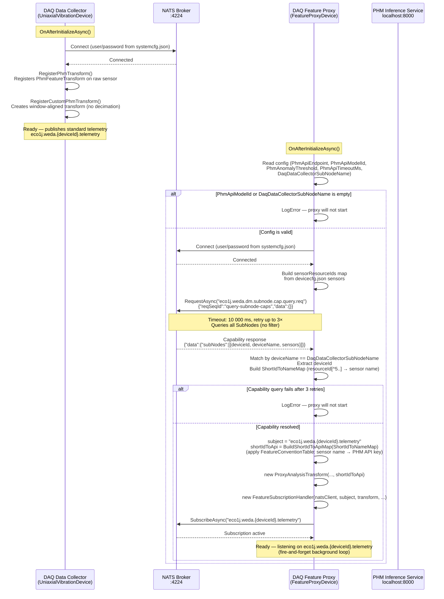
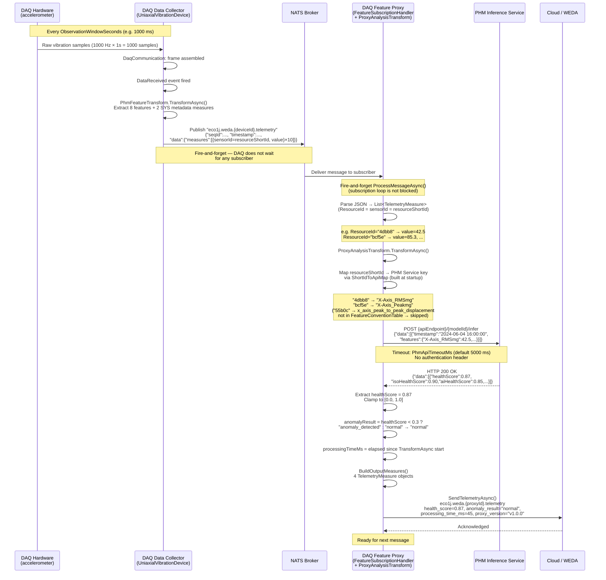
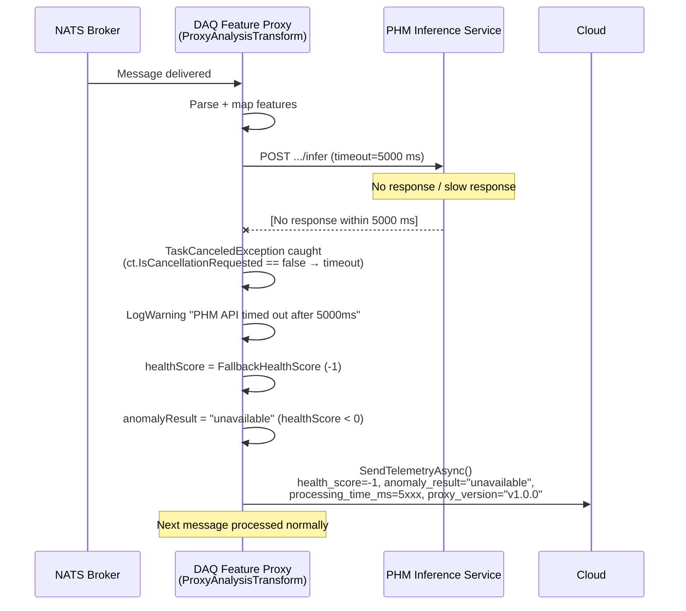
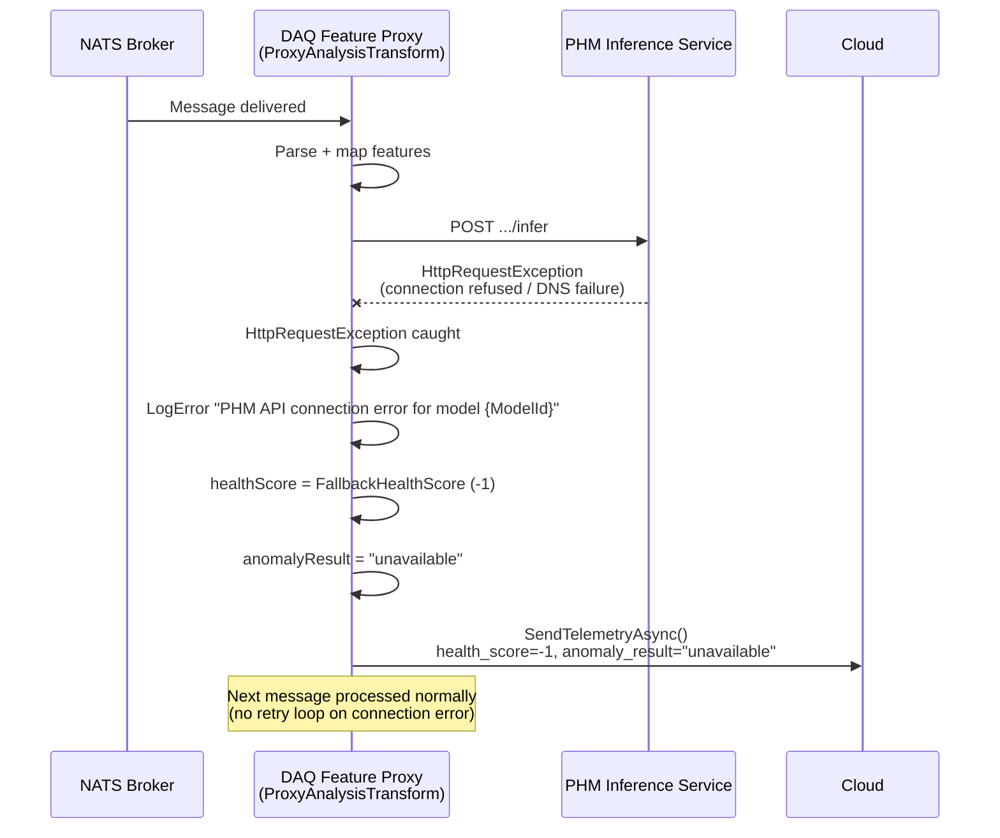
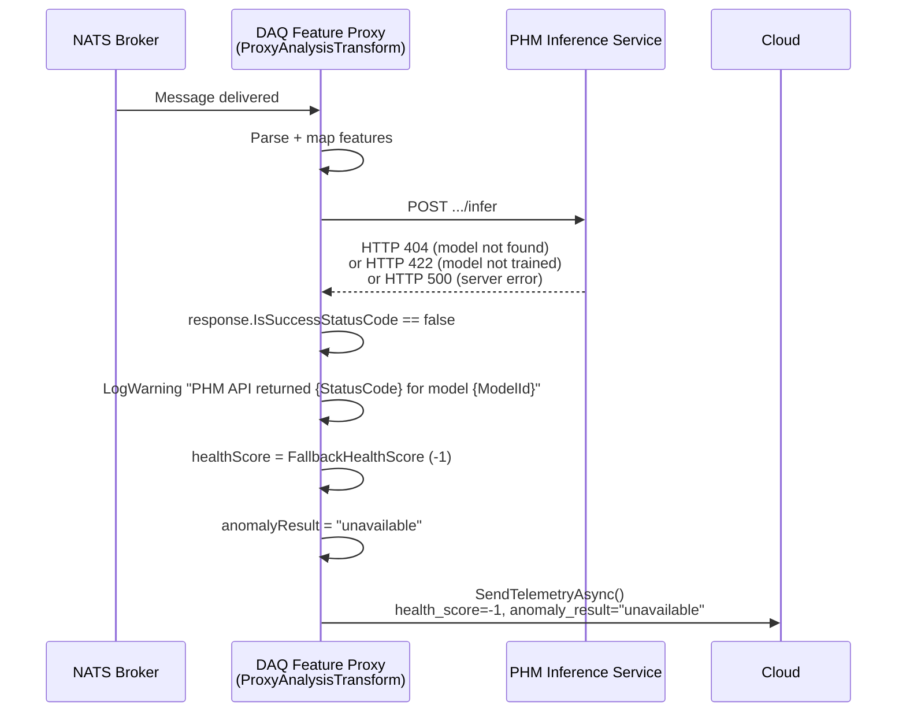
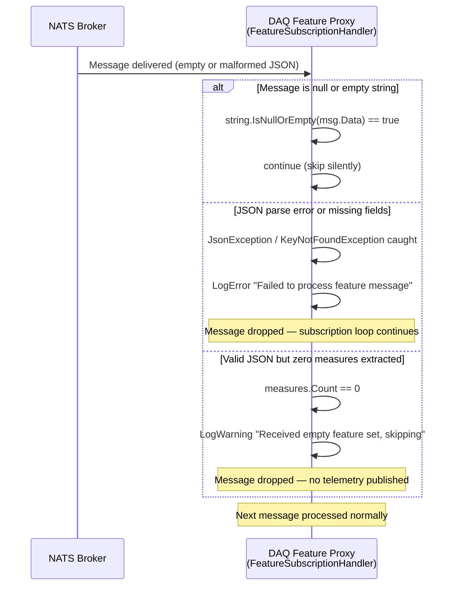
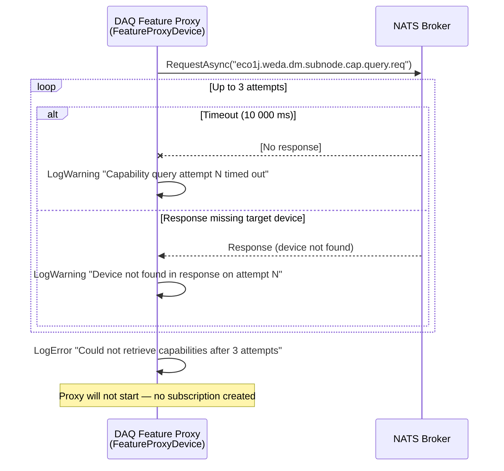
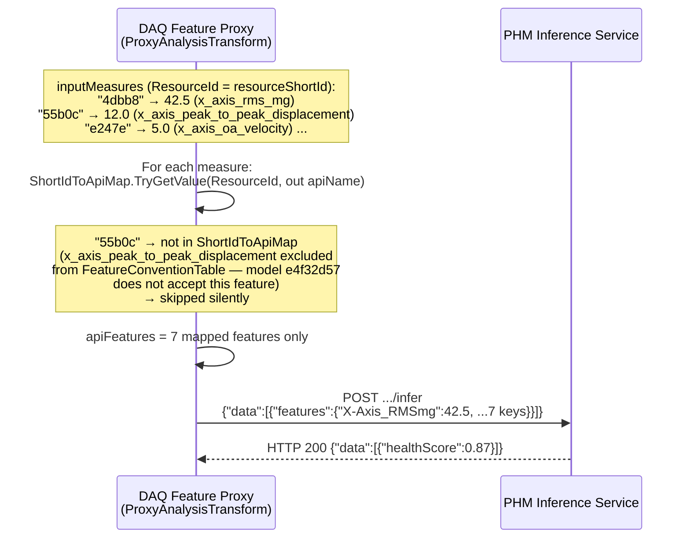

# DAQ Feature Proxy — Communication Sequence Diagrams

**Date:** June 16, 2026  
**Scope:** Communication flows between DAQ Data Collector, NATS broker, Feature Proxy, PHM Inference Service, and Cloud

---

## 1. System Components

```
┌─────────────────────────┐     ┌──────────┐     ┌───────────────────────────┐     ┌─────────────────────────┐     ┌───────┐
│   DAQ Data Collector    │     │  NATS    │     │    DAQ Feature Proxy      │     │   PHM Inference Service │     │ Cloud │
│  (daq-data-collector)   │     │  Broker  │     │   (daq-feature-proxy)     │     │  http://localhost:8000  │     │       │
│                         │     │  :4224   │     │                           │     │                         │     │       │
│ UniaxialVibrationDevice │     │          │     │ FeatureProxyDevice        │     │ POST /api/v1/models/    │     │       │
│ PhmFeatureTransform     │     │          │     │ DeviceCapabilityClient    │     │   {modelId}/infer       │     │       │
│ DaqCommunication        │     │          │     │ FeatureSubscriptionHandler│     │                         │     │       │
│                         │     │          │     │ ProxyAnalysisTransform    │     │                         │     │       │
└─────────────────────────┘     └──────────┘     └───────────────────────────┘     └─────────────────────────┘     └───────┘
```

Both SubNodes connect to the **same NATS broker** using credentials from `systemcfg.json`.  
They operate **independently** — the Feature Proxy can start, stop, or crash without affecting DAQ data collection.

---

## 2. Startup / Initialization

The Feature Proxy performs a NATS Request/Reply capability query at startup to discover:
- The DAQ SubNode's `deviceId` → used to derive the subscription topic
- The `resourceShortId → sensor name` map → used to identify incoming telemetry measures



---

## 3. Normal Data Flow (Happy Path)

Every observation window (default 1000 ms), the DAQ device acquires a raw vibration frame, extracts PHM features, and publishes them as standard SubNode telemetry. The Feature Proxy receives the message, maps `resourceShortId` values to PHM API field names, calls the PHM Inference Service, and outputs 4 sensor readings to cloud telemetry.



---

## 4. Error Scenarios

### 4.1 PHM Service Timeout

The proxy never blocks the NATS subscription loop. If the API does not respond within `PhmApiTimeoutMs`, the proxy logs a warning and returns a hard-coded fallback health score of `-1`.



### 4.2 PHM Service Connection Error (Network Unreachable)



### 4.3 PHM Service Returns HTTP Error (4xx / 5xx)



### 4.4 Malformed or Empty Telemetry Message



### 4.5 Capability Query Failure at Startup



### 4.6 Sensor Not in Convention Table

The DAQ publishes `x_axis_peak_to_peak_displacement` (shortId `55b0c`), which is not accepted by the current PHM model. Sensors absent from `FeatureConventionTable` are logged and skipped; the remaining 7 features are sent to the API.



---

## 5. NATS Subject Map

| Direction | Pattern | Publisher | Subscriber |
|-----------|---------|-----------|------------|
| Proxy → DAQ (startup) | `eco1j.weda.dm.subnode.cap.query.req` | `DeviceCapabilityClient` (Request) | WEDA Device Manager (Reply) |
| DAQ → Proxy (runtime) | `eco1j.weda.{deviceId}.telemetry` | `UniaxialVibrationDevice` | `FeatureSubscriptionHandler` |
| Proxy → Cloud | `eco1j.weda.{proxyId}.telemetry` | `FeatureProxyDevice.SendTelemetryAsync` | WEDA Cloud |

`{deviceId}` is the DAQ SubNode's numeric device ID, obtained from the capability query response. The proxy subscribes to this topic only after the capability query succeeds.

---

## 6. Message Formats

### 6.1 Capability Query Request (Proxy → NATS)

```json
{
  "reqSeqId": "query-subnode-caps",
  "data": {}
}
```

### 6.2 Capability Query Response (NATS → Proxy, condensed)

```json
{
  "code": 0,
  "data": {
    "subNodes": [
      {
        "deviceId": "318281269764947968",
        "deviceName": "UniaxialVibrationDevice2",
        "capabilities": {
          "sensors": [
            { "name": "x_axis_rms_mg",    "sensorGroup": "AI", "resourceId": "b73a9e41-9d5a-5f3b-96e9-65ce13c4dbb8" },
            { "name": "x_axis_peak_mg",   "sensorGroup": "AI", "resourceId": "88913282-f68d-5f97-863b-1f77b99bcf5e" },
            { "name": "timestamp_timestamp","sensorGroup": "SYS","resourceId": "..." }
          ]
        }
      }
    ]
  }
}
```

`DeviceCapabilityClient` extracts `deviceId` and builds `ShortIdToNameMap` from AI-group sensors only. `resourceShortId = resourceId.Replace("-","")[^5..]` (e.g. `"b73a9e41-...-65ce13c4dbb8"` → `"4dbb8"`).

### 6.3 Standard Telemetry (DAQ → Proxy)

**Subject:** `eco1j.weda.318281269764947968.telemetry`

`sensorId` = `resourceShortId` (5-char hex). SYS-group sensors (`a58c1`, `4724b`) are present but not in `ShortIdToApiMap` and are silently skipped.

```json
{
  "seqId": 145,
  "timestamp": 1781577276562,
  "data": {
    "measures": [
      { "sensorId": "a58c1", "value": 1781577272853, "timestamp": 1781577274829 },
      { "sensorId": "4724b", "value": 1781577274829, "timestamp": 1781577274829 },
      { "sensorId": "4dbb8", "value": 42.5,          "timestamp": 1781577274829 },
      { "sensorId": "bcf5e", "value": 85.3,          "timestamp": 1781577274829 },
      { "sensorId": "55b0c", "value": 12.0,          "timestamp": 1781577274829 },
      { "sensorId": "e247e", "value": 5.0,           "timestamp": 1781577274829 },
      { "sensorId": "d7d22", "value": 3.1,           "timestamp": 1781577274829 },
      { "sensorId": "2c0bf", "value": 7.0,           "timestamp": 1781577274829 },
      { "sensorId": "85e51", "value": 18.0,          "timestamp": 1781577274829 },
      { "sensorId": "1d3a4", "value": 2.01,          "timestamp": 1781577274829 }
    ]
  }
}
```

### 6.4 PHM Inference API Request (Proxy → PHM Service)

7 features are sent — `55b0c` (`x_axis_peak_to_peak_displacement`) is excluded because it is not in `FeatureConventionTable` (model e4f32d57 does not accept this feature).

```json
{
  "data": [
    {
      "timestamp": "2024-06-04 16:00:00",
      "features": {
        "X-Axis_RMSmg":       42.5,
        "X-Axis_Peakmg":      85.3,
        "X-Axis_OAVelocity":  5.0,
        "X-Axis_Deviation":   3.1,
        "X-Axis_Skewness":    7.0,
        "X-Axis_Kurtosis":    18.0,
        "X-Axis_CrestFactor": 2.01
      }
    }
  ]
}
```

### 6.5 PHM Inference API Response

```json
{
  "data": [
    {
      "timestamp":    "2024-06-04T16:00:00Z",
      "healthScore":  0.87,
      "isoHealthScore": 0.90,
      "aiHealthScore":  0.85,
      "contributingFactors": [
        { "feature": "X-Axis_RMSmg", "zScore": 1.2, "contribution": 0.35 }
      ]
    }
  ]
}
```

Only `data[0].healthScore` is consumed by the proxy. The remaining fields are ignored.

### 6.6 Output Telemetry (Proxy → Cloud)

```json
{
  "deviceId": "<proxy-subnode-id>",
  "timestamp": 1717504800050,
  "data": {
    "measures": [
      { "sensorId": "health_score",       "value": 0.87,    "timestamp": 1717504800000 },
      { "sensorId": "anomaly_result",     "value": "normal","timestamp": 1717504800000 },
      { "sensorId": "processing_time_ms", "value": 45,      "timestamp": 1717504800000 },
      { "sensorId": "proxy_version",      "value": "v1.0.0","timestamp": 1717504800000 }
    ]
  }
}
```

---

## 7. Feature Mapping Chain (telemetry → PHM Service)

The two-step mapping is built once at startup and stored as `ShortIdToApiMap` in `ProxyAnalysisTransform`.

**Step 1** — `DeviceCapabilityClient` builds `ShortIdToNameMap` from the capability response:

| `resourceShortId` (sensorId in telemetry) | sensor name |
|-------------------------------------------|-------------|
| `4dbb8` | `x_axis_rms_mg` |
| `bcf5e` | `x_axis_peak_mg` |
| `55b0c` | `x_axis_peak_to_peak_displacement` |
| `e247e` | `x_axis_oa_velocity` |
| `d7d22` | `x_axis_deviation` |
| `2c0bf` | `x_axis_skewness` |
| `85e51` | `x_axis_kurtosis` |
| `1d3a4` | `x_axis_crest_factor` |

**Step 2** — `FeatureProxyDevice.BuildShortIdToApiMap` applies `FeatureConventionTable`:

| `resourceShortId` | sensor name | PHM Service key | Included |
|---|---|---|---|
| `4dbb8` | `x_axis_rms_mg` | `X-Axis_RMSmg` | Yes |
| `bcf5e` | `x_axis_peak_mg` | `X-Axis_Peakmg` | Yes |
| `55b0c` | `x_axis_peak_to_peak_displacement` | *(not in convention table)* | **No** — model e4f32d57 does not accept this feature |
| `e247e` | `x_axis_oa_velocity` | `X-Axis_OAVelocity` | Yes |
| `d7d22` | `x_axis_deviation` | `X-Axis_Deviation` | Yes |
| `2c0bf` | `x_axis_skewness` | `X-Axis_Skewness` | Yes |
| `85e51` | `x_axis_kurtosis` | `X-Axis_Kurtosis` | Yes |
| `1d3a4` | `x_axis_crest_factor` | `X-Axis_CrestFactor` | Yes |

SYS-group sensors (`a58c1` `timestamp_timestamp`, `4724b` `device_time`) are filtered out during capability parsing and never enter `ShortIdToNameMap`.

---

## 8. Anomaly Detection Logic

```
healthScore
    │
    ├─ healthScore < 0                               →  anomaly_result = "unavailable"  (API failure)
    ├─ healthScore < PhmAnomalyThreshold (default 0.3)  →  anomaly_result = "anomaly_detected"
    └─ healthScore ≥ PhmAnomalyThreshold             →  anomaly_result = "normal"

API failure / timeout:
    healthScore = FallbackHealthScore (-1, hard-coded)
    → healthScore < 0  →  anomaly_result = "unavailable"
```

`-1` is outside the valid `[0.0, 1.0]` range, making API unavailability distinguishable from a real health score. The `"unavailable"` result prevents spurious anomaly alerts when the PHM Service is down.

---

## 9. Key Source Files

| File | Role |
|------|------|
| `daq-data-collector/Devices/UniaxialVibrationDevice.cs` | Acquires raw vibration data, fires `DataReceived`, publishes standard telemetry |
| `daq-data-collector/Communication/Pipeline/PhmFeatureTransform.cs` | Extracts PHM features from a raw DAQ frame |
| `daq-feature-proxy/Devices/FeatureProxyDevice.cs` | Reads config, runs capability query, derives topic, builds `ShortIdToApiMap`, wires subscription → transform → telemetry |
| `daq-feature-proxy/Communication/DeviceCapabilityClient.cs` | NATS Request/Reply capability query; returns `DeviceCapability(DeviceId, ShortIdToNameMap)` |
| `daq-feature-proxy/Communication/Pipeline/FeatureSubscriptionHandler.cs` | Subscribes to `eco1j.weda.{deviceId}.telemetry`, fires `ProcessMessageAsync` per message |
| `daq-feature-proxy/Communication/Pipeline/ProxyAnalysisTransform.cs` | Maps `resourceShortId` → PHM API key, calls PHM REST API, builds output measures |
